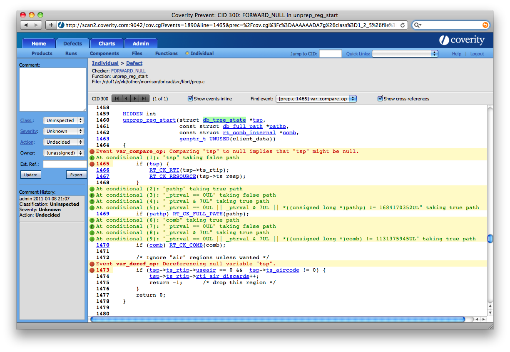
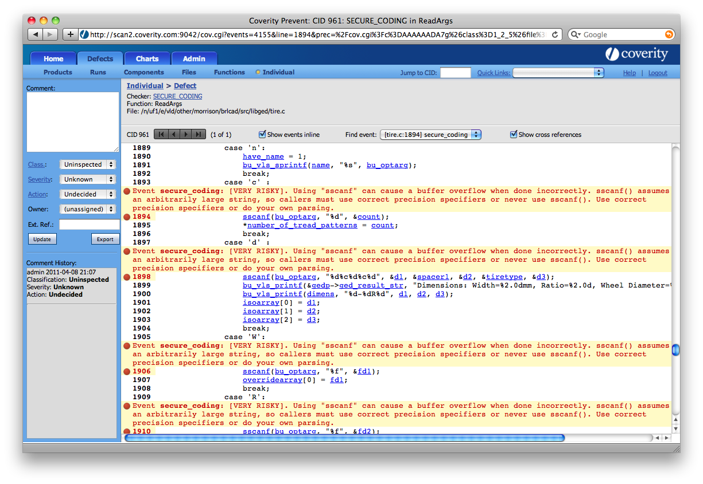

The BRL-CAD source code is large with a lot of history. In order to
survive decades of development, considerable time and attention is put
forth towards improving code maintainability and code quality. One of
the best ways to get involved in BRL-CAD open source development is to
help clean up source code.

Cleaning up the source code helps you become familiarized with BRL-CAD
and improves maintainability. There are a variety of ways you can clean
up source code, but some of our specific efforts in place to help
refactor BRL-CAD are:

# The HACKING File

Our tried and true [developer guidelines HACKING
file](http://brlcad.svn.sourceforge.net/viewvc/brlcad/brlcad/trunk/HACKING?revision=HEAD)
identifies numerous stylistic concerns and source code conventions that
the entire BRL-CAD source code should conform to. When in doubt, consult
the dev guidelines.

# Strict Compilation

This code cleanup effort is now considered ***complete*** and is
enforced by default. One excellent and easy way to improve code quality,
maintainability, and consistency is to pay attention to compilation
warnings. Sure, the compiler sometimes gets things wrong, but even the
"false positives" that get reported tend to be code that [smells
bad](http://en.wikipedia.org/wiki/Code_smell). For BRL-CAD, we turn on
nearly all compilation warnings that the compiler is able to produce and
consider all warnings to be errors.

# Duplication Reduction

As BRL-CAD's source code is large, another way to clean up code is to
reduce the inevitable duplication that results after years of
development. There has been considerable success in the past using the
[Simian](http://www.harukizaemon.com/simian/) similarity analyser. This
shell script snippet should provide a reasonable analysis of BRL-CAD's
core source code:

`#!/bin/sh`
`` files=`find . \( -name \*.h \ ``
`                        -o -name \*.c \`
`                        -o -name \*.cxx \`
`                        -o -name \*.cpp \`
`                        -o -name \*.tcl \`
`                        -o -name \*.itcl \`
`                        -o -name \*.itk \`
`                        -o -name \*.tk \) \`
`                     -not -regex '.*src/other.*' \`
`                     -not -regex '.*misc.*' \`
`                     -not -regex '.*libfft.*' \`
`                     -not -regex '.*src/mged/points/.*' \`
``                      -not -regex '.*src/tab/.*'` ``
`java -Xms200m -Xmx2000m -jar simian-2.2.24.jar -threshold=25 $files`

You'll of course probably need to change the version number from 2.2.24
to whatever version you downloaded. You should get a report that looks
something like this:

`Similarity Analyser 2.2.24 - `[`http://www.redhillconsulting.com.au/products/simian/index.html`](http://www.redhillconsulting.com.au/products/simian/index.html)
`Copyright (c) 2003-08 RedHill Consulting Pty. Ltd.  All rights reserved.`
`Simian is not free unless used solely for non-commercial or evaluation purposes.`
`{failOnDuplication=true, ignoreCharacterCase=true, ignoreCurlyBraces=true, ignoreIdentifierCase=true,`
` ignoreModifiers=true, ignoreStringCase=true, threshold=6}`
`Found 10 duplicate lines in the following files:`
` Between lines 472 and 485 in /Users/morrison/brlcad/src/libged/wdb_nirt.c`
` Between lines 451 and 465 in /Users/morrison/brlcad/src/libged/wdb_nirt.c`
`Found 10 duplicate lines in the following files:`
` Between lines 42 and 57 in /Users/morrison/brlcad/src/libged/comb.c`
` Between lines 44 and 59 in /Users/morrison/brlcad/src/libged/region.c`
`...`
`Found 332 duplicate lines in the following files:`
` Between lines 49 and 525 in /Users/morrison/brlcad/src/libged/wdb_importFg4Section.c`
` Between lines 50 and 526 in /Users/morrison/brlcad/src/libged/importFg4Section.c`
`Found 416 duplicate lines in the following files:`
` Between lines 113 and 836 in /Users/morrison/brlcad/src/rt/viewarea2.c`
` Between lines 119 and 842 in /Users/morrison/brlcad/src/rt/viewarea.c`
`Found 83039 duplicate lines in 6556 blocks in 815 files`
`Processed a total of 330888 significant (572540 raw) lines in 1262 files`
`Processing time: 22.329sec`

Once you get the output report, focus attention on refactoring the
largest or most frequently duplicated code into reusable functions. Feel
free to follow the [Rule of
three](http://en.wikipedia.org/wiki/Rule_of_three_(programming)) or [DRY
principle](http://en.wikipedia.org/wiki/Don%27t_repeat_yourself) from
there. Submit patches or commit changes accordingly.

# Coverity Scan

Since 2006, BRL-CAD has been a participant in the [Coverity Scan
Initiative](http://scan.coverity.com/), an effort funded by the U.S.
Department of Homeland Security to improve the quality, safety and
[security](http://en.wikipedia.org/wiki/Open_source_software_security)
of open source software. Coverity performs a static source code analysis
(one of the best) and generates a detailed report of issues detected.

The BRL-CAD scan was previously "stuck" but we're now back online and
operational! For an interesting preview of some of the kinds of things
reported, here are some screenshots:

Those and many other issues are all managed through a private website
that is only accessible if you have an account. If you're going to help,
fantastic. Get in touch with a developer to have your account created.

***PLEASE don't bother inquiring if you're only interested in looking at
results or poking around.***

We'll probably have you fix an issue or two first to make sure you're
serious.

# Collaborative Refactoring Best Practices

This document covers a peer-reviewed, tested, and documented workflow
for addressing issues reported by Coverity Static Analysis through the
Coverity Integrity Center web interface. The document identifies
categories of medium and high risk defect types, specific refactoring
pitfalls to watch out for, how to add new unit and regression tests to
BRL-CAD, and identifies several best practices for code refactoring.
Definitions are provided for "Refactoring", "Zero One or Infinity"
(ZOI), "Don't Repeat Yourself" (DRY), "Rule of Three", and "Cargo Cult
Programming".

# CPPCHECK-CLEANUP

-   Run the following:
    -   cd brlcad
    -   cppcheck -isrc/other/ include/ src/ --enable=all
        2&gt;cppcheck_brlcad.txt
-   It checks for issues in 1690 files under all src/ except src/other
    and all include/
-   By default,(i.e. without --enable=all ) , only error messages are
    shown.
-   To get just Stylistic issues, change --enable=all to --enable=style
-   To get just unused function issues, change --enable=all to
    --enable=unusedFunction
-   If not checking for unusedFunction, it can also have multithreaded
    checking by option -j 4.
-   The following issues will be stored in the file
    cppcheck_brlcad.txt. Note,many a times, cppcheck is wrong about
    reported errors. There are many bugs it doesn't catch.
-   A small snippet of the output is like below -

`[src/adrt/librender/spall.c:195]: (warning) scanf without field width limits can crash with huge input data`
`[src/adrt/master/master.c:488]: (style) Array index i is used before limits check`
`[src/anim/anim_hardtrack.c:185]: (warning) scanf without field width limits can crash with huge input data`
`[src [src/burst/Hm.c:347]: (style) The scope of the variable 'bit' can be reduced`
`[src/conv/asc/g2asc.c:655]: (error) fprintf format string has 3 parameters but only 1 are given`
`.`
`.`
`.`
`[src/util/ttcp.c:612]: (style) The scope of the variable 'cnt' can be reduced`
`[src/util/xyz-pl.c:59]: (warning) scanf without field width limits can crash with huge input data`
`(information) Cppcheck cannot find all the include files (use --check-config for details)`
