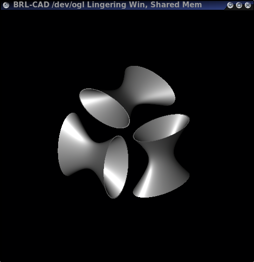
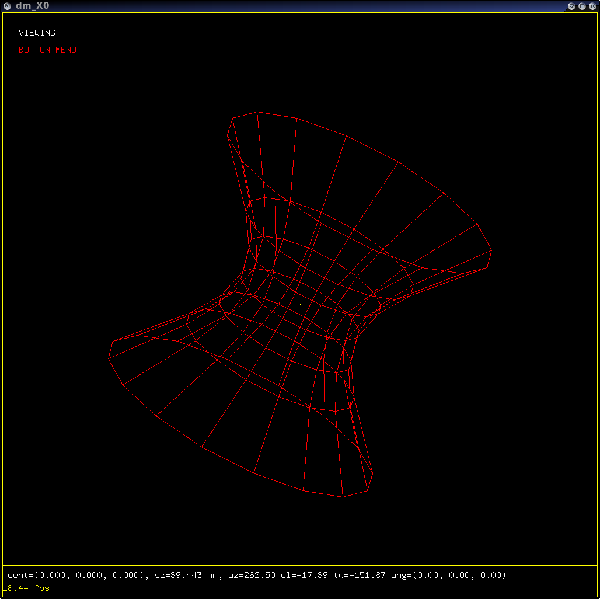

## 2009 GSoC Log

### 2009-05-28

Looked at tor.c's implementation, since revolving a carc segment will
result in a toroid. Started doing the math for a simple case, still need
to generalize it.

### 2009-05-27

Had a bit of trouble getting the trunk svn checkout to compile. Started
reading through the revolve.c code to pick up where I left off last
year.

### 2009-05-26

Today was spent fighting the fglrx driver, trying to get dual-head
working. Finally found a patch to get it to compile, and dual-head is
working with xrandr, but I can't get it to ignore the EDID and let me
run custom modelines. It's "good enough" for now to start coding
tomorrow.

## 2009 GSoC Proposal

I am proposing to complete the implementation of the revolve primitive
that I started last year, and to create a sweep primitive.

### Revolve

#### rt_revolve_shot()

Solve the hit intersection between the ray and a circular arc, bezier
curve, or NURBS. Use an analytical solution when possible, but switch to
a numeric solution so that higher-order splines will still work (with a
performance penalty).

#### rt_revolve_curve()

Calculate the surface curvature from the curvature of the sketch segment
and the distance between the hit point and the revolve axis.

#### rt_revolve_uv()

Add UV mapping for surfaces formed by a circular arc, bezier curve, or
NURBS sketch segment. The surface created by each segment will have its
own UV coordinate space.

#### rt_revolve_tess()

Starting from scratch on this one. Should be able to use an algorithm
similar to the one for tor, except replacing the circular outline with
the sketch outline. This will probably be the most challanging part of
finishing the revolve primitive.

### Sweep

A sweep consists of several components:

-   Sketch: an outline, must be closed for the result to be a solid
    object.
-   Path: a curve in 3D space, along which the sketch is swept.
-   Orientation: describes the direction of the sketch's xy axes during
    the sweep.

The sketch plane and the path will always be perpendicular, and the
orientation fully constrains the primitive.

More complex sweeps are much more useful, so I'm planning on starting
with a generalized numerical approach.

One way to determine the orientation would be to use the vector pointing
toward the center of curvature of the sweep path. The orientation of the
sketch should be continuous, so if the curvature of the path changes
discontinuously, then the curvature vector will be remapped to a
different vector in the sketch's coordinate system. To me, this seems
like a good default setting, but I'm open to suggestions.

Also, I will have to check for a self-intersecting sweep (if the sketch
bounds are larger than the local radius of curvature of the path).

### Timeline

#### Revolve

2-3 weeks to finish, with most of that time spent on tess().

#### Sweep

-   data representation, code modifications external to
    /src/librt/primitives/sweep, and stub outline of sweep.c (&lt; 1
    week).
-   import/export/describe/print (&lt; 1 week).
-   plot - wireframe (1-2 weeks)
-   prep/shot (2-3 weeks)
-   uv/curve/norm (&lt; 1 week, done at the same time as prep/shot)
-   tess (2-3 weeks)

### About me

I just graduated with an ME degree from The University of Texas at
Austin, and I'm going back for grad school. I first got involved in Open
Source through the game BZFlag, where I wrote several server plugins and
ran a few game servers. Last summer, I started working on BRL-CAD for
GSoC, where I implemented the hyperboloid of one sheet, and started the
revolve primitive. Programming and computers have always been fun for
me. I started programming QBasic in middle school, then moved on to
writing simple games for my TI graphing calculator. I took two years of
AP computer science in high school (with a perfect score on both AP
tests). I've taken several more programming courses at college, covering
Java, C, and C++.

## 2008 GSoC

### 2008-06-17

Moved as much code as possible into prep, and performed general code
cleanup - removing bn_log() statements that had been commented, etc. I
tested my changes using three trials each before and after my changes
using the same image, and calculated a 6% improvement.

### 2008-06-16

Finished curve(), so hyp.c is functionally complete. Starting to figure
out what can be moved from shot/norm/curve/etc to prep, and developing a
way to test the effectiveness of my optimizations.

### 2008-06-09 to 2008-06-13

I changed the 'in' creation to be more closely aligned with BRL-CAD
standards:

-   Vertex is the center of the base ellipse (was the center of the
    primitive)
-   Height vector points from the base to the top (was from center to
    top)
-   Major and minor axis lengths control the base/top ellipse sizes
    (formerly controlled the center "neck" ellipse size)
-   Scale factor 'c' now controls the neck size as a fraction of the
    base dimensions (formerly controlled the slope of the asymptotic
    cone)

UV mapping was also updated to match with ehy's UV mapping, so the
checker pattern would match. UV now ranges from (0,1) on each face,
instead of being unique on the entire surface. The largest part of this
week was spent working on tess(). Currently, all elliptical cross
sections use the same number of points (calculated from the base), but
the smaller ellipses at the neck could be made with fewer points and
remain within the tolerances, hopefully increasing performance.

### 2008-06-05

Fixed one more raytrace bug due to faulty conditional logic. Also, I
upgraded the uv mapping to be more uniform. Longitude lines are spaced
more evenly about an elliptical cross section, and latitude lines are
now ellipses instead of circles to match the cross section on the top
and bottom caps.

-   [sample uv
    mapping](https://webspace.utexas.edu/trv82/www/hyp_rt14.png)

I found out why raytrace from within mged wasn't working: I was running
mged from its build location (src/mged/mged) to save time by skipping
the "make install" step. Running mged from the installed location
(/usr/brlcad/bin/mged) allows the raytrace to work perfectly.

### 2008-06-04

Yesterday was mainly spent trying to figure out why the raytrace wasn't
working. Today, I rewrote most of shot(), ignoring what prep() was
doing, and updated norm() to use the new private vector stored in the
hitpoint. "rt" seems to work perfectly, but trying to raytrace from
inside mged still fails.

### 2008-06-02

Implemented import5(), export5(), and describe(). Wireframe drawing
works perfectly, but raytrace fails; still trying to track down the
problem.

### 2008-05-30

More work on plot(). Changed the wireframe drawing routine to a loop
from the previously hard-coded statements. I added another slice to the
wireframe, so ellipses are drawn at +-100%, +-50%, +-25%, and 0% of the
height vector, and upgraded the ellipses from 8 to 16 points.

<figure>

Refined the plot() function, and corrected some errors regarding
elliptical cross sections and primitives not centered at the origin.

### 2008-05-28

Started a simple plot() function, based primarily on the superell's
plot(). It currently ignores tolerances, but gives an idea of where the
hyperboloid is.

-   [sample 1](https://webspace.utexas.edu/trv82/www/hyp.png)
-   [sample 2](https://webspace.utexas.edu/trv82/www/hyp1.png)
-   [sample 3](https://webspace.utexas.edu/trv82/www/hyp2.png)

### 2008-05-27

Added mged support to create a hyp, still doesn't work completely due to
stubbed methods (specifically draw, import5, and export5). Started
researching tess() and plot().

### 2008-05-20

Made my first commit today to submit the code I've been working on for
the single-sheet hyperboloid. I also realized that I needed to check for
divide by zero cases in my algorithms, and I fixed my norm() function to
handle the div by zero case.

### 2008-05-04

I'm planning on using this page as a development log for my GSoC work on
implementing the revolve and sweep primitive. I have started working on
a hyperboloid of one sheet, and posted
[patches](http://sourceforge.net/tracker/index.php?func=detail&aid=1939611&group_id=105292&atid=640804)
to sourceforge. I have finished the prep, print, shot, norm, uv, and
free functions in src/librt/g_hyp.c, and made changes to
src/librt/Makefile.am, include/raytrace.h, include/rtgeom.h, and
src/librt/table.c to support the new primitive.

-   Design document for [Revolve](Revolve.md)
