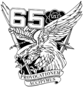
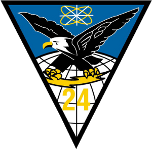
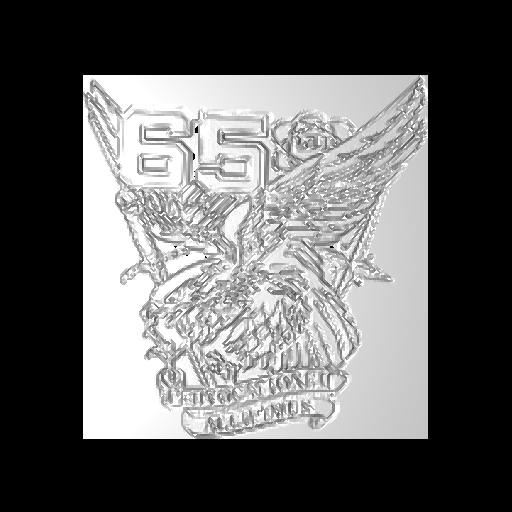
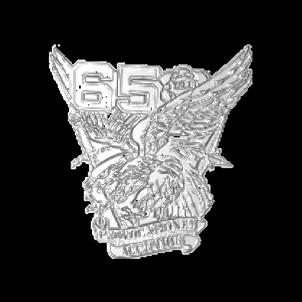
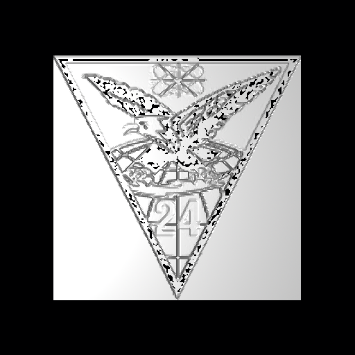
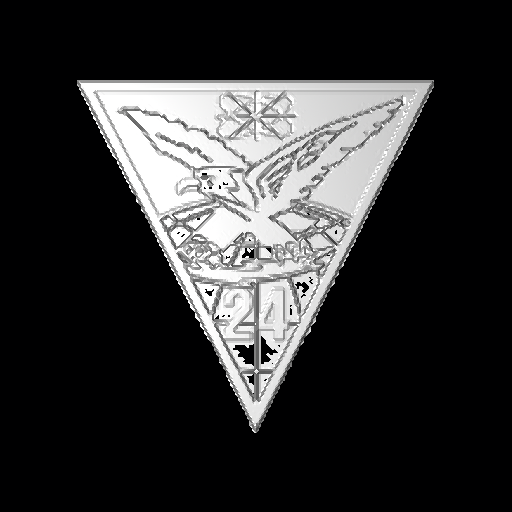
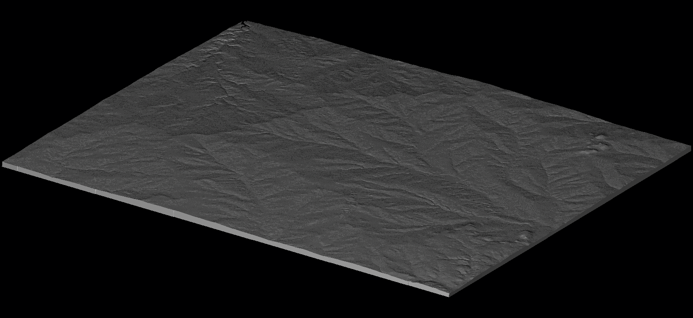

[category:tutorials](category:tutorials.md)

# Displacement (DSP) map primitive

## Creating a DSP object from miscellaneous images

We will use two examples to illustrate the next few sections.

1\. A black and white (gray scale) image (png format):

with properties:

`$ file Ex1.png`
`Ex1.png: PNG image, 142 x 150, 8-bit gray+alpha, non-interlaced`

2\. A color png file:

with properties:

`$ file Ex2.png`
`Ex2.png: PNG image, 152 x 150, 8-bit/color RGBA, non-interlaced`

### Preparing your height field data

The DSP takes unsigned short (16-bit) integer data. Our various
command-line data converters can help bring data in from pretty much any
existing format, including image data, via various processing commands.
If the data were in png image format, for example (which is basically
3-channel 8-bit integer data), the data could be prepared with a
combination of 'png-pix', 'pix-bw', and 'cv'.

If you type the 'in' command, it will prompt you for each parameter
individually and that should help some. For the DSP, the main parameters
are: the source of the height data, the width (number of points in the X
direction) and length (number of points in the Y direction) of the input
data, width/length/height scaling factors, and whether to smoothly
interpolate between cells (0 = do not interpolate, 1 = interpolate).

See the 'dsp_add' tool for combining two existing DSP data files into
one.

A DSP primitive is an array of cells initially defined by points in the
X-Y plane as positive heights from Z = 0. The DSP can then be
transformed to other orientations and positions. The number of cells is
(numX \* numY).

The data format for the DSP primitive is network-ordered unsigned short
integers (nu16). BRL-CAD has a couple of dozen tools that you can use
for converting existing data into that raw format, such as the 'cv'
command or the 'bw-d' and 'd-u' commands among other similar tool
chains. If you use the cv command, the output format is "nus" for
network unsigned shorts.

Using the two examples to convert the data to dsp format.

Example 1.

Convert it to a bw file (one pixel is one unsigned char):

`$ png-bw Ex1.png > Ex1.bw`

View the result:

`$ bw-fb -w142 -n150 Ex1.bw`

Convert it to the format required for a dsp file (nu16):

`$ cv huc nu16 Ex1.bw Ex1.dsp`

Example 2.

Convert it to a pix file (one pixel is defined by three unsigned chars):

`$ png-pix Ex2.png > Ex2.pix`

View the result:

`$ pix-fb -w152 -n150 Ex2.pix`

Convert it to a bw file (one pixel is one unsigned char):

`$ pix-bw Ex2.pix > Ex2.bw`

View the result:

`$ bw-fb -w152 -n150 Ex2.bw`

Convert it to the format required for a dsp file:

`$ cv huc nu16 Ex2.bw Ex2.dsp`

### Importing DSP data into a .g file

Example 1.

In [mged](mged.md) create a dsp object of width 142, length 150,
no interpolation, cut direction 'ad', cell size 1 (in current units),
and unit elevation 0.005 (in current units):

`mged> in dsp1.s dsp f Ex1.dsp 142 150 0 ad 1 0.005`
`mged> r dsp1.r u dsp1.s`

Example 2.

In mged create a dsp object:

`mged> in dsp2.s dsp f Ex2.dsp 152 150 0 ad 1 0.005`
`mged> r dsp2.r u dsp2.s`

### Rendering your DSP

Example 1.

`mged> B dsp1.r`
`mged> ae 270 90`
`mged> rt`

You should see something like this:

You can play around with the scaling factors (the end pair: 1 - cell
width, 0.005 - cell height) to improve the looks of the image.

But now let's invert the file so we get its negative:

`$ bwmod -m-1 -a255 < Ex1.bw > Ex1n.bw`

And make another dsp in the same manner as before:

`$ cv huc nu16 Ex1n.bw Ex1n.dsp`
`$ ...`

And see the results:

Example 2.

`mged> B dsp2.r`
`mged> ae 270 90`
`mged> rt`

You should see something like this:

Again, you could play with various parameters to get the desired look.
You could also create the negative as we did with example 1 and see the
results:

## Creating a DSP object from manual or programmatic generation of data

A DSP object can be created manually or programmatically by creating an
ASCII data file as input using the BRL-CAD utility asc2dsp to convert it
directly to the DSP binary format. An easy way to create the input file
for asc2dsp is to first create it row by row in natural form with the
top row being the desired top row and so on in desired viewing order.
Then take the finished file and filter it through the Unix utility tac
which will reverse the order of the rows (lines).

### A simple example

For example, let's create the letter "T" for viewing in the X-Y plane.

`$ cat t-normal.asc`
`1 1 1 1 1`
`0 0 1 0 0`
`0 0 1 0 0`
`0 0 1 0 0`
`0 0 1 0 0`
`0 0 1 0 0`

Now reverse the file:

`$ tac t-normal.asc > t-reversed.asc`

and see the result in perfect form for asc2dsp:

`$ cat t-reversed.asc`
`0 0 1 0 0`
`0 0 1 0 0`
`0 0 1 0 0`
`0 0 1 0 0`
`0 0 1 0 0`
`1 1 1 1 1`

Finally, create the dsp file:

`$ asc2dsp t-reversed.asc t.dsp`

(The TGM creation is left as an exercise for the reader.)

### A practical example

Now let's consider a more practical example and a real test of BRL-CAD.
We can import topological (topo) data and produce a realistic ground
surface. There are many free sources of such data, but these, for US
topo data, seem to be the most likely:

[`http://nationalmap.gov/viewer.html/`](http://nationalmap.gov/viewer.html/)
[`http://earthexplorer.usgs.gov/`](http://earthexplorer.usgs.gov/)

Trying to find suitable topo data, in a desired format for a specific
area, is not so easy there, so we located another source of topological
data (digital elevation models \[DEM\]) in
[SDTS](http://mcmcweb.er.usgs.gov/sdts/) format:

[`http://data.geocomm.com/dem/demdownload.html`](http://data.geocomm.com/dem/demdownload.html)

We selected
[Colorado](http://data.geocomm.com/catalog/US/61076/sublist.html), [El
Paso County](http://data.geocomm.com/catalog/US/61076/1231/index.html),
and [Digital Elevation
Models](http://data.geocomm.com/catalog/US/61076/1231/group4-3.html).

On that page we downloaded all six 10-meter data archive files for
complete coverage of the county. We also downloaded the six \*TXT files
which contain metadata about each archive. \[Note that you are required
to have a Geo Community account for any downloads (membership is
free).\]

The six archive files are:

`3818122.DEM.SDTS.TAR.GZ`
`4055020.DEM.SDTS.TAR.GZ`
`4055026.DEM.SDTS.TAR.GZ`
`4055028.DEM.SDTS.TAR.GZ`
`4055034.DEM.SDTS.TAR.GZ`
`4057865.DEM.SDTS.TAR.GZ`

Taking the first archive as an example:

`$ tar -tvzf 3818122.DEM.SDTS.TAR.GZ`

we see that the archive files are not in a directory (but they are a set
with possibly redundant file names found in other sets), so we create a
directory for each:

`$ mkdir 3818122.dem`
`...`

Now move each archive into its own directory and unpack it:

`$ mv 3818122.DEM.SDTS.TAR.GZ 3818122.dem`
`$ cd 3818122.dem`
`$ tar -xvzf 3818122.DEM.SDTS.TAR.GZ`
`3814CATD.DDF`
`3814CATS.DDF`
`3814CEL0.DDF`
`3814DDDF.DDF`
`3814DDOM.DDF`
`3814DDSH.DDF`
`3814DQAA.DDF`
`3814DQCG.DDF`
`3814DQHL.DDF`
`3814DQLC.DDF`
`3814DQPA.DDF`
`3814IDEN.DDF`
`3814IREF.DDF`
`3814LDEF.DDF`
`3814RSDF.DDF`
`3814SPDM.DDF`
`3814STAT.DDF`
`3814XREF.DDF`
`README`

We can view the SDTS data files with a free viewer (for Windows only)
available here:

[`http://www.visualizationsoftware.com/3dem`](http://www.visualizationsoftware.com/3dem)

In order to manipulate the data in SDTS files we used the [GDAL
library](http://gdal.org/) and then created a C++ program called
'sdtsdem2asc' which can be found here:

[`https://github.com/tbrowder/brlcad-usgs-topo-tools`](https://github.com/tbrowder/brlcad-usgs-topo-tools)

After building and installing that program, we can change directory to
the desired data set and create the dsp. We enter the desired base name
of the image (we choose the unique data set base name) and use the
'--chop' option to minimize the dsp's vertical height to the default one
meter below the lowest height in the data set. Note the program will do
all the work for us with the options shown:

`$ cd /path/to/3818122.dem`
`$ sdtsdem2asc 3814CATD.DDF --base=3818122 --chop`

The resulting default png file (but cropped) is shown below.

