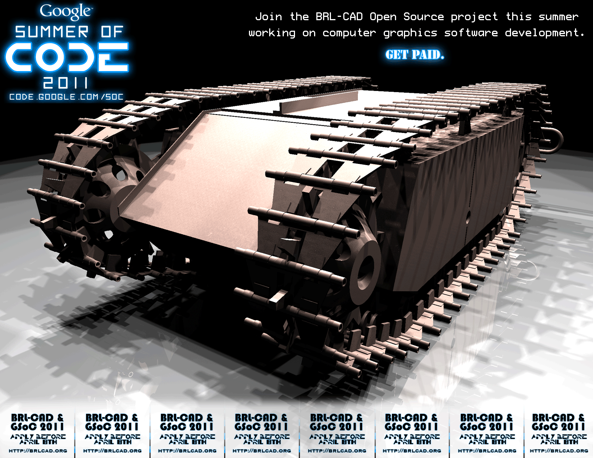

# Overview

**BRL-CAD is accepted as a mentoring organization in the [2020 Google
Summer of Code](Google_Summer_of_Code/2020.md)!**

Since 2005, Google has run an awesome open source software development
program specifically for *students* called the [Google Summer of
Code](http://code.google.com/soc/) (GSoC). Under this program, Google
funds students to write code for open source projects during the
northern hemisphere's summer timeframe:

-   The student writes a project proposal for BRL-CAD.
    -   Sometimes their project idea caters to something that the open
        source organization suggests and sometimes it's an idea entirely
        of the student's conception.
-   Proposals are reviewed, evaluated, and ranked by the open source
    organization's mentors.
-   Google allocates a certain number of slots to each participating
    organization
    -   That, in turn, determines how many student developers work with
        that organization.

# Getting Started [Checklist](Summer_of_Code/Checklist.md)

Whether you're applying or accepted, we've itemized everything you need
to do into a simple
**[CHECKLIST](Summer_of_Code/Checklist.md)**. We're here to help
you become new open source developers, so don't be shy if you have any
questions.

## The Selection Process

GSoC is about getting people involved and contributing to open source
over the long-term. As such, we heavily weight our application selection
process towards students that are interested in remaining involved in
BRL-CAD and open source software development long after GSoC has ended.

***GSoC is not a job.*** If you think this is just a summer job, then
GSoC is probably not for you. It's only like a job in terms of planning
your time commitment over the summer.

Additionally, submissions are graded based on perception of the
submitter's abilities to complete the task within the program timeframe,
general consensus on the technical approach being proposed, and overall
interest in having such modifications made to BRL-CAD. Particular notice
is made of students that are responsive to questions and readily
interactive in the IRC channel or on the mailing list. Communication is
a great thing.

Just about every GSoC organization receives considerably more project
proposals than can be accepted. Every application gets read multiple
times and reviewed in detail. Of those applications, only a small subset
are selected so keep in mind that the selection process is rather
competitive and difficult.

Whether or not you are accepted, contributing to open source outside of
GSoC is one of the main goals of the program and is the best way to be
noticed and get your proposal accepted. Keep that in mind. Thanks for
your interest and we look forward to working with new BRL-CAD
developers!

# BRL-CAD participation in GSoC

You can check out promotional flyers that have been prepared in the past
on our [GSoC flyers](Google_Summer_of_Code/Flyers.md) page.

## [GSoC 2020](Google_Summer_of_Code/2020.md)

## [GSoC 2019](Google_Summer_of_Code/2019.md)

## [GSoC 2018](Google_Summer_of_Code/2018.md)

Our umbrella selected 9 students that prepared quality proposals for
BRL-CAD, FreeCAD, LibreCAD, or/and Slic3r. By the end of GSoC, all but 1
passed successfully.

## [GSoC 2017](Google_Summer_of_Code/2017.md)

Our umbrella accepted 10 students that prepared quality proposals and
demonstrated commitment. Students were selected for LibreCAD, Slic3r,
BRL-CAD, and FreeCAD.

## [GSoC 2016](Google_Summer_of_Code/2016.md)

This year we tamed it back to 9 students working on projects for
BRL-CAD, OpenSCAD, LibreCAD, and FreeCAD (new partner). We were not
going to apply at all, but we also didn't want to lose momentum with our
umbrella partners or leave them to fend for themselves.

## [GSoC 2015](Google_Summer_of_Code/2015.md)

This year we had a whopping 12 students accepted to work on projects. As
an umbrella organization, we expanded our cooperation to include
LinuxCNC.

## [GSoC 2014](Google_Summer_of_Code/2014.md)

Hoping to foster collaboration and communication, we actively reached
out to a number of related and active open source CAD communities. We
expanded our umbrella to include cooperation with STEPcode, LibreCAD,
and OpenSCAD.

## [GSoC 2013](Google_Summer_of_Code/2013.md)

Middle ground, not too many, not too few. It was just right. We accepted
seven students that all participated successfully. This was also our
first year participating as an umbrella organization, coordinating one
of those slots with the STEPcode community.

## [GSoC 2012](Google_Summer_of_Code/2012.md)

This year, we aimed big. Lots of mentors, lots of students. Compared to
some of the larger notable orgs, students had a really great chance of
acceptance if they were actively communicative and highly passionate
about their project idea and BRL-CAD. Overall, we accepted eleven
students.

## [GSoC 2011](Google_Summer_of_Code/2011.md)

After a year off focusing on a major development initiative, BRL-CAD
once again was accepted to participate in the Google Summer of Code. We
structured our participation minimally, however, intending to only
accept a couple students. In the end, we only accepted two students,
both of whom did outstanding work.

## GSoC 2010

We [took a break](http://brlcad.org/d/node/47) and didn't apply to
participate in 2010. We wanted to give another org the chance to
participate and allow ourselves a little extra time to focus on our own
development priorities.

## [GSoC 2009](Google_Summer_of_Code/2009)

For the second year in a row, BRL-CAD is participating in the Google
Summer of Code. BRL-CAD was accepted as a participating organization and
took upon five students, four of which successfully worked their
projects and integrated with the development team.

## [GSoC 2008](Google_Summer_of_Code/2008)

The Google Summer of Code 2008 was announced on February 25, 2008.
BRL-CAD was accepted as a participating organization and took upon four
students, all of which successfully worked their projects and integrated
with the development team.

[Category: Summer of Code](Category:_Summer_of_Code)
