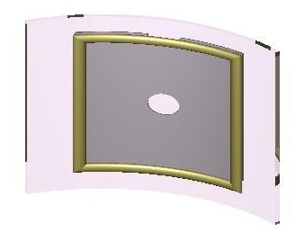

## Personal Information

-   Name: **Csányi Pál**
-   NickName: **Paul**
-   E-mail: **csanyipal AT gmail DOT com**
-   AIM: **csanyipal**
-   IRC nickname (Freenode network): **csanyipal**
-   SourceForge username:
    **[csanyi_pal](https://sourceforge.net/users/csanyi_pal)**

## Projects

### Photo holder

[1](http://more.brlcad.org/model/photo-holder)
[2](https://sourceforge.net/support/tracker.php?aid=3027507)

I made an ogg video from it, available here:
[3](http://hu.wikipedia.org/wiki/Fájl:PhotoHolder.ogg)

### LPT Interface

This is about computer control. The hardware Interface is complete. I
started the software part to develop in Objective-C. I have a plan to
connect to this Interface some mechanics designed with BRL-CAD. So far
this is only in my imagination.

### Two wheel robot with IR sensor

This is so far only in my imagination. For this robot to accomplish, I
shall use gEDA suite for electronic part, PIC programming for the brain
of robot, and BRL-CAD for the body of robot.
