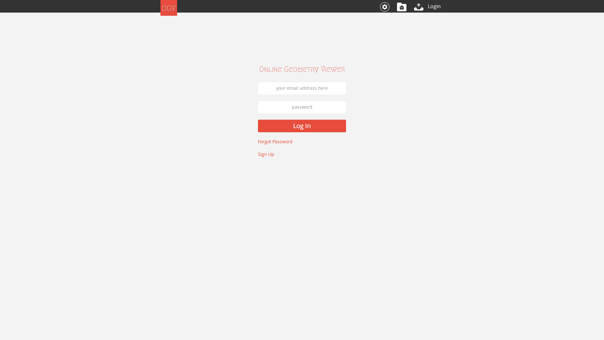
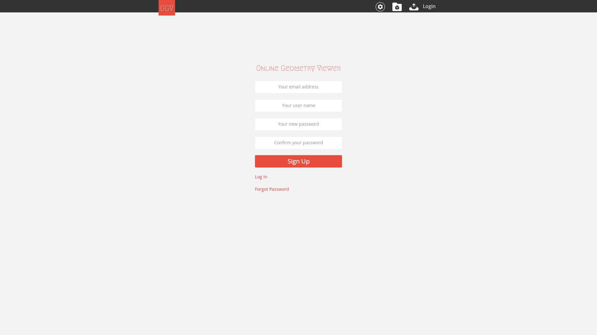
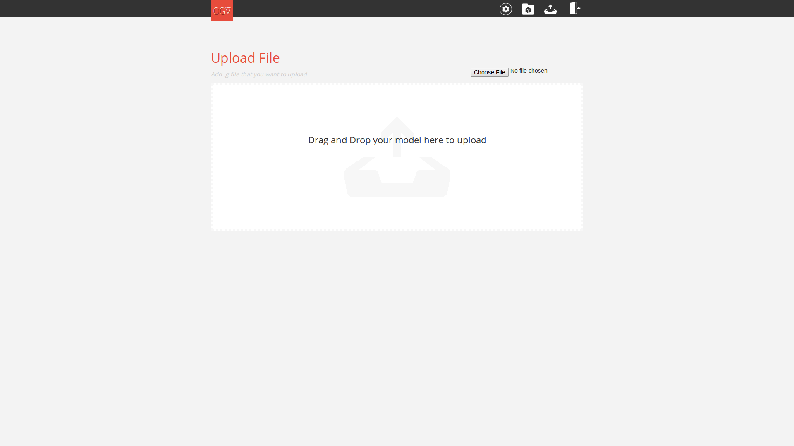
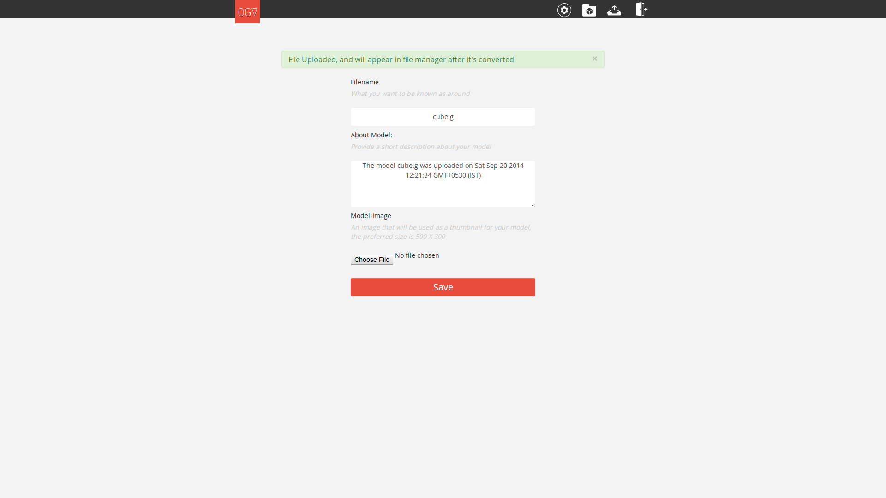
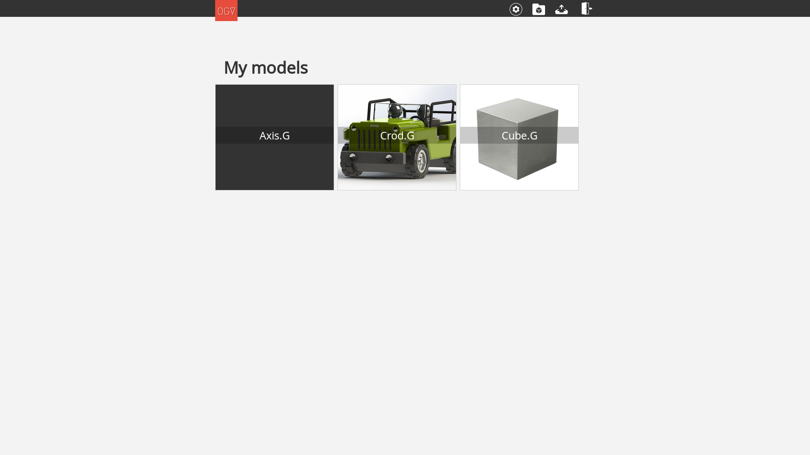
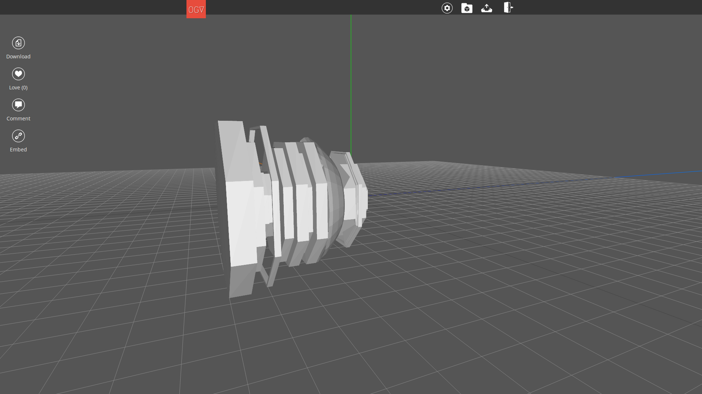

# Online Geometry Viewer

Online Geometry Viewer is an online web app, where users can upload,
view and share 3D CAD models. They can also host these models online,
can like (love) or comment on them. In a nutshell it can be looked at as
**a social blogging platform for 3D models**.

## History

OGV started as a [Google Summer of
Code](../Google_Summer_of_Code.md) project in 2013 by Harmanpreet
Singh. It was written in PHP on server side and HTML, CSS and Javascript
on the client side. It used MySQL for database. For viewing models in
web browser a webGL based library called three.js was used. Users could
upload 3D models and view them in 3D online. After the GSoC 2013 was
complete, there were discussions at BRL-CAD mailing list regarding
infrastructure of OGV. It started with moving from vanilla PHP to using
some framework and then moved towards using nodejs for OGV. Thus in GSoC
2014, another GSoC project by Inderpreet Singh aimed at moving OGV from
PHP to nodejs using a full stack framework meteorjs. Few extra features
mostly regarding making it social were also added.

## Motivation

When we built our initial HTML web pages in 90s we din't have an 
tag. Just a few years back Video was a foreign element added via third
party plugins. Today images,videos and audio all have become first class
citizens of the web. HTML 5 has introduced many new members to the
family. Canvas, WebGL and SVG being few of them. These technologies
allow us to manipulate and access 2d and 3d graphics right in the
browser. Today we have incredible power in our hands when it comes to
handling graphics on web. Even with technologies like WebGL, 3D graphics
have not yet become a part of our daily web experience. We believe in
OGV as one of those platforms that will make sharing 3D models on the
web as normal as sharing videos on youtube or images on flickr.

## Features

-   **Real Time:-** Online Geometry Viewer is written using metoerJS
    which is Real Time by default. Thus if a user comments on your
    model, it magically gets updated in real time and you can see it
    without need of any refresh or much delay.

<!-- -->

-   '''Authentication & User Profiles
    -   Email Verification: Users can easily sign up on the website by
        just filling out a small form but before they can upload
        anything, they need to verify their email Id otherwise they get
        an error. For verification an email is sent to user with a link,
        clicking on this link completes the verification.
    -   User Roles: There are currently two kinds of users in OGV, admin
        and normal. By default any user that signs up is a normal user.
        One admin user with email id (test@example.com) is automatically
        created during the first start.
    -   Profile settings: Users can change their name, add a short bio
        and a profile picture to their profile. These settings are
        easily available at a url Root_url/settings where Root_url is
        as you might have guessed the main url where OGV is hosted.

Login page of Online Geometry Viewer.
 Sign Up
page of Online Geometry Viewer.

-   **Uploader: -** OGV uses CollectionFS a file handling package
    available at Atmosphere. Using this package, OGV uploader provides
    both *drag 'n' drop* as well as input field for uploading the model
    files.

-   **File types supported:-** Currently OGV supports only .g file as
    input for uploader, in future it will support more of them.

<!-- -->

-   **Model Meta:-** Each model can have a representative image, that
    will be shown in model feed. Along with that it can also have a
    description that can accompany the image. Users can also change name
    of the model. This editing option is visible to user immediately
    after user uploads the model.

-   **Model Feeds: -** The front page of OGV is named as model feed. It
    consists of all the model posts. A model posts consists of
    representative image, model description, comments, lovemeter, model
    name and info about the user who uploaded it. Clicking on
    representative image takes user to the model viewer page.

-   **File manager:-** Every user has a file manager, where he can see
    and edit his own models.

-   **Model Viewer:-** Model Viewer is a place where user actually sees
    his models in 3D. He can pan, rotate, zoom in and out and take a
    good look at model. Here you can also get **embed code for models**
    which then you can use to show models from OGV in your website.

## Technical Information

As earlier pointed out Online Geometry viewer is built using Meteorjs
and threejs. Meteorjs handles all the application logic whereas threejs
handles the rendering part. There have been various other packages that
have been used from atmospherejs. List of packages can be found in file
named smart.json in the code.

### Directory Structure

At the top level meteor's default coding structure is used for
separating server code, client code, collections etc. Inside client
there are two folders one for templates and other views. Templates hold
the html content while views hold the logic part, the JS content for
client. All other folders are self-explanatory.

### Coding Standards

It has been tried to follow BRL-CAD hacking guide as much as possible
with exception in callback functions where the curly brackets '{' of the
function that's being passed as parameter does not start in next line
(as it's done with other functions).

## To Do List

-   Improve the code, test a lot, find bugs.
-   Set up an installation procedure that would ask for admin account's
    credentials and also other site specific settings.
-   Obj files get duplicated when converting from g to obj, need to fix
    that.
-   Show uploading percentage and converting percentage.
-   Different modes such as wireframe in model viewer.
-   List obj files in a model and an option to choose only few of all
    the obj files.
-   Allow users to change the colors in model viewer.
-   Support more file formats.
-   Allow search and selective viewing of OBJ models.
-   Ask for default account username and password during first run.
