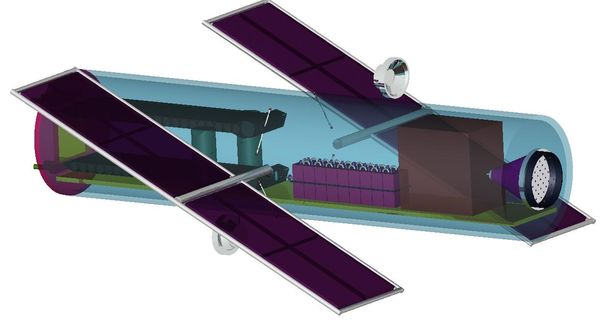
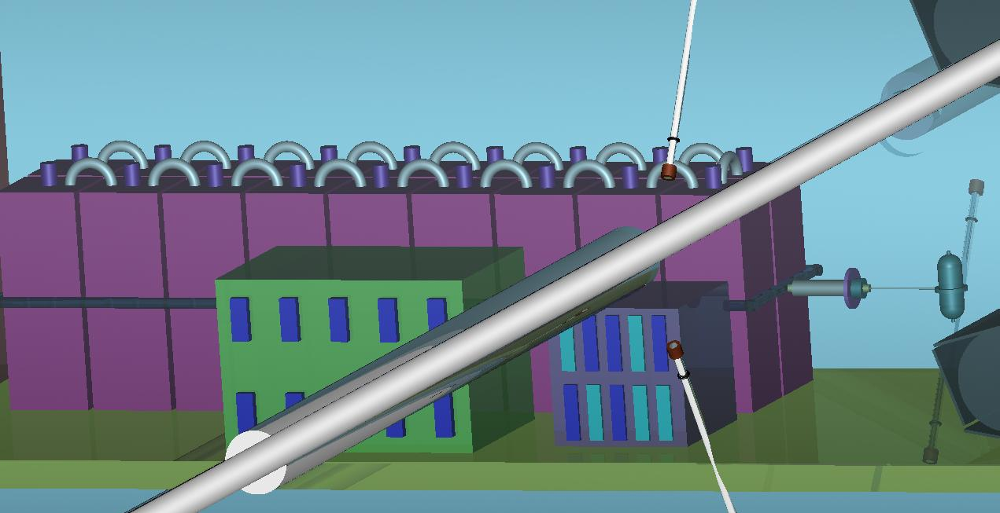
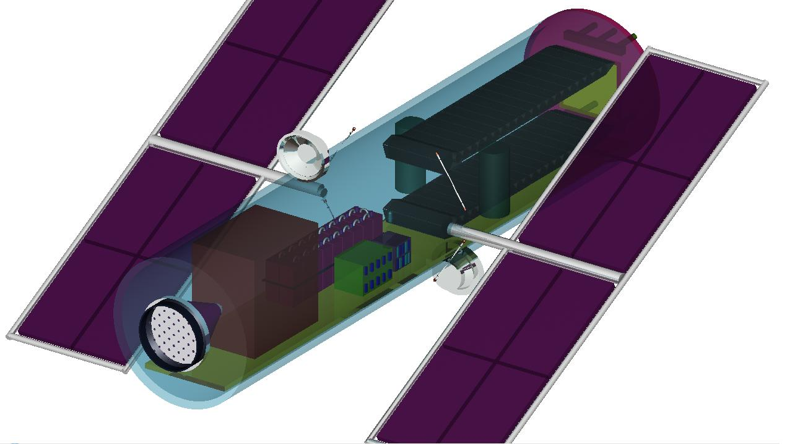
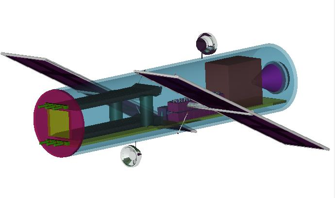
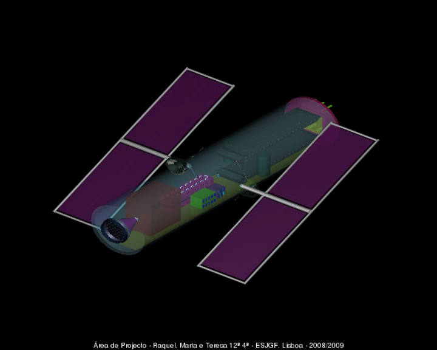

Included in following is a brief article regarding a project from within
our user community where BRL-CAD was put to use. It's a science project
from three young ladies who, in the span of just a couple months, went
from knowing absolutely nothing about modeling and BRL-CAD to creating a
CAD model of their concept with rendered images and animations. Raquel,
Marta, and Teresa used BRL-CAD for their project to model and visualize
a space vehicle they designed.

# Projecto VeRDE: Vehicle for Collecting Space Debris

`Students:  `*`Raquel`` ``Albuquerque,`` ``Marta`` ``Camões,`` ``and`` ``Teresa`` ``Leal`*  
`Teacher:   `*`Professor`` ``Luís`` ``Ferreira`*  
`School:    `*[`Escola`` ``Secundária`` ``José`` ``Gomes`` ``Ferreira`](http://www.esjgf.com)*

The project is named “Projecto VeRDE”. Translating to English may sound
strange as "Green Project", but in Portuguese 'VeRDE' is the
abbreviation of “[Veículo de Recolha de Detritos
Espaciais](http://observatoriosatalaia.blogspot.com/2009/05/projecto-verde-veiculo-de-recolha-de.html)."
In English, this is a "Vehicle for Collecting Space Debris".

The idea behind the project is that planet Earth is surrounded by space
junk that endangers astronauts and represents a very expensive risk to
space infrastructures like the International Space Station (ISS), the
Hubble Space Telescope, and other functioning satellites. The goal of
this space vehicle is 1) to reduce the amount of space debris in Low
Earth Orbit (LEO) and 2) to construct a “space truck” with
environmentally friendly components and electronic systems that already
exist in satellites and space shuttles.

The students conducted research on prospective vehicle components by
surveying various space companies’ websites that sell materials to the
National Aeronautics and Space Administration (NASA), the European Space
Agency (ESA), and others for building their space shuttles and
satellites. They discovered that there are already a variety of
components available such as:

-   Radio Frequency Ion Thruster Assembly
-   Actuator Drive Electronic
-   Laser-reactive method for disposal of small space debris
-   Protective coating for the vehicle surface
-   Solar arrays, batteries, and sensors
-   Mini-pulse tube cooler
-   Avionics integrated control and data system electronics (ICDE)
-   Magnetic torquers
-   Antenna
-   … and more ...

Using this information regarding available components, a concept vehicle
design was constructed. The three high-school teenagers then worked on
creating a representation of their concept within the BRL-CAD solid
modeling system. Without any prior knowledge of BRL-CAD, but after going
through the available introductory tutorials (even though they were in
English), they were able to create a 3d model concept prototype with
material shader properties defined. They then used BRL-CAD tools to
render animation frames for a 360 degree spinning visualization.

In orbit, space debris travels at a very high speed that can be reduced
with the help of lasers. This reduced speed lets the debris enter inside
the space vehicle. Then, with the help of a treadmill, the debris can be
clustered with a polymer. Afterwards the cluster of space junk will be
sent to the sun (the incinerator chamber) thanks to the velocity that it
gains from the treadmill plus the velocity of the vehicle.

At a science fair in 2009 among 100 other projects, Raquel, Marta, and
Teresa received an honorable mention for their project at the Electrical
Museum in Lisbon, Portugal. *"To create the design of our spaceship the
BRL-CAD was a very useful tool to create our 3D model."* - Raquel
Albuquerque

## 360 view animation

Screen capture of 360 animation:

-   [MPEG-4 Video
    File](http://brlcad.org/videos/verde/Projecto_VeRDE.mp4)
-   [MPEG-2 Video
    File](http://brlcad.org/videos/verde/Projecto_VeRDE.mpg)
-   [Ogg/Vorbis Video
    File](http://brlcad.org/videos/verde/Projecto_VeRDE.ogg)
-   [Windows Media Video
    File](http://brlcad.org/videos/verde/Projecto_VeRDE.wmv)

Included above are rendered 360 degree spinning view video animations of
the spacecraft. Individual frames were rendered with BRL-CAD's
"[rt](rt "wikilink")" ray tracer and composited with 3rd-party video
processing tools.

## Interview with Raquel

**Was this your first time using BRL-CAD?**

*Yes, it was. We didn't know anything about BRL-CAD until our teacher
told us about it and encouraged us to do the 3D model using BRL-CAD.*

**How long would you estimate it took you to learn MGED / BRL-CAD?**

*First we all trained our skills by reading and doing some models
through BRL-CAD tutorials. This first learning step probably took about
two months because we were getting used to the code, language, and
dealing with the command window.*

*I have to say that Teresa was the one who learned faster because she
got really excited with it, and I think during the whole modeling
process she became addicted to BRL-CAD! (After a couple months), I think
we were all equal in dealing with this application and became
BRL-CADaholics.*

**How long did it take your team to model the space craft? How many days
or hours did it take?**

*We begin to model in BRL-CAD in November/December 2008 and we finished
it in April 2009,we didn't finish sooner because we also had other
subjects in school.*

*We used BRL-CAD during classes about 3 hours per week, and we also
worked at home. Friday and Saturday evenings, we worked about 2 or 3
hours on average. Taking all this into account, we worked about 6 hours
per week during 4 months, so... 96 hours approximately.*

**What was the hardest aspect of using MGED / BRL-CAD?**

*Dealing with the Command Window was difficult at the beginning. We were
accustomed to moving and creating objects directly, with buttons,
arrows, and other widgets that simplify modeling actions. It appeared
more difficult, but our model became more precise due to the coordinates
and measurements that we inserted in the command window.*

*But the hardest part was making the fly-around animation. We had the
script that's in BRL-CAD's website, but it was quite difficult to
understand and modify because we had never dealt with programming
languages before. But with Sean and our teacher's guidance it became
clear.*

**What was the easiest aspect of using MGED / BRL-CAD?**

*When we got used to it, we realized that it was easier that we thought
at the beginning.*

*I would say that the boolean operations were the easy part, due to its
precision and simplicity, by constructing complex objects with basic
geometric solids.*

------------------------------------------------------------------------

Interview responses from February 16th, 2010.
