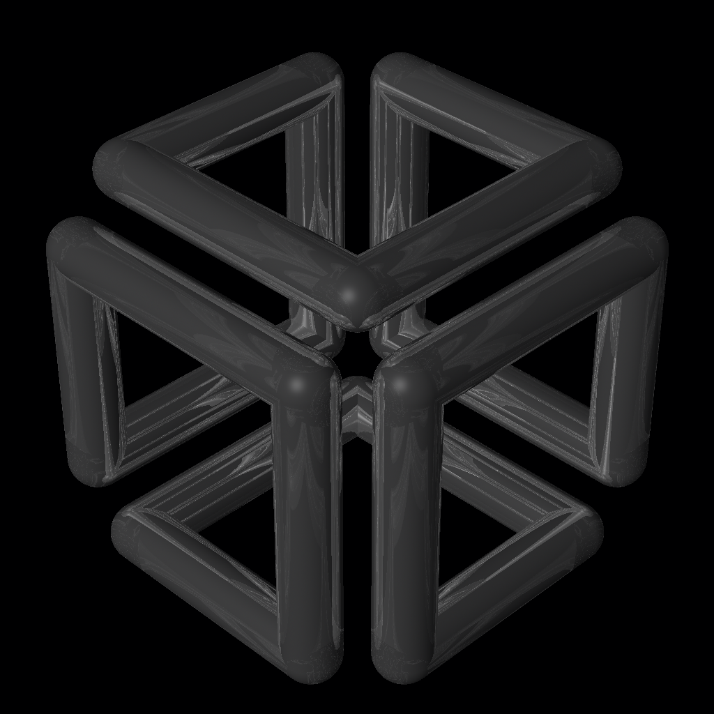
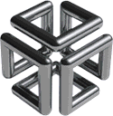

[category:tutorials](category:tutorials "wikilink")

SGI Cube logo modeled and rendered in BRL-CAD:

Included below is an example shell script that uses BRL-CAD tools to
procedurally create and render the SGI Cube (tm) logo. The script sets
up functions that create spheres (SPHs) and cylinders (RCCs) going back
and forth in various directions, creating the corresponding geometry for
each of those directions. All of the SPHs and RCCs are then combined via
a Constructive Solid Geometry (CSG) union operation and material
properties are set on the object. The script then sets the orientation
of a view that matches the original SGI logo and renders to a PNG image
file.

# Scripting MGED

BRL-CAD's solid modeling editor, MGED, will run any non-modal modeling
command provided after the name of the geometry database on the command
line. The "-c" option tells MGED to run in classic console mode. MGED
will also run a series of commands piped in or redirected to it via
standard input. This makes scripting MGED in just about any language
rather straightforward. While this example uses a shell script, it could
have just as easily have been written in another programming language.
BRL-CAD provides a C API to most of the geometry creation routines via
BRL-CAD's libwdb "write database" library and BRL-CAD's librt ray-trace
library.

As some may suspect, it is considerably more efficient to batch multiple
MGED commands together via standard input instead of re-invoking MGED
for each command. The script shown, however, runs MGED multiple times
for each of the various directions merely for the purposes of this
simplified example.

# Results

As should be evident in the resulting SGI Cube, the rendered
cube is pretty close to the original. Setting up lights in the scene and
testing out other shader parameters to more exactly match the original
SGI cube logo are left as an exercise to the reader. :-)

# The Script

    #!/bin/sh
    # Example script for creating and rendering the SGI Cube logo as BRL-CAD geometry
    # Author - Christopher Sean Morrison
    # This script is in the public domain.

    SGI="`basename $0`"
    rm -f $SGI.*

    # cube dimensions
    i=1000 ; j=800 ; radius=100

    # starting position
    x=0 ; y=0 ; z=0

    # functions to create geometry for each direction of the cube
    right ( ) {
        old=$x
        x=$((old + $2))
        mged -c $SGI.g in rcc.$1 rcc $old $y $z $((x - old)) 0 0 $radius
        mged -c $SGI.g in sph.$1 sph $x $y $z $radius
    }
    left ( ) {
        old=$x
        x=$((old - $2))
        mged -c $SGI.g in rcc.$1 rcc $old $y $z $((x - old)) 0 0 $radius
        mged -c $SGI.g in sph.$1 sph $x $y $z $radius
    }
    forward ( ) {
        old=$y
        y=$((old + $2))
        mged -c $SGI.g in rcc.$1 rcc $x $old $z 0 $((y - old)) 0 $radius
        mged -c $SGI.g in sph.$1 sph $x $y $z $radius
    }
    back ( ) {
        old=$y
        y=$((old - $2))
        mged -c $SGI.g in rcc.$1 rcc $x $old $z 0 $((y - old)) 0 $radius
        mged -c $SGI.g in sph.$1 sph $x $y $z $radius
    }
    up ( ) {
        old=$z
        z=$((old + $2))
        mged -c $SGI.g in rcc.$1 rcc $x $y $old 0 0 $((z - old)) $radius
        mged -c $SGI.g in sph.$1 sph $x $y $z $radius
    }
    down ( ) {
        old=$z
        z=$((old - $2))
        mged -c $SGI.g in rcc.$1 rcc $x $y $old 0 0 $((z - old)) $radius
        mged -c $SGI.g in sph.$1 sph $x $y $z $radius
    }

    ### CREATE THE CUBE ###

    forward 100 $i
    left    101 $j
    down    102 $i
    right   103 $i
    up  104 $j
    back    105 $i
    down    106 $i
    forward 107 $j
    left    108 $i
    back    109 $i
    right   110 $j
    up  111 $i
    left    112 $i
    down    113 $j
    forward 114 $i
    up  115 $i
    back    116 $j
    right   117 $i

    # combine all the primitives together via unions
    mged -c $SGI.g g cube.c rcc.* sph.*

    # create a region from that combination (make it occupy physical space)
    mged -c $SGI.g r cube.r u cube.c

    # assign some material properties using a cook-torrence shader
    mged -c $SGI.g mater cube.r "cook re=.8 di=1 sp=1 ri=10" 250 250 250 0

    ### RENDER THE CUBE ###

    # pipe in mged commands for setting up and saving the view to a render script
    cat <<EOF | mged -c $SGI.g
    B cube.r
    ae 135 -35 180
    set perspective 20
    zoom .25
    saveview $SGI.rt
    EOF

    # render the view we saved as a 1024x1024 image
    ./$SGI.rt -s1024

    # convert from raw pix image format to png format
    pix-png -s1024 < $SGI.rt.pix > $SGI.png

    # display the png image in a framebuffer window
    png-fb $SGI.png

    # keep the geometry database as sgi.g and the rendering as sgi.png
    mv $SGI.g sgi.g
    mv $SGI.png sgi.png

    # clean up after ourselves
    rm -f $SGI.*

  
This script is available for download from
[**here**](https://sourceforge.net/p/brlcad/code/HEAD/tree/brlcad/trunk/src/proc-db/sgi.sh).

The SGI Cube logo is a registered trademark of SGI.
