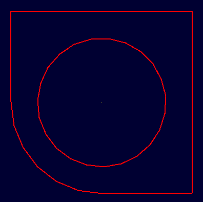

[category:tutorials](category:tutorials "wikilink")

Example sketch object created with LIBGED_MAKE_SKETCH=1:

Sketches are presently usually created and edited using the graphical
sketch editor interface. The sketch editor interface should display
whenever a sketch is created via the Create menu or whenever an existing
sketch primitive is selected for editing.

That said, it is possible using the low-level database I/O "get" and
"put" commands to create and edit a sketch. Those commands are actually
what the GUI-based sketch editor uses under the hood.

One of the better ways to describe the format of the sketch primitive is
with an example. Here's a mildly detailed sketch that contains lots of
points and several entity types. Shown in following is a case where we
have a simple sketch named "mysketch". If you run the "get" command, you
can see the overall structure:

  

    mged> get mysketch

The result is:

` sketch V {0 0 -4.999999999999999646464397e-40} A {1 0 0} B {0 1 0} VL { {0.59800664451827234557868 -4.674418604651163100527356} {2.501661129568105934595224 -1.833887043189368792894811} {6.259136212624585304808988 -3.109634551495016552280504} {2.581395348837209002823556 -3.209302325581395720632827} {5.830564784053156479615154 -5.571428571428572062984586} {5.521594684385382478808424 -1.764119601328903774728474} {2.531561461794019862736604 -0.9966777408637871316088308} {0.1594684385382059976787872 0.2691029900332225777148665} {-2.720930232558139483245441 -1.495016611295681085991305} {1.764119601328903774728474 -1.016611295681063120710519} {0.239202657807309121418271 -2.730897009966777755352041} {1.9634551495016612232547 -2.501661129568106378684433} {-1.265780730897009931368302 -2.611295681063122930964937} } SL { { line S 0 E 1 } { carc S 2 E 1 R -1 L 0 O 0 } { bezier D 3 P { 1 3 4 5 } } { carc S 5 E 6 R 1.644755298192071224505639 L 0 O 0 } { line S 6 E 7 } { bezier D 6 P { 7 8 9 10 11 12 0 } } }`

Most of that is floating point conversion goo of course, but it boils
down to what is shown in following with a V position, AxB vectors to
scale/orient the sketch, a VL list of 2D vertices, and then any number
of SL segment lists for lines, arcs, and bezier curves. Note that the
'sketch' prefix is not the name of the primitive but, rather, its type.

    sketch
    V {0 0 -4.999999999999999646464397e-40}
    A {1 0 0}
    B {0 1 0}
    VL {
       {0.59800664451827234557868 -4.674418604651163100527356}
       {2.501661129568105934595224 -1.833887043189368792894811} 
       {6.259136212624585304808988 -3.109634551495016552280504}
       {2.581395348837209002823556 -3.209302325581395720632827}
       {5.830564784053156479615154 -5.571428571428572062984586}
       {5.521594684385382478808424 -1.764119601328903774728474}
       {2.531561461794019862736604 -0.9966777408637871316088308}
       {0.1594684385382059976787872 0.2691029900332225777148665}
       {-2.720930232558139483245441 -1.495016611295681085991305}
       {1.764119601328903774728474 -1.016611295681063120710519}
       {0.239202657807309121418271 -2.730897009966777755352041}
       {1.9634551495016612232547 -2.501661129568106378684433}
       {-1.265780730897009931368302 -2.611295681063122930964937}
    }
    SL {
       { line S 0 E 1 }
       { carc S 2 E 1 R -1 L 0 O 0 }
       { bezier D 3 P { 1 3 4 5 } }
       { carc S 5 E 6 R 1.644755298192071224505639 L 0 O 0 }
       { line S 6 E 7 }
       { bezier D 6 P { 7 8 9 10 11 12 0 } }
    }

You can run the 'l' (ell not one) command on an existing sketch to get a
descriptive summary. For example, S and E reference the corresponding VL
vertex starting and ending point respectively.

    mged> l mysketch 
    mysketch:  2D sketch (SKETCH)
            V = (0 0 -0),  A = (1 0 0), B = (0 1 0)
            13 vertices
            Vertices:
             0-(0.598007 -4.67442) 1-(2.50166 -1.83389) 2-(6.25914 -3.10963)
             3-(2.5814 -3.2093) 4-(5.83056 -5.57143) 5-(5.52159 -1.76412)
             6-(2.53156 -0.996678) 7-(0.159468 0.269103) 8-(-2.72093 -1.49502)
             9-(1.76412 -1.01661) 10-(0.239203 -2.7309) 11-(1.96346 -2.50166)
             12-(-1.26578 -2.6113)

            Curve:
                    Line segment (0.598007 -4.67442) <-> (2.50166 -1.83389)
                    Full Circle:
                            center: (2.50166 -1.83389)
                            point on circle: (6.25914 -3.10963)
                    Bezier segment:
                            degree = 3
                            starts at (2.50166 -1.83389)
                            ends at (5.52159 -1.76412)
                    Circular Arc:
                            start: (5.52159, -1.76412)
                            end: (2.53156, -0.996678)
                            radius: 1.64476
                            curve is counter-clock-wise
                            center of curvature is right of the line from start point to end point
                    Line segment (2.53156 -0.996678) <-> (0.159468 0.269103)
                    Bezier segment:
                            degree = 6
                            starts at (0.159468 0.269103)
                            ends at (0.598007 -4.67442)

You can create one by writing out the sketch as one long Tcl line but
instead of "**get**", you'd use "**put**" to create/update a sketch.
Example box:

    mged> put mysketch2 sketch V {0 0 0} A {1 0 0} B {0 1 0} VL { {0 0} {1 0} {1 1} {0 1} } SL {
      {line S 0 E 1} {line S 1 E 2} {line S 2 E 3} {line S 3 E 0} }

Example box with big rounded edges (barbell shape):

    mged> put mysketch3 sketch V {0 0 0} A {1 0 0} B {0 1 0} VL { {0 0} {1 0} {1 1} {0 1} } SL {
      {line S 0 E 1} {carc S 1 E 2 R 1 L 0 O 0} {line S 2 E 3} {carc S 3 E 0 R 1 L 0 O 0} }

Finally, as of BRL-CAD 7.22 functionality was restored for creating a
default sketch (shown above) with the "make" command instead of an empty
sketch ready for editing. This default shape is can be created by
setting the LIBGED\_MAKE\_SKETCH environment variable:

    mged> set env(LIBGED_MAKE_SKETCH) 1
    mged> make sketch2 sketch
    mged> get sketch2
    sketch V {0 0 0} A {1 0 0} B {0 1 0} VL {
        {500 0} {1000 0} {1000 1000} {0 1000} {0 500} {500 500} {250 250} } SL {
        { carc S 4 E 0 R 500 L 1 O 0 } { line S 0 E 1 } { line S 1 E 2 }
        { line S 2 E 3 } { line S 3 E 4 } { carc S 6 E 5 R -1 L 1 O 0 } }
    mged> l sketch2
    sketch2:  2D sketch (SKETCH)
        V = (0 0 0),  A = (1 0 0), B = (0 1 0)
        7 vertices
        Vertices:
         0-(500 0) 1-(1000 0) 2-(1000 1000)
         3-(0 1000) 4-(0 500) 5-(500 500)
         6-(250 250)

        Curve:
            Circular Arc:
                start: (0, 500)
                end: (500, 0)
                radius: 500
                curve is counter-clock-wise
                center of curvature is left of the line from start point to end point
            Line segment (500 0) <-> (1000 0)
            Line segment (1000 0) <-> (1000 1000)
            Line segment (1000 1000) <-> (0 1000)
            Line segment (0 1000) <-> (0 500)
            Full Circle:
                center: (500 500)
                point on circle: (250 250)

There is, of course, plenty of room for improvement when it comes to
creating, editing, and managing sketches and sketch data. Contributions
are always welcome!
