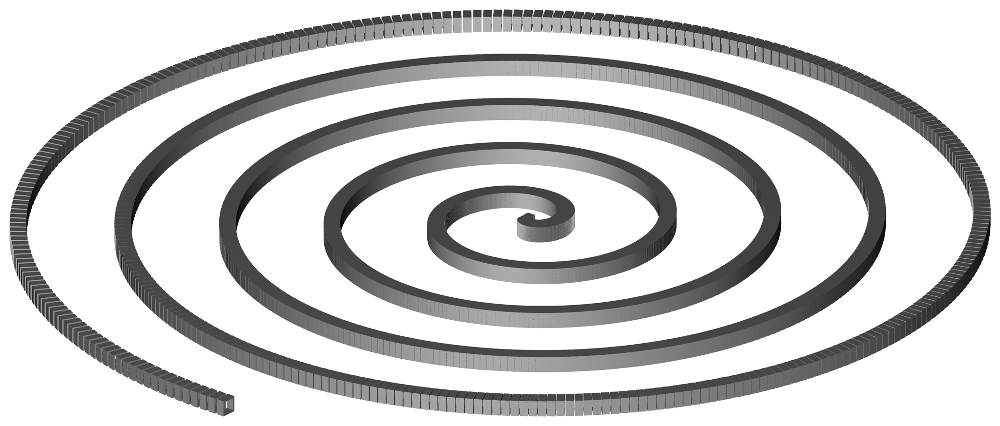

[category:tutorials](category:tutorials "wikilink")

Spiraling boxes, modeled with a Perl script and rendered in BRL-CAD:

Included below is an example Perl script that uses BRL-CAD tools to
procedurally create and render a spiral of boxes. The script creates
boxes (RPPs) with holes cut out of them as an underlying shape pattern,
then replicates that shape around in an outward spiraling pattern. The
shapes are then combined together into a proper region, and a resulting
render is shown.

# Scripting MGED with Perl

BRL-CAD's solid modeling editor, MGED, will run most commands provided
after the name of the geometry database on the command line. The "-c"
option tells MGED to run in classic console mode without a GUI, which is
perfect for scripting from most any language including Perl. First in
Ruby written by, Dwayne Hans, 2016.

This script takes advantage of the fact that it is considerably more
efficient to batch multiple MGED commands together instead of
re-invoking MGED multiple times. It builds up a list of commands for one
segment, then groups them together in batches of 100 before running
MGED. This avoids considerable operating system and process
initialization overhead, allowing the script to run orders of magnitude
faster than if the segments were created one at a time.

# The Script

    #!/usr/bin/env perl
    #
    # Generates a 3D model of a spiral via BRL-CAD.
    # This script is in the public domain.
    #
    ######################################################################

    use warnings;
    use constant PI => 4.0 * atan2(1, 1);

    $t_min = 0;
    $t_max = 10 * PI; # 2*PI per revolution so 5 revolutions
    $granularity = 1500; # this is the total number of segments

    # This is the basic hollowed-out box shape:
    # in 1.s rpp 0 .5 0 1 0 1
    # in 2.s rpp -2 2 0.1 0.9 0.1 0.9
    # 1.s - 2.s

    # dimensions of the box
    $xmin = 0;
    $xmax = .5;
    $ymin = 0;
    $ymax = 1;
    $zmin = 0;
    $zmax = 1;

    # Thickness of the walls.
    $thickness = .1;

    # You want this going through so that you can cut a hole through the object.
    $xmin2 = -2; # $xmin+$thickness;
    $xmax2 = 2; #$xmax-$thickness;
    $ymin2 = $ymin + $thickness;
    $ymax2 = $ymax - $thickness;
    $zmin2 = $zmin + $thickness;
    $zmax2 = $zmax - $thickness;

    # default keypoint is bottom corner, so calculate the box base center
    $xkey = ($xmax - $xmin) / 2.0;
    $ykey = ($ymax - $ymin) / 2.0;

    # Future improvement possibility: make it spiral downward.

    # generate the spiral
    $i = 0; # $i is the counter.
    $command = "";
    for ($j = $t_min; $j <= $t_max; $j += $t_max / $granularity, $i++) {
      # x/y position of the box (not exact)
      $x = $j * cos($j); $y = $j * sin($j);

      # here we calculate the angle to rotate the box.
      # we add 6 degrees "fudge factor" since we're not calculating an exact x/y
      $ang = 96.0 - atan2($y, $x) * 180.0 / PI;

      # command to create a hollowed box segment, rotate, and move it into place
      $command .= "in box_$i.s rpp $xmin $xmax $ymin $ymax $zmin $zmax ;
                   in hole_$i.s rpp $xmin2 $xmax2 $ymin2 $ymax2 $zmin2 $zmax2 ;
                   comb seg_$i.c u box_$i.s - hole_$i.s ;
                   draw seg_$i.c ;
                   oed / /seg_$i.c/box_$i.s ;
                   keypoint $xkey $ykey 0 ;
                   rot 0 0 $ang ;
                   translate $x $y 0 ;
                   accept ;";

      # create 100 segments at a time to reduce process initialization overhead
      if ($i % 100 == 0) {
        print "#$i at\tx = $x\ty=$y\n\t$command\n\n";
        `mged -c spiral.g \'$command\'`;
        $command = "";
      }
    }
    # pick up any remaining segments if $granularity isn't a multiple of 100
    if ($command ne "") {
      print "#$i at\tx = $x\ty=$y\n\t$command\n\n";
      `mged -c spiral.g \'$command\'`;
      $command = "";
    }

    print "Grouping the spiral segments together into one shape...(please wait)...";
    `mged -c spiral.g 'g spiral.c *.c'`;
    print "done.\n";

    print "Making the shape into a solid region (so it has mass and occupies space)...\n";
    `mged -c spiral.g 'r spiral.r u spiral.c'`;

    print "All done.\n=n";

There are, of course, many ways that this script could be improved upon
such as spacing the segments out evenly. For example, there are minor
issues with the way the script calculates the position and rotation of
individual box segments (hence the fudge factor), but it does the job
well enough for this demonstration.

This script was originally written by [Bryan
Bishop](http://heybryan.org) and is available for download from
[**here**](https://sourceforge.net/p/brlcad/code/HEAD/tree/brlcad/trunk/src/proc-db/spiral.pl).
