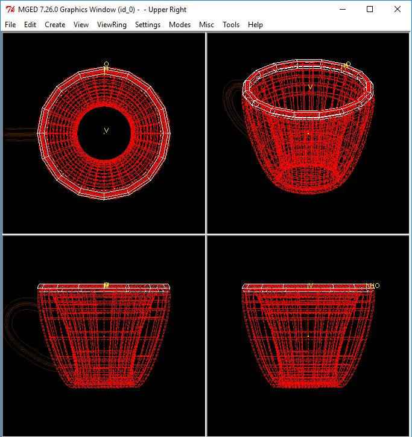
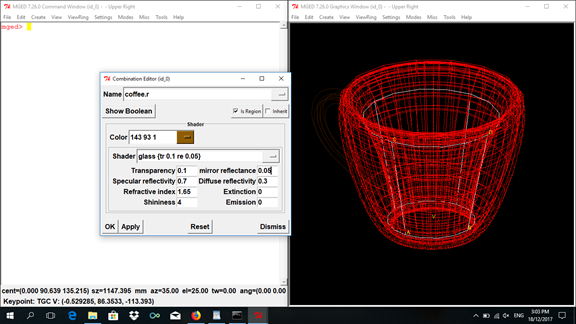
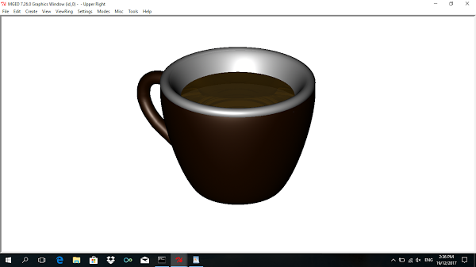

 <b>Process</b> 

<b>1. Outside of the cup</b>

Use "eto" for the cup so that it will have more rounder edges and
middle. Name it <i>cup.s</i>. Then after that, adjust the shape's width
and set the "D" if you want to make the edges and middle more rounder.
Click "Apply" then to put some color on it, make it into a region first
and named it <i>cup.r</i> then go to the Combination Editor and input
"53 20 0" (dark brown color) on the Color GUI.

<figure>

</figure>

<b>2. Handle</b>

Create <i>handle.s</i> and use "pipe" for the handle so you can bend it
to a more unique shape than the torus by clicking the "Append Point"
then select the parts of the handle you wanted to add new points with.
Adjust the new points to the desired shape and position by clicking
"Move Point" and click the place where you want the points to be moved.
The problem on this is that the adjusted points leave creases on the
shape which gives it a rougher appearance and needs a lot of adjustments
to lessen the creases. Do the same way on how put color on <i>cup.r</i>
only name the new region <i>handle.r.</i>

<figure>

</figure>

<b>3. Inside of the cup</b>

To give it a white inside part, copy the shape of the outside cup (cp
cup.s inside.s) and name it inside.s. Adjust its "r", and "Rotate C"
until it is smaller and thinner than the outside cup. The space inside
of the cup might now looked too small for a cup and also that
<i>cup.r</i> would hide parts of <i>inside.s</i> so make a region of
<i>cup.r</i> and <i>inside.s</i> as follows:

`r inside.r u inside.s - cup.r`

<figure>

</figure>

<b>4. Rim</b>

Place a torus for a rim so that the white color would overlap the brown
cup rim and give it a nicer appearance. Adjust "Radius 1" to fit it to
the cup's circumference, and "Radius 2" to fit it to the cup's width.
After that make it into a region named <i>rim.r</i>.

<figure>

</figure>

<b>5. Base</b>

Use "sph" for the base then set its "C" to make it flatter. Make it into
a region named <i>base.r</i> then type "53 20 0" on the Color GUI in
Combination Editor.

<figure>

</figure>

<b>6. Coffee (optional)</b>

If you want to put coffee in your mug, use "rcc" then adjust its "H"
"A,B" and "C,D" to fit in the cup. Name it <i>coffee.s</i>. Make it into
a region and name it <i>coffee.r</i> then input "143 93 1" (light brown
color) on the Combination Editor and set the Shader to "glass". Set the
Mirror Reflectance to 0.05 to give it a liquid appearance and, to give
it a more coffee-like appearance, set the Transparency to 0.1. The
problem on setting the transparency to 0.1 rather than 0 is that the
Command Window would "complain" on overlapping.

<figure>

</figure>

<b>7. Combining all regions</b>

Combine all the regions and name it <i>coffeemug.c</i> using this
command:

`comb coffemug.c u cup.r u inside.r u handle.r u rim.r u base.r u coffee.r`

or without <i>coffee.r</i>:

`comb coffemug.c u cup.r u inside.r u handle.r u rim.r u base.r`

<b>8. Raytracing the design</b>

Now, Blast your design first before raytracing:

`B coffeemug.c`

Then raytrace your design using the Raytrace GUI in the File Menu and,
for best results, set the Background Color to white, the view in
"az35,el25", and also the Framebuffer option to "Overlay".

<figure>

</figure>

with coffee

without coffee
