# Community Bonding Period

------------------------------------------------------------------------

-   Discussion of a project on FreeCAD forum and on IRC.
-   Compile Qt plugin of FreeCAD to load FreeCAD widgets in QT creator.
-   Understanding the code of
    [ArchRebar](https://github.com/FreeCAD/FreeCAD/blob/master/src/Mod/Arch/ArchRebar.py)
    object.
-   Added PlacementList property to the rebar object. The PlacementList
    holds the placement of all the rebars. [Pull
    request](https://github.com/FreeCAD/FreeCAD/pull/780).

------------------------------------------------------------------------

# Coding Period

------------------------------------------------------------------------

**1 June** : Today, officially my all exams are over and from now
onwards I will give my 100 percent to my GSoC project. I have written
TODO tasks for upcoming two weeks.

**2 June** : I have found a couple of shortcomings
[bugs](https://forum.freecadweb.org/viewtopic.php?f=8&t=22760#p176641)
in my scripts which I have shared before community bonding period. Also
discussed these bugs with my mentor.

**3 June** : Yesterday, Yorik (my mentor) gave some suggestion that how
to fix these
[bugs](https://forum.freecadweb.org/viewtopic.php?f=8&t=22760#p176641).
Today, I was trying to make the logic which will work on any type of
reinforcement and trying to implement that logic through programming.
Also, explored functions like `face.normalAt()`, `face.CenterOfMass()`.

**4 June** : Today, I designed the taskpanel UI of straight rebar in
Qtcreator by using FreeCAD
widgets.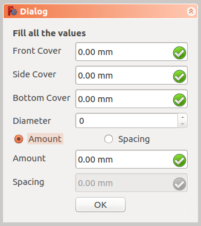

**5 June** : Today, I have integrated the task panel UI of straight
rebar with backend scripts. This script will take input values from task
panel and then pass input values to `makeStraightRebar()` function which
will create reinforcement of straight rebar in the structural element.
For more detail, here are my
[commits](https://github.com/amrit3701/FreeCAD-Reinforcement/commit/21c427118a7e502a9a04240fe8ea10661ff45794).

**6 June** : Today, I have shared my scripts to the mentor for review.
Here are the reviews:
<https://forum.freecadweb.org/viewtopic.php?f=8&t=22760&sid=edc3a89eda2a484d1af55128b1781e6b#p177059>

**7 June** : Today, I have learnt that how to add an image in the dialog
box using PySide. For eg. I simply added QLabel object at the top of the
dialog box using Qtcreator and then use
`label.setPixmap(QtGui.QPixmap(`<path>`))` command to add an image.
Also, followed some links/tutorials to learn Inkscape.
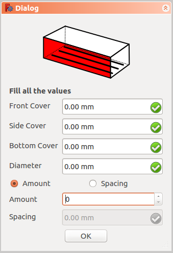

**8 June** : Today, I have added checks to my Python code. These checks
will verify that user have selected the face or not and if only user
have selected a single face then only rebar object is created.
[Commit](https://github.com/amrit3701/FreeCAD-Reinforcement/commit/c329b018a2c28538174f006ac55f057bf35f5de0)

**9-10 June**:

-   Discussed my approach with structural engineers and found the right
    way to create reinforcement in the structural element.
    [Link](https://forum.freecadweb.org/viewtopic.php?f=8&t=22760&p=177570#p177570)
-   Sent [pull request](https://github.com/FreeCAD/FreeCAD/pull/811) to
    FreeCAD (master).

**11 June**: Not done too much, finalised what has done till now and
made a planned for things coming in the next weeks.

**12 June**: Discussed following things with Yorik:

-   How to get previous values (when reinforcement is created) when a
    user wants to re-edit the current reinforcement?

<!-- -->

-   Add properties to the rebar object.
-   Constraint the sketch of the rebar object.

<li>

How we can check the given sketch is rectangular or not?

</li>
</ul>

**13 June**:

-   Understand functions present in a
    [file](http://free-cad.sourceforge.net/SrcDocu/df/df4/fcgeo_8py_source.html).
-   Added support when Structural element is derived from Sketch object.
-   Defined `EdgesAngle(edge1, edge2)`, `checkRectangle(edges)`
    functions.

Here is the
[commit](https://github.com/amrit3701/FreeCAD-Reinforcement/commit/1c2b0c299eb91592ab2c6011ff50535e43438eaf).

**14 June**:

-   Solved a issue related to the placement of rebar. For e.g., Rebar
    position was not at correct position when structural element not
    located at orign. So, to fix this problem I have subtracted
    placement vector of structural element to the coordinates of rebar
    sketch.
-   Defined `getBaseObject(obj)`, `getBaseStructuralObject(obj)`
    functions.
-   Refactored the code by creating the seperate file "Rebarfunc.py".
    This file contains basic functions which will use for creating any
    type reinforcement in the future.

**15-16 June**:

-   Sent [pull request](https://github.com/FreeCAD/FreeCAD/pull/822) to
    FreeCAD master. Detail of PR: Defined custom function
    (setpropertyRebarShape) in the _ViewProviderRebar class. This
    function will add properties to the instance of _ViewProviderRebar
    class as per according to the rebar shape.
-   Wrote code so that user will re-edit the rebar through rebar dialog
    box. To implement this, I have defined two new methods
    `editDialog()` and `editStraightRebar()` in the StraighRebar.py
    file.
-   Also added a couple of methods (`getTrueParametersOfStructure()`,
    `getParametersOfFace()`) in the Rebarfunc.py file.
-   Removed minor bugs in the existing code.

Here is the
[commit](https://github.com/amrit3701/FreeCAD-Reinforcement/commit/7efc536ae2be260496b36bc44ba95fadd94626ab).

**17 June**:

-   Fix bug and added comments in the StraightRebar.py and Rebarfunc.py
    files.
    [Commit](https://github.com/amrit3701/FreeCAD-Reinforcement/commit/f2fc06a7071d75f6153421f88bf3ec57fb3fe41f)
-   Updated README.md
    [Commit](https://github.com/amrit3701/FreeCAD-Reinforcement/commit/001ebb1e55025a0cac8ac7998657a196b992626a)
-   Imporoved of UI of dialog box of straight rebar and also set tab
    order on input fields of straight rebar dialog
    box.[Commit](https://github.com/amrit3701/FreeCAD-Reinforcement/commit/29719cee9a696884a23aa8a951b3b8728a36e04f)

**18 June**: Today, a whole I was struggling to find a reason behind why
rebar created in a wrong direction when user set an option "remove
external geometry of base sketches when needed" in the Arch preferences.
Finally, I found a reason behind this bug and then fix it.
[Commit](https://github.com/amrit3701/FreeCAD-Reinforcement/commit/0397796b38008254f3d60168f05bd3d3582dde80)

**19 June**:

-   Fix bug when user created reinforcement more than one times on the
    same structural element, rebar was not created at right position.
    [`Commit`](https://github.com/amrit3701/FreeCAD-Reinforcement/commit/2e32eed6aefb2fd8f0d209148ae9eb8287ca4e4b)
-   Discussed with Yorik on IRC, that where we can add properties of
    rebar and then after discussion I am added all the properties to a
    specific rebar shape as per according to rebar shape.
    [Commit](https://github.com/amrit3701/FreeCAD-Reinforcement/commit/8b4213987b9ab0402999fab673bce27c4c330678)
-   Created the UI dialog box for U-Shape rebar
-   Also wrote a code for creating U-Shape rebar.
    [Commit](https://github.com/amrit3701/FreeCAD-Reinforcement/commit/24e195d94d46f6c4909d75f7ad9f5a160232fd63)

**20 June**:

-   Implemented property top cover in U-Shape rebar instead of bent
    lenght.[Commit](https://github.com/amrit3701/FreeCAD-Reinforcement/commit/02966c63e3ce4accae512c20561e3a2bfaf2d9db)
-   Made an icon for U-Shape rebar and also improved Straight rebar
    icon.

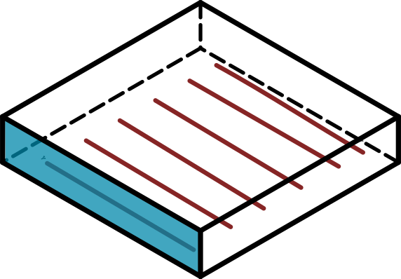
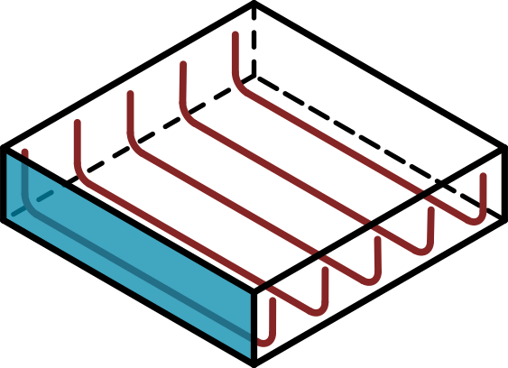

</ul>

**21 June**:

-   Added two FreeCAD command (`Arch_Rebar_Straight`,
    `Arch_Rebar_UShape`) in the RebarTools.py file.
    [Commit](https://github.com/amrit3701/FreeCAD-Reinforcement/commit/30d7b60182c1fda8f6310aeee0da1c3a94ba4e69)

**22 June**:

-   Changed a title window heading of dialog box.
-   Used standard button instead of custom button
-   Assigned tasks which I will complete in the coming week.

Here is a
[commit](https://github.com/amrit3701/FreeCAD-Reinforcement/commit/5d9467eacdc2c769703c37dfdb4bacaee6cad3b4).

**23 June**:

-   Added checks when sketch support is empty.
    [Commit](https://github.com/amrit3701/FreeCAD-Reinforcement/commit/70dbced59d68cef6c13c07b238b8a0e3cee3b4fb)
-   Learnt how to Constraint Internal Angle between two lines.
    `(https://www.freecadweb.org/wiki/Constraint_InternalAngle)`
-   Added comment to code.
    [Commit](https://github.com/amrit3701/FreeCAD-Reinforcement/commit/cbef50b7c4484a8e9002a2b9af18e0b1c38f2b29)
-   Discussed about license with Yorik.

**24-25 June**:

-   Create a UI of dialog box of stirrup shape rebar.
    [Commit](https://github.com/amrit3701/FreeCAD-Reinforcement/commit/46c7ea56737bb3c9852459355fb5f54fa6731666)
-   Experimenting how to create non-planar rebar because current FreeCAD
    reinforcement system is fully dependent on sketch which is strictly
    based on 2D. Then found a solution to create non-planar rebar by
    passing wire(may be planar or non-planar) to `Arch.makeRebar()`
    function.
-   Also found some bugs which will come by using wire profile to create
    rebar.
    [Link](https://forum.freecadweb.org/viewtopic.php?f=8&t=23113)

**26-27 June**:

-   Discussed about old and new properties of Rebar object like distance
    and direction properties and implemented on Rebar object with Yorik
-   Derived formula to get points when length and angle is given

**28 June**:

-   Wrote code of Stirrup.py file.
    [Commit](https://github.com/amrit3701/FreeCAD-Reinforcement/commit/eb9c65954c9f1d22b1c8dc881ba4d0eaa1be7515)
-   Discussed doubts regarding stirrup with Yorik on IRC.

**29 June**:

-   Learnt all the mathematical concepts of stirrup and derives formulas
    to find rounding length.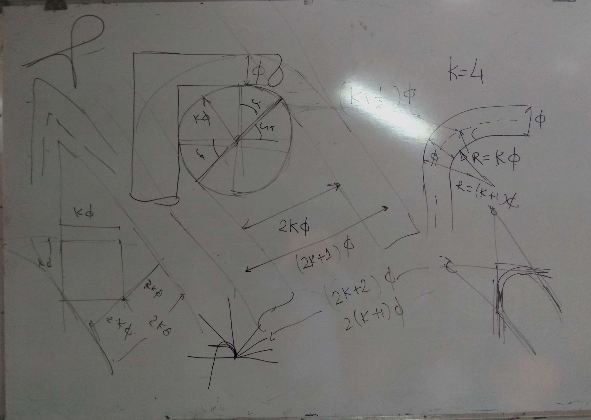
-   Embedded dropdown list icons in my code.
    [Commit](https://github.com/amrit3701/FreeCAD-Reinforcement/commit/1a45628fc4478601eac357dcf0455be04dd8e909)

**30 June**:

-   Today, I have passed my first evaluation and got some good comments
    from my mentors.
-   I have wrote the code for stirrup rebar.
    [Commit](https://github.com/amrit3701/FreeCAD-Reinforcement/commit/660cd715990af7ae1d94d45935b4ac82676874cf)

Here are the few screenshots of stirrup created from my code:
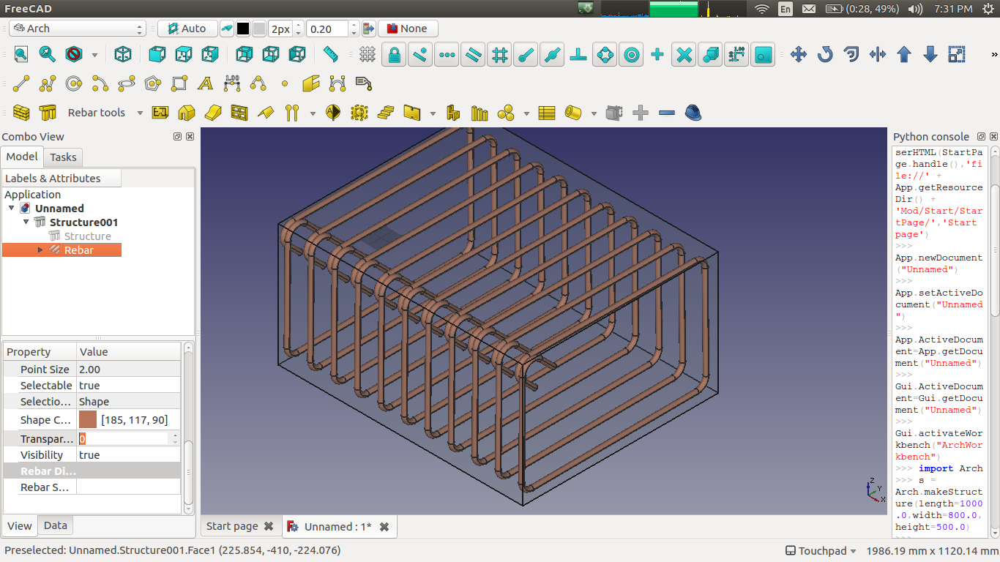
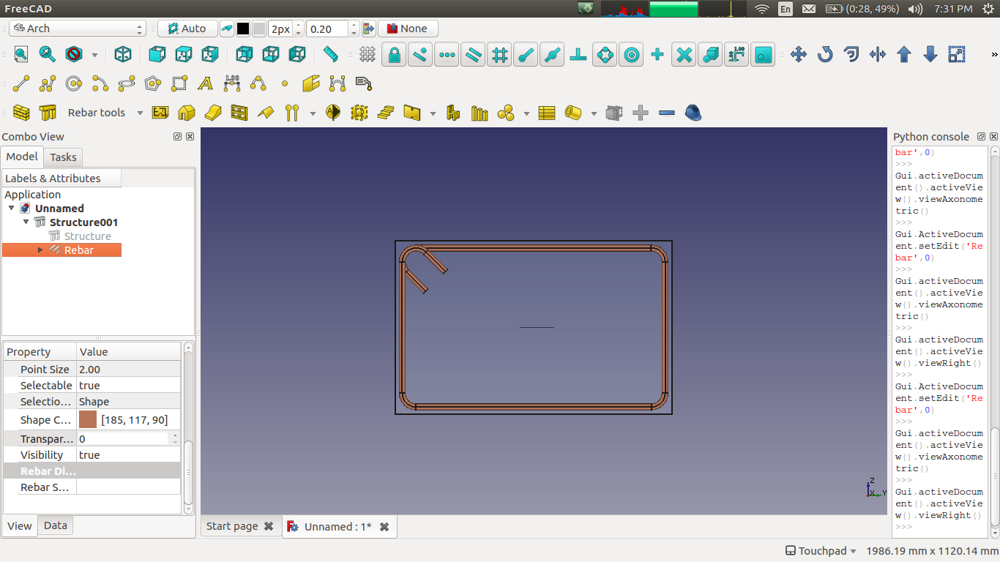

**1 July**:

-   Refactoring the existing code by added two seperate functions which
    calculates points of Straight and U-Shape rebar.
    [Commit](https://github.com/amrit3701/FreeCAD-Reinforcement/commit/cdd5d8707db0eb9aa0ba28b9e3703ac3e9261e7b)
-   Added License to all the files.
    [Commit](https://github.com/amrit3701/FreeCAD-Reinforcement/commit/857f0ac46fb3a964169690a772e4904bf80f937a)

**2 July**:

-   Read the code of
    [TaskThickness.cpp](https://github.com/FreeCAD/FreeCAD/blob/master/src/Mod/Part/Gui/TaskThickness.cpp)
    file.
-   Implemented "Pick Selected Face" button in the straight rebar.
    [Commit](https://github.com/amrit3701/FreeCAD-Reinforcement/commit/e59ab8d65e762432152b3213463998daffef9c67)

**3-4 July**:

-   Introduced new property i.e. Bent Factor property in Stirrup.
    [Commit](https://github.com/amrit3701/FreeCAD-Reinforcement/commit/6f013f2f7c8dac4175ef72101e4ad14e24185bfb)
-   Discussed about bar distribution on forum and IRC.

**5-6 July**:

-   Implementated "Pick Selected Face" button in all rebar shapes.
    Commits:
    [1](https://github.com/amrit3701/FreeCAD-Reinforcement/commit/f2dd3c23381af4a827605c573304dc78d161bae5),
    [2](https://github.com/amrit3701/FreeCAD-Reinforcement/commit/c19c7a91281ac07eba96106b753b237df4a8d515)
-   Updated `getParametersOfFace()` function according to Yorik's commit
    in the FreeCAD master.
    [Change](https://github.com/amrit3701/FreeCAD-Reinforcement/commit/c19c7a91281ac07eba96106b753b237df4a8d515#diff-2b102af403a2e140e40c12a0d845efd2R143)
-   Introduced new custom spacing property in the Rebar object.

**7 July**:

-   Sent PR to FreeCAD master and Yorik merged my PR. [Pull
    Request](https://github.com/FreeCAD/FreeCAD/pull/862)
-   Added PickFaceSelectedLabel in all UI files.
    [Commit](https://github.com/amrit3701/FreeCAD-Reinforcement/commit/408b0244b2a8b18ca4ddc62c2764e30b25678a8e)
-   Added Stirrup Rebar icon in dropdown list.
    [Commit](https://github.com/amrit3701/FreeCAD-Reinforcement/commit/4421504b05ea4c095802c887f578029641a8e98c)

**8 July**:

-   Designed a UI for rebar distribution.
    [Commit](https://github.com/amrit3701/FreeCAD-Reinforcement/commit/8f77ded1cd11cbd76a08450c0f7b1736f186bf04)
-   Saw rebar distribution in Tekla Structures and also found some bugs
    in Tekla rebar distribution.

**9 July**:

-   Wrote code for implementing rebar distribution.
    [Commit](https://github.com/amrit3701/FreeCAD-Reinforcement/commit/bcc2ea75e92a775e2cbefa7dbba118cff3150877)

**10-11 July**:

-   Made an icon for dialog box of rebar distribution.
    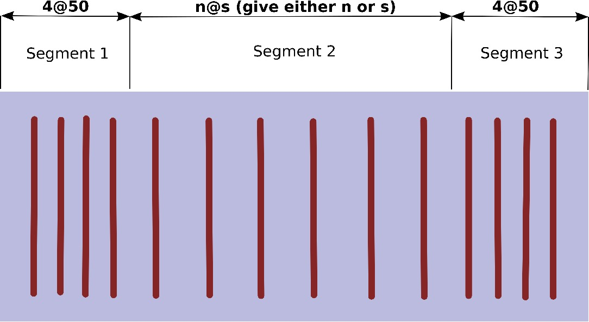
-   Added button for custom spacing in straight rebar dialog box and
    also added few function in RebarDistribution.py file.
    [Commit](https://github.com/amrit3701/FreeCAD-Reinforcement/commit/543aab29000d8766a26fb27b3b83881c6aab012f)
    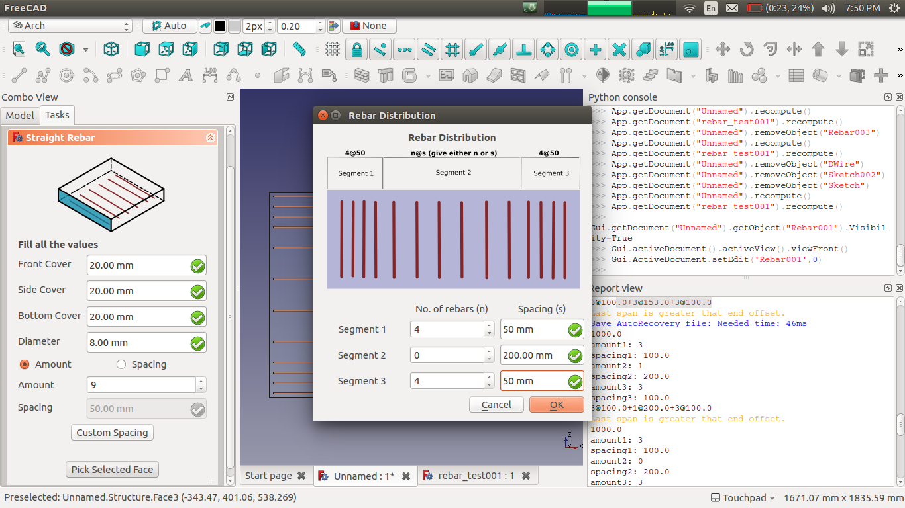
-   Implemented uniform spacing in all rebar dialog box with a proper
    way.
    [Commit](https://github.com/amrit3701/FreeCAD-Reinforcement/commit/8a3672dc88deb395706773b8291e162b1a1e5f3d)

**12 July**:

-   Discussed about rebar distibution dialog box on the [FreeCAD
    forum](https://forum.freecadweb.org/viewtopic.php?f=8&t=22760&start=100#p182185)
    with all FreeCAD testers and also explained how rebar distribution
    works.

**13-14 July**:

-   Added support to rebar add-on when structure element is derived from
    any object(like wire, sketch etc.).
    [Commit](https://github.com/amrit3701/FreeCAD-Reinforcement/commit/497e29985815d3a1426ab83a6a8076e8584b980d)
-   Also, read about direction of cosine and exploring properties of
    edges, faces and boundingbox.

**15 July**:

-   Added comments in Rebarfunc.py file.
    [Commit](https://github.com/amrit3701/FreeCAD-Reinforcement/commit/6b63b9d5a068625a2a3e0a93c8bdd1c4deb77db7)
-   Fix bug when user selects face whose length and width are equal.
    [Commit](https://github.com/amrit3701/FreeCAD-Reinforcement/commit/0faed773ca38eb2dfe1602d4bbd2a5c318c82821)
-   As said my mentor, I added line in the code which change Label
    property to reflect rebar type(Straight Rebar, Stirrup Rebar etc) in
    the tree view.
-   Create UI file for L-Shape rebar.

**16 July**:

-   Wrote code of L-Shape rebar.
    [Commit](https://github.com/amrit3701/FreeCAD-Reinforcement/commit/6331f87d3c56886c6bd3eb8e13eb39b2e2135b03)
-   Create differents icons of L-Shape rebar which shows orientation of
    rebar.
    [Commit](https://github.com/amrit3701/FreeCAD-Reinforcement/commit/99bfef2fb6a337b04bfbc15d6e3285970d901073)
-   Added return statement in all make rebar functions.
    [Commit](https://github.com/amrit3701/FreeCAD-Reinforcement/commit/871aaff82c4e9507d88514a79cdc21269c96decc)
-   Also screencast a video of L-Shape rebar.
    [Video](https://youtu.be/qPIbB-TlMHY)

**17-19 July**:

-   Imporved geometry of stirrup rebar.
    [Commit](https://github.com/amrit3701/FreeCAD-Reinforcement/commit/122d23d147f21fbb8b84fec23b97f9dbe9346910)
-   Defined \[code\]translate()\[/code\] function in Rebarfunc.py file
    as said by Yorik.
-   Discussed many things with Yorik on IRC related to Rebar-Addon.

**20 July**:

-   Added orientation property and separated side cover into parts i.e.
    left and right side cover.
    [Commit](https://github.com/amrit3701/FreeCAD-Reinforcement/commit/27a4deb6620068bf580271892148d1452ae06277)
-   Separate side cover of stirrup into left, right, top and bottom side
    cover.
    [Commit](https://github.com/amrit3701/FreeCAD-Reinforcement/commit/082bfc9d04931c365099425fa486cba0eb4b3919)

**21-22 July**:

-   Created different icons of U-Shape rebar according to the
    orientation property.
    [Commit](https://github.com/amrit3701/FreeCAD-Reinforcement/commit/d4ba112864c43f30b67bd12fd185eda948a9a647)
-   Separated side cover of L-Shape rebar into left and right side
    cover.
    [Commit](https://github.com/amrit3701/FreeCAD-Reinforcement/commit/def951eea4480af2011cc519ae8606ec1ebc6957)
-   Introduced many new properties in straight rebar. The fields present
    in the straight rebar dialog box is changing according to
    orientation and cover along
    property.[Commit](https://github.com/amrit3701/FreeCAD-Reinforcement/commit/901d3ea1b6cf5f794ae3ceb48d0ec84d6ae1f532)

**23 July**: Didn't do too much just create icon of straight rebar when
orientation is set to vertical.
[Commit](https://github.com/amrit3701/FreeCAD-Reinforcement/commit/fca5da2fee3781fe11bc2a557382f56c5afcb3dc)

**24 July**: Discussed many new things regarding the drawing of a
structural element with Yorik on IRC.
<https://forum.freecadweb.org/viewtopic.php?f=8&t=22760&start=150#p183274>

**25 July**: Found one bug in Chakkree's script and fixed it. Here is
the discussion: [Forum
Link](https://forum.freecadweb.org/viewtopic.php?f=8&t=22760&start=170#p183866)

**26 July**:

-   I watched Regis stair reinforcement
    [video](https://youtu.be/HWLgcaM5y_g).
-   Fixed a bug regarding the direction of stirrup expand when a user
    selected base face of the structural element.
    [Commit](https://github.com/amrit3701/FreeCAD-Reinforcement/commit/4ff86e3ef802e8cc8f0697e358817673e4bff3cd)

**27-29 July**:

-   Created UI for bent up rebars.
    [Commit](https://github.com/amrit3701/FreeCAD-Reinforcement/commit/acbae03332d9482ef6afbbb5ef83e7731aac3c41)
-   Implemented bent up rebar.
    [Commit](https://github.com/amrit3701/FreeCAD-Reinforcement/commit/33ebe406b233ed6ae25829299dc914f1d5115768)

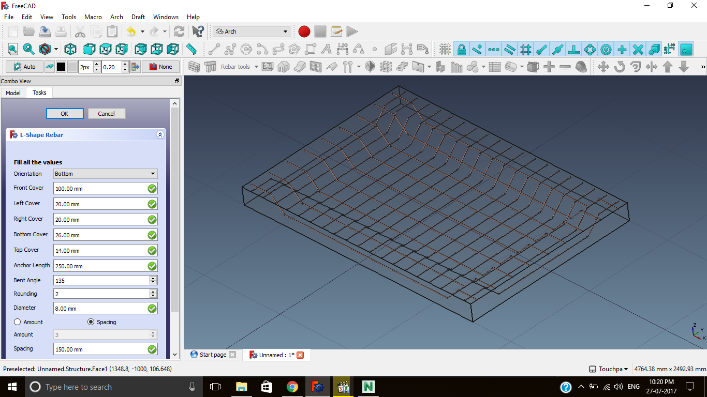

</ul>

**30-31 July**: Didn't do anything. Took rest for two days.

**1 Augest**:

-   Created dialog box for pop up image and implemented it.
    [Commit](https://github.com/amrit3701/FreeCAD-Reinforcement/commit/159884f86e53d0efc0bda39de05d913e067757cb)

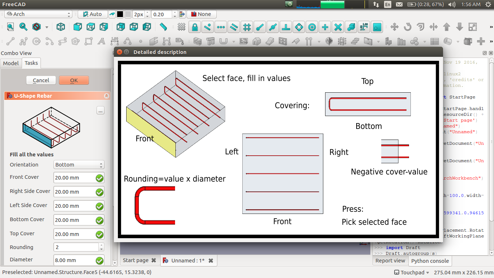

</ul>

**2-4 Augest**:

-   Read Chakkree's code for implementing circular stirrup.
    [Code](https://forum.freecadweb.org/viewtopic.php?f=8&t=22760&start=70#p181904)
-   Created UI of Circular stirrup.
    [Commit](https://github.com/amrit3701/FreeCAD-Reinforcement/commit/f4ed0f4d06a34d2a45ec39de6828dc3a1066a623)
-   Wrote code in CircularStirrup.py file.
    [Commit](https://github.com/amrit3701/FreeCAD-Reinforcement/commit/32f883a9014b1f8d59a039245d14e0a3558227e6)
    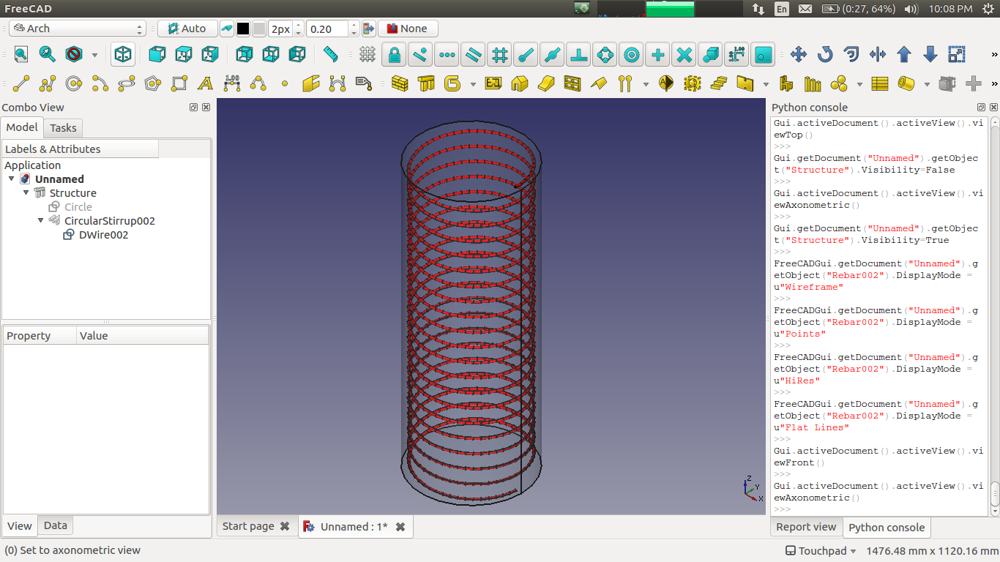
    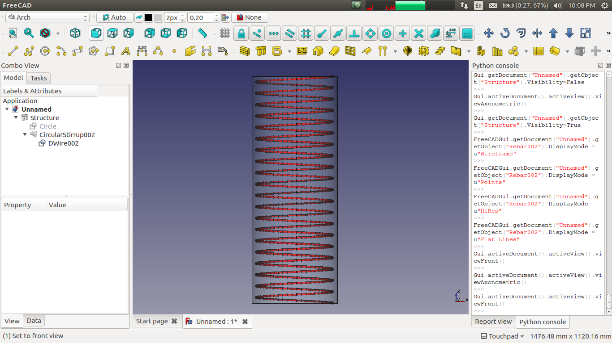
-   Discussed issues related to circular stirrup with Yorik which comes
    when I set `Part::Helix` as a base of rebar object.
    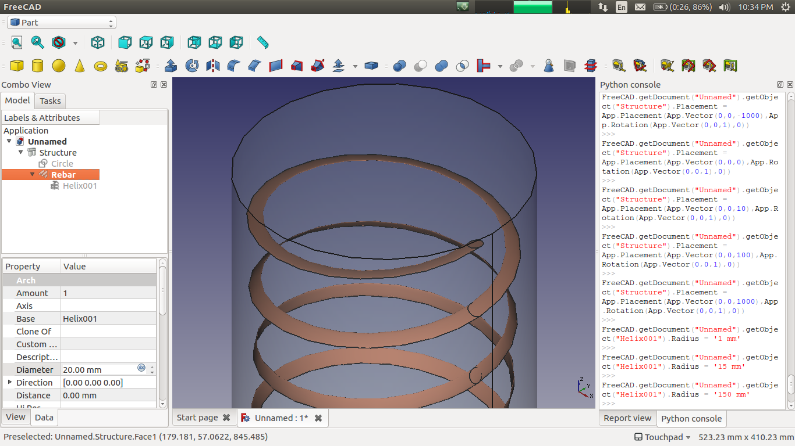 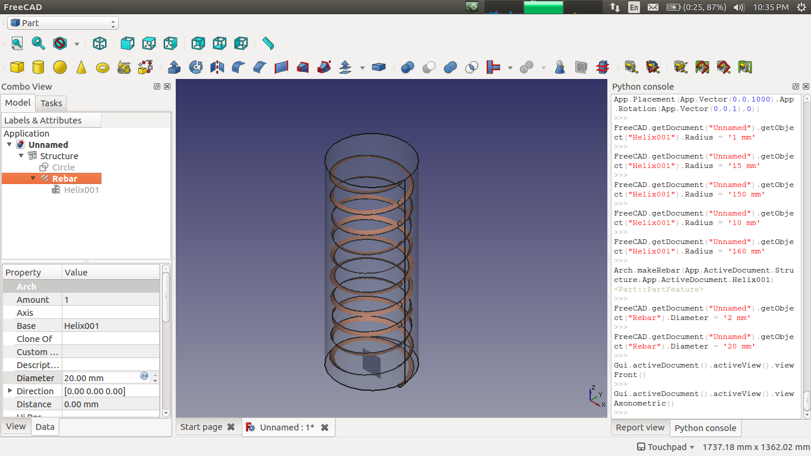

**5 Augest**: GSoC party!.

**6 Augest**:

-   Added `Arch_Rebar_CircularStirrup` in FreeCAD
    [Commit](https://github.com/amrit3701/FreeCAD-Reinforcement/commit/d55dc9e61eb431956172794afeddd660eb5c1374)

-   Removed minor bugs in circular stirrup
    [Commit](https://github.com/amrit3701/FreeCAD-Reinforcement/commit/333189fe87ca101327ceca2f267bc860efb5d863)
-   Discussed few things related to circular stirrup with Chakkree's on
    the FreeCAD forum.
    <https://forum.freecadweb.org/viewtopic.php?f=8&t=22760&start=200#p185451>

**7-11 August**

-   Discussed issue related to helical rebar shape on passing
    `Part::Helix` object as base object of Rebar on IRC.
-   Implemented "Apply" button in all rebars dialog boxs.
    [Commit](https://github.com/amrit3701/FreeCAD-Reinforcement/commit/388c280df1fd217dfac9a747cc7e477680b0942a)
-   Added description image in Bent shape rebar.
    [Commit](https://github.com/amrit3701/FreeCAD-Reinforcement/commit/b7ad0889efa07415dba2551a85a78ab407c2796d)
    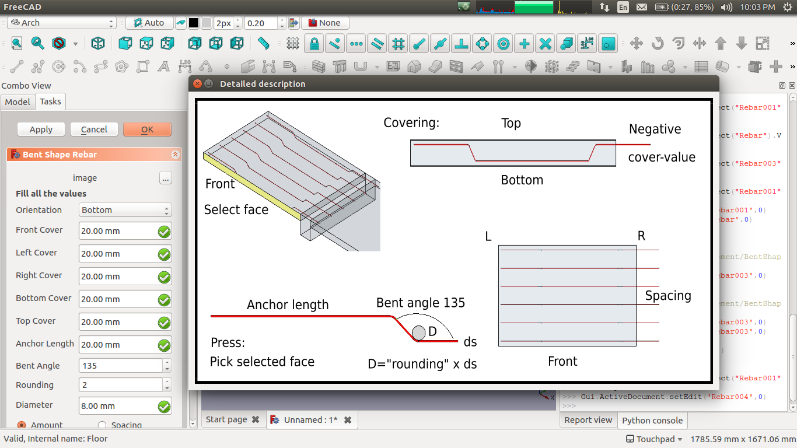
-   Fixed bug
    [Commit](https://github.com/amrit3701/FreeCAD-Reinforcement/commit/ea3e56f6059a69b15f1dc0bb2fb5a26e0d0048ea):
    No reaction on changing diameter in LShape, UShape and Bent shape
    rebar. For detail, here is the discussion:
    <https://forum.freecadweb.org/viewtopic.php?f=34&t=23637&p=186052#p186052>
-   Implemented `Part::Helix` in circular(helical) rebar.
    [Commit](https://github.com/amrit3701/FreeCAD-Reinforcement/commit/888377bc01e6ff0e21fba187bf6821eb46c4c26b)
    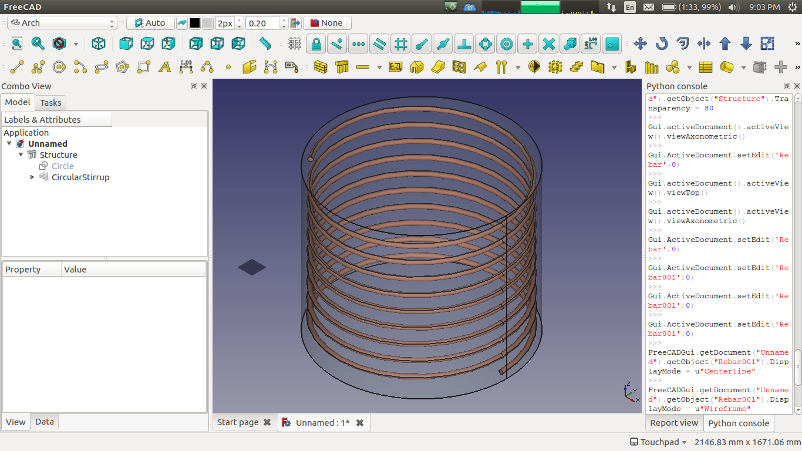
    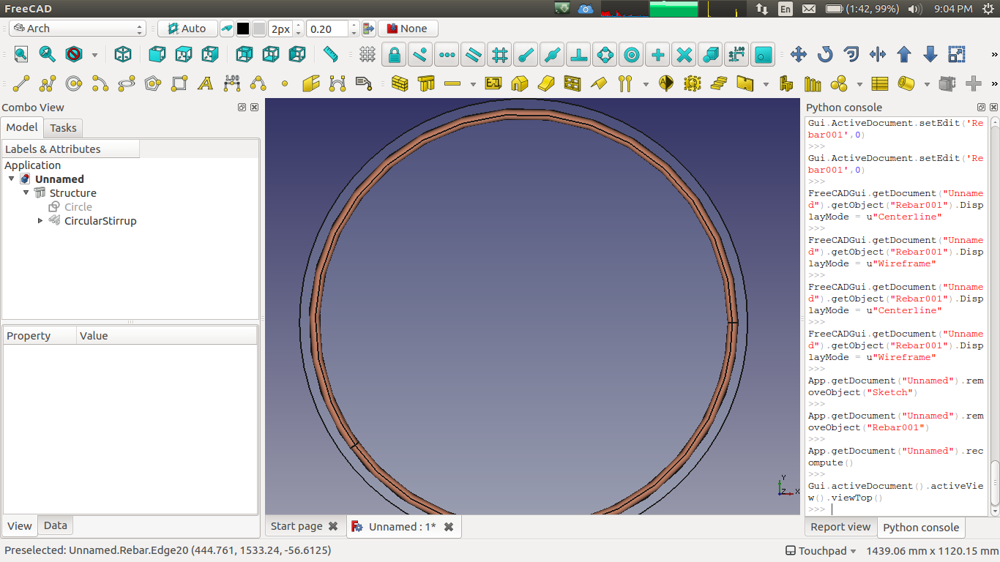

**12-13 August**:

   Added detail description icons of Striaght, LShape and Stirrup rebar
    (made by thschrader).
    [Commit](https://github.com/amrit3701/FreeCAD-Reinforcement/commit/e18c04a066cb2725de3643e4e6b747952b11efb0)
-   Added rebar tool dropdown list icons of bent shape and helical rebar
    (made by Yorik).
    [Commit](https://github.com/amrit3701/FreeCAD-Reinforcement/commit/2de16ede89c889b8661b90a5ed62d38c57bba32b)
-   Created first wiki page on UShape rebar.
    [Link](https://www.freecadweb.org/wiki/Arch_Rebar_UShape)

**14-18 August**:

-   Added help icon in all rebar dialogs.
    [Commit](https://github.com/amrit3701/FreeCAD-Reinforcement/commit/0b1b5268763d65bd9400516366c6139a179d5395)
-   Updated detailed description icon of helical rebar.
    [Commit](https://github.com/amrit3701/FreeCAD-Reinforcement/commit/9946f98d5074e96908eb2cab5cae5c7bcc664241)
-   Replace Circular Stirrup name to Helical Rebar.
    [Commit](https://github.com/amrit3701/FreeCAD-Reinforcement/commit/6051eae0f588ea6d7f7f051a95ffe975326cbc51)
-   Created wiki pages(user documentation) for all rebar shapes. See
    given below:
    -   Straight Rebar:
        [User_Documentation](https://www.freecadweb.org/wiki/Arch_Rebar_Straight)
    -   UShape
        Rebar:[User_Documentation](https://www.freecadweb.org/wiki/Arch_Rebar_UShape)
    -   LShape Rebar:
        [User_Documentation](https://www.freecadweb.org/wiki/Arch_Rebar_LShape)
    -   Bent Shape Rebar:
        [User_Documentation](https://www.freecadweb.org/wiki/Arch_Rebar_BentShape)
    -   Stirrup:
        [User_Documentation](https://www.freecadweb.org/wiki/Arch_Rebar_Stirrup)
    -   Helical Rebar:
        [User_Documentation](https://www.freecadweb.org/wiki/Arch_Rebar_Helical)

**19 August**:

-   Added comments in StraightRebar.py, BentShapeRebar.py and
    HelicalRebar.py.
    [Commit](https://github.com/amrit3701/FreeCAD-Reinforcement/commit/a6702034e9bed4a7443e7179558b007e1db658dc)

**20 August**:

-   Added comments in UShapeRebar.py, LShapeRebar.py and Stirrup.py and
    Rebarfunc.py.
    [Commit](https://github.com/amrit3701/FreeCAD-Reinforcement/commit/48c57088c3463e5cbff2a33e1c3583297dfb53aa)

**21 August**: Discussed few things related to rebar addon code with
Yorik on IRC.

**22 August**: Added support in LShape dialog to take custom spacing
when a user create rebar.
[Commit](https://github.com/amrit3701/FreeCAD-Reinforcement/commit/1bad73492e13fe8fc4e96e915e4f085712efacd2)

**23 August**: Also enabled custom spacing button in rest of rebar
dialog.
[Commit](https://github.com/amrit3701/FreeCAD-Reinforcement/commit/7cc53c21f304566a5c911959edbbd820ac971a49)

**24-26 August**: Update README.md file on GitHub repo.
[Commit](https://github.com/amrit3701/FreeCAD-Reinforcement/commit/ddba8be594a3abb262b4377946f1d7771ce118bc)

**27 August**: Filled GSoC final evaluation form.
