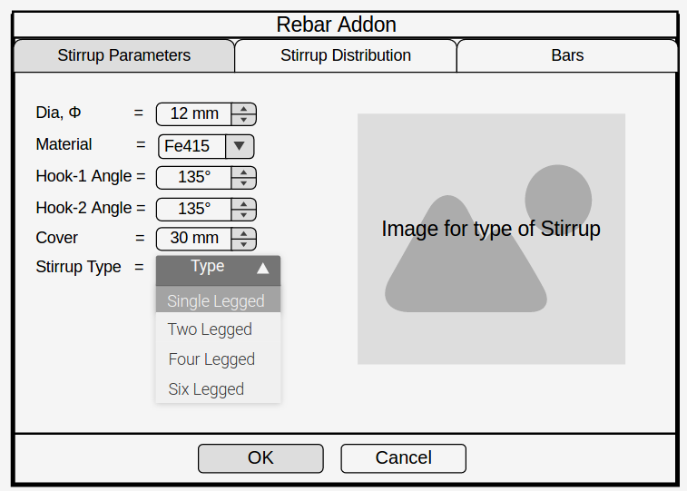
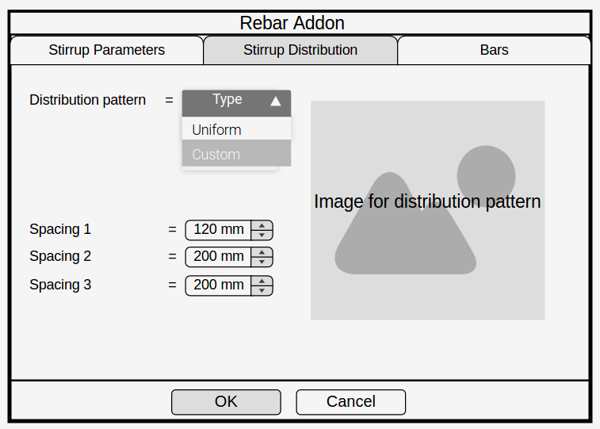
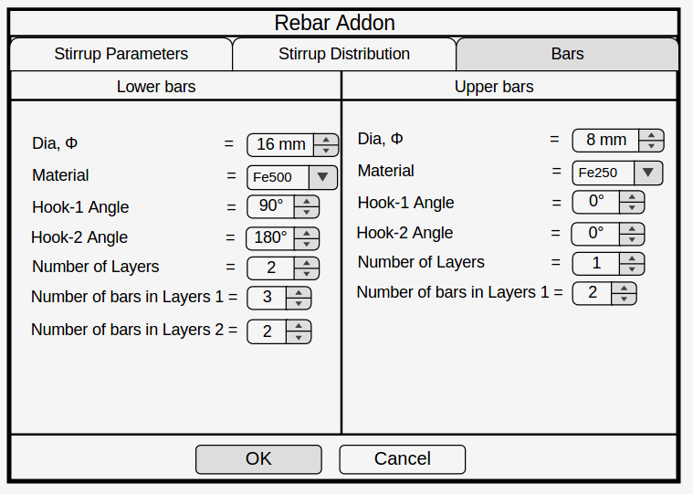

**Name:** Amritpal Singh

**IRC Nick:** Amritpal

**Blog:** **<https://amritpals.com>**

**GitHub Profile:** **<https://github.com/amrit3701>**

**Brief Background Information**

I am B.Tech. (3rd year), Information Technology (IT) student of Guru
Nanak Dev Engineering College, India. Proficient in writing code in
C/C++, Python, bash scripting and recently also worked on Open-source
Mathematical Software System (SageMath).

I also worked on Structure Information Modeling (SIM) and made a parser
to store contents of STAAD PRO files into MySQL database. User can
provide building specifications (for example) through web browser and at
the back-end, FreeCAD macros use these input values to draw different
views of the building on different drawing sheets. To support 3D
rendering on the web browser, an option is provided to convert FreeCAD
native file format (.FCStd) to WebGL format.

Link: <https://github.com/amrit3701/Sim>

I also developed a Python script for AutoCAD to change the dimensions in
a DXF file with a defined increment. Currently, I am working on code
compliance on IFC files using parsing functionality of IfcOpenShell
using Python.

# Project Information

# Project Title: Rebar Addon for FreeCAD

# Brief Project Summary

My project is to create a rebar addon for Arch Workbench of FreeCAD to
ease up the process of creating reinforcement in structural element. The
main purpose of this project is to enable the user to create
reinforcement through an easy and intuitive way. For this proposal, I
will be considering rebaring systems for rectangular footing, pedestal,
column, beam and slab.

# Detailed Project Description

**Existing system in FreeCAD**

At present, the rebar functionality in FreeCAD is very limited and
creating a reinforcement system is quite tedious. The current approach
is followed by creating a sketch for the rebar profile and defining the
required set of constraints. This becomes very time-consuming task when
user has building model with several structural objects.

**Proposed solution to the problem**

To ease up the rebaring process in FreeCAD, an interactive addon will be
developed where user will input the required data as per the design
requirements and they will need not to draw rebars from the Sketcher
workbench for creating reinforcement in the structural object.

The basic procedure to achieve this goal will as per the following
points:

1.  The first step will begin in the Arch workbench by creating a
    structure from the “Create a Structure” tab, or alternatively the
    user may also create a sketch of the profile from Sketcher workbench
    and then extrude it to transform into the desired structure.
2.  Then the user will select the desired element or a number of
    elements of a same category.
3.  After selecting the element(s), user will click on rebar dropdown
    provided in Arch workbench. From dropdown, user will select the
    rebar shape. Upon selection, dialog box will pop-out with input
    fields specific to selected rebar. User can enter the input values
    in the input fields and finally submit with button click.

Options or input parameters for reinforcement are categorised into three
groups that forms three different tabs on the rebar dialogue box as
following:

1.  Stirrup parameters
2.  Stirrup distribution
3.  Bars

**User Interface**

<dl>
<dt>

**Tab I**

</dt>
<dd>

</dd>
<dt>

**Tab II**

</dt>
<dd>

</dd>
<dt>

**Tab III**

</dt>
<dd>

</dd>
</dl>

**Features of Rebar addon**

1.  User can input the following values in the stirrup parameters tab of
    the addon:
    -   Dia
    -   Material
    -   Cover
    -   Stirrup Type
    -   Angle of the hooks as per the type of stirrup
2.  In the stirrup distribution tab user will be asked to input the
    following values:
    -   Distribution pattern
    -   Value(s) of spacing(s) as per the distribution pattern
3.  In the bars tab user can enter the following inputs for both the
    lower and upper bars:
    -   Dia
    -   Material
    -   Hooks angle
    -   Number of layers
    -   Number of bars in each layer
    -   Spacing
4.  The created rebars will have their own view and data properties.
5.  User can edit the parameters of the group of rebars from the view &
    data properties itself.
6.  These rebars will be fully parametric. Hence the parameters of the
    rebars will automatically adjust themselves if the changes are made
    to their parent structure.
7.  The rebars will also have the functionality to cut, copy, clone,
    move and rotate.

**Implementation**

-   Every workbench is nothing more than a folder containing an Init.py
    and/or InitGui.py. I just need to define FreeCAD commands, that can
    be made into menu items or toolbar buttons.
-   The inputs provided by user from rebar dialog box will be passed to
    our custom rebar function. This function will use the inputs to
    define the shape of rebar and in this function the sketcher object
    will be added to the FreeCAD active document which will hold the
    profile of the rebar by calculating coordinates of vertices and
    drawing the shape of rebar from user inputs.
-   Then this sketcher object and the selected structural object will
    pass to the prebuilt function of FreeCAD which will create the
    rebar. Below is the detailed description of that function.
    -   *makeRebar(\[baseobj,sketch,diameter,amount,offset,name\])*:
        Adds a reinforcement bar object to the given structural object,
        using the given sketch as profile.

By following the above approach I can reuse the existing implementation
of reinforcement system in the FreeCAD and at the same time proposing
something new and interesting which will enrich user experience.

<dd>

</dd>

I created separated workbench to understand how Python scripts run from
FreeCAD UI. Here is the code of my workbench:
<https://github.com/amrit3701/Structural>. Doing this exercise helped me
in understanding internal structure and flow of FreeCAD.

Here is the reference link for Dialog creation in FreeCAD that may
helpful during development:
<https://www.freecadweb.org/wiki/Dialog_creation>

# Milestones

As an overview, out of five rebars (as mentioned in brief description),
the simplest one footing rebar, will be completed in the first phase
itself before the first evaluation. Next two rebars i.e. column and
pedestal are too similar, they will be completed in the second phase
before second evaluation. The remaining two rebars beam and slab will be
completed in the last phase after second evaluation. Following is the
detailed breakdown:

**Community Bonding Period**

-   Interaction with mentors and other developers on IRC / mailing list
    regarding the crucial aspects of the project.
-   Learn Pyside (QT) to create to create UI components like dropdown,
    dialog box etc.
-   Study Chakkree’s reinforcement scripts:
    (https://forum.freecadweb.org/viewtopic.php?f=23&t=16375).

**30 May - 13 June (2 weeks)**

-   Writing scripts of reinforcement of footing to achieve following:
    -   Parametrization
    -   Placement with respect to structure element
    -   Grouping
-   Following rebar shapes will be included in its reinforcement:
    -   Straight rebar
    -   C-Shape rebar

**14 June - 20 June (1 week)**

-   Develop initial phase of Addon UI that involves dropdown (to select
    different rebar shapes) and dialog box with options.

**21 June - 23 June (3 days)**

-   Integration of UI with custom functions.
-   At the end of this milestone, user will be able to see rebars in
    dropdown. Selecting the rebar will open dialog box with its
    associated properties.

**24 June - 26 June (3 days)**

-   Backup days, for any backlogs or any pending tasks and preparation
    for phase I evaluation.

**27 June - 30 June (4 days, Phase I evaluation)**

-   Developer documentation using Doxygen.
-   Submitting all the work to mentor.

**1 July - 7 July (1 week)**

-   Writing scripts for reinforcement of column.
-   Following rebar shapes will be included in its reinforcement:
    -   Straight Rebar
    -   L-Shape
    -   C-Shape
    -   Stirrups (2 legs, 3 legs and 4 legs)
    -   Diagonal Stirrup

**8 July - 12 July (5 days)**

-   Writing scripts for reinforcement of pedestal.
-   Following rebar shapes will be included in its reinforcement:
    -   L-Shape rebar
    -   Stirrup (Rectangular shape)

**13 July - 19 July (1 week)**

-   Adding UI fields in dialog box for reinforcement of column and
    pedestal.

**20 July - 23 July (4 days)**

-   Integration of developed UI of column and pedestal with custom rebar
    function.

**24 July - 28 July (5 days, Phase II evaluation)**

-   Work on backlogs or bugs if any.
-   UI enhancements.
-   Submitting all the work to mentor.

**29 July - 4 August (1 week)**

-   Writing scripts for reinforcement of beam.
-   Following rebar shapes will be included in its reinforcement:
    -   Straight Rebar
    -   L-Shape
    -   C-Shape
    -   Stirrups (2 legs, 3 legs, 4 legs )
    -   Diagonal Stirrup

**5 August - 9 August (5 days)**

-   Writing scripts for reinforcement of slab.
-   Following rebar shapes will be included in its reinforcement:
    -   Bentup rebar
    -   Straight rebar
    -   C-Shape rebar

**10 August - 14 August (5 days)**

-   Adding UI fields for reinforcement of beam and slab.

**15 August - 17 August (3 days)**

-   Integration of developed UI of beam and slab with custom rebar
    functions.

**18 August - 24 August (1 week)**

-   Work on Addon UI to implement input validations and error handling
    on dialog box.
-   Work on backlogs, testing and bug fixes.

**25 August - 29 August (5 days, Final Phase)**

-   Developer documentation using Doxygen.
-   User documentation through detailed tutorial and post with
    screenshots on FreeCAD wiki.
-   Submitting all the work to the mentor.

The advent of this rebar addon in FreeCAD will reduce the effort in
creating rebaring to a great extent and thus saving time. Structural
engineers will find it easier to do the rebar detailing in their
structural models and generate the rebar shop drawings in an easy but
professional way.

# Time Availability

I will be available 40 hours / week, if needed can spend more. No
restriction of time.

# Why FreeCAD?

The very first reason to choose FreeCAD is that it is the first free and
open source BIM software with the functionality of CAD in it. It is a
powerful parametric modeler. There are several workbenches included in
it which are integrated with one another. The community of FreeCAD is
very well established with plenty of helpful coders and engineers of
respective domains from different parts of the Globe.

# Why you?

I’m a practical programmer with good proficiency in the languages like
C/C++, Python and bash scripting. I worked with Civil engineers, solved
their problems and also ease their work through my programming
knowledge. All of my previous projects were on FreeCAD only which
included Structural Information Modeling (SIM), Parametric building and
python-scripted objects. It has been one year that I’m an active member
on FreeCAD forum.
