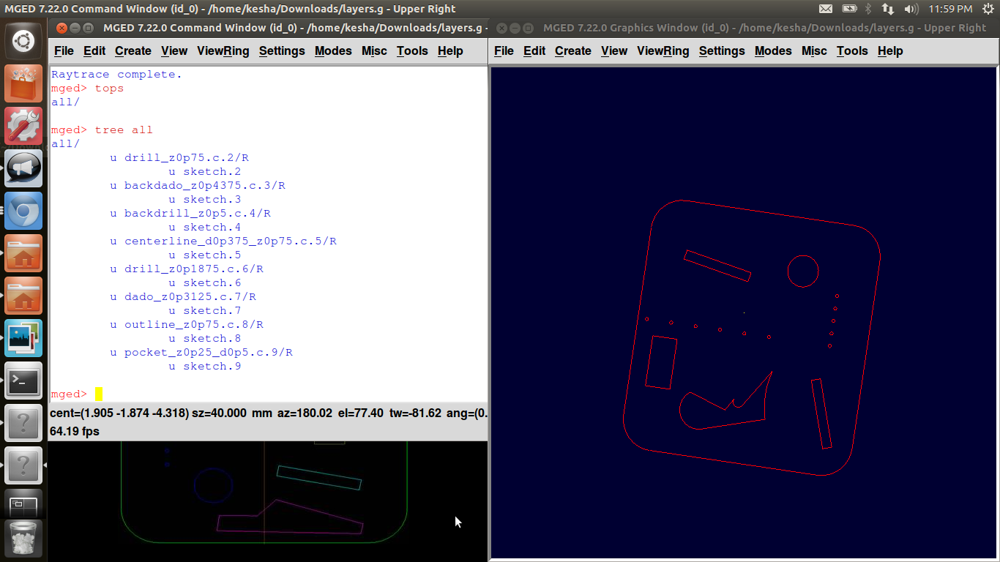

# Summary of GSOC Project

This is the first year in which I was eligible for GSoC program and was
selected by the highly esteemed open source community BRL-CAD. Before
joining the project, I had just the glimpse of how large code bases are
maintained, but had never got hands on experience with them. I used git
version control, but that just limited to handling my college project.

I would like to rewind and fast-forward the 4 beautiful months of my
life, the best in terms of experience and knowledge gaining and learning
summer quickly below-

Initially, before the project submission deadline, I submitted few small
and pretty code refactoring patches to BRL-CAD to get myself famaliar
with svn version control system and other basics for working with gsoc
project.

Upto the student selection date, I worked on an issue of github to get
famaliar with github version control system, on which STEPcode is
managed. In this period, I got to know abt diff tools, working with git
version control in a better way, gdb debugger, doxygen and how to write
comments and observed some good tactics related to coding followed in
industry, like taking minute care from declaring variable names to
introducing magic numbers and to see that in future there will be no
false positives and bugs introduced that would create problem in long
run.

In between the selection period and the actual program period, it was
the community bonding period as well as time for release process of
BRL-CAD 7.24.0. I helped in formatting the release notes for this major
release and got some experience with release procedure.

After the actual beginning of the program I worked with open issues of
github and got it merged on the mainstream. One was removing all
cppcheck warnings from stepcode. There were mainly 6 types of warnings
reported in STEPcode by cppcheck which included unused variables,
preference for preincrement/decrement, sscanf() to prevent overflow,
strncpy not '\\0' terminated, C style pointer casting and reducing the
scope. After clearing those, I ran cppcheck on brlcad trunk and uploaded
the output to refactoring page of brlcad. Also, I made a patch for
preference for preincrement/decrement from that output and cleared those
warnings from cppcheck on BRL-CAD sources.

The next issue I worked on was installing the headers from the central
files used in the minimal example. This included installing headers from
10 directories of stepcode. Now, anyone can just do sudo make install
and start using the API's like any other library.

After that, I worked on checking the step-g importer on brlcad and wrote
regression tests checking the step-g importer with 3 small and simple
step models. I also read and knew about how to use anything from net
with a copyright and use the license. I had never dealt with those kind
of scenes before.This test will confirm the working of step-g importer
and check for the geometry by checking volume &gt; 0. I also looked upon
the todo task on brlcad wiki and deleted those which were already done
and added a prototype and Todo comments in the trunk to make it easily
visible and more organized. These patches are still awaiting review by
mentors.

I forgot to mention about my experience with STEPbot, my experiment with
a bot for channel \#stepcode on IRC. And one fine evening, when I logged
on to IRC, I was surprised to see an infobot similar to that on \#brlcad
already implemented and hence the logs of that channel could be archived
very easily.

A huge thanks to Mark, my mentor who has been the best mentor I could
ever have. He had been by my side at every 'step' of my project guiding
me and providing quick response and feedback of my work and effective
guidelines throughout the project. Thank you Sean. You are the best
project manager I ever saw. Along-with the help in technical aspects, I
loved how you used to motivate and inspire me. Also, I liked your way of
getting answers from me instead of giving solution directly,no matter if
it took an hour for a simple thing. :) Thanks Cliff, Erik and all other
GSoC students who had been as a support anytime in the last 4 months. I
could not imagine my project being complete without you guys. Awesome,
cool community, i must say. :) Thanks all once again.

Future plans - In past a week or so, I observed that a lot of people
were posting queries related to STEPcode. They were asking for good
tutorials or easy-to-understand links. So, I think, I would first make
tutorial for beginners on STEPcode. And next, after that I am willing to
get my hands on step exporter. My plans till next summer is to work and
get familiar with the step-exporter and dedicate my next summer to it.

You just walked with me on my journey of past 4 months. I know, this has
been too long and thanks for your precious time reading this. Hope you
enjoyed the walk. Below are my daily logs and reports.

Three Cheers for this awesome summer !

# Week (-1) : Familiarizing Phase

## April 19-22

-   Joined \#brlcad channel on IRC
-   Subscribed to [mailing
    list](https://lists.sourceforge.net/lists/listinfo/brlcad-devel)
-   Introduced myself to the community through mailing list
-   Downloaded Source Code
-   Compiled it successfully from the source using cmake
-   Made an account on SVN.
-   Had a glance at source folder and caught my eyes on an instance of
    duplication.
-   Made [first
    patch](https://sourceforge.net/tracker/?func=detail&atid=640804&aid=3611485&group_id=105292)
    and submitted it.
-   Looked through project ideas and found [Code Refacoring](/wiki/Code_Reduction) most interesting
    and suitable for me.

## April 23-30

-   University Final Exams

## May 1

-   Checked out some TODO task in the domain of Code Reducing and
    Refactoring.
-   Picked up moving LIBWBD comments.
-   Used the grep command to find out the comments that needed to be
    moved.
-   Within just 10 minutes, I was able to successfully move all comments
    and submitted [another
    patch](http://sourceforge.net/p/brlcad/patches/172/)
-   Discussed with Sean about my interest when he encouraged me to
    explore converting and processing geometry.

## May 2

-   Read [tutorial
    I](http://brlcad.survice.com/downloads/documentation/BRLCAD_VolumeI.pdf)
    and then [tutorial
    IV](http://brlcad.org/w/images/6/66/Converting_Geometry.pdf) on
    Converting Geometry and recieved some basic idea on STEP and other
    convertors available for importing and exporting between different
    CAD softwares.
-   Gone through project ideas again and liked two more ideas-namely
    Improving [STEP Library](/wiki/STEP_Libraries) and STEP AP242
    Parser.

## May 3

-   Proposal Submission Deadline on melange.
-   Made my
    [User-Wiki-pages](/wiki/user/KeshaSShah/GSoC13)
-   Uploaded proposal on
    [Melange](http://www.google-melange.com/gsoc/dashboard/google/gsoc2013#proposals)
    and embedded wiki links in it.

## May 4-5

-   Read about the STEPcode from [its
    wiki](http://stepcode.org/mw/index.php?title=STEPcode)
-   [Files and
    Directories](http://stepcode.org/mw/index.php?title=Files_and_directories)
    in sc/source
-   [Build](http://stepcode.org/mw/index.php?title=Building_STEPcode#How_to_build)
    the STEPcode with testing enabled using cmake
-   Looked at [files created in build
    directory](http://stepcode.org/mw/index.php?title=Building_STEPcode#Files_created_in_build_dir)

## May 6-8

-   Picked up [Issue
    \#47](https://github.com/stepcode/stepcode/issues/47) to work upon.
-   Made a list of differences between pair of 13 similar files.
-   Untangles some calls from src/fedex_plus to src/clstepcore.
-   Discussed on IRC about the errors I encounter.
-   Read about how calls are made, maintainence of [call-stack
    heap](/wiki/Call_stack), the process of
    linking and [Compiler
    warnings](http://gcc.gnu.org/onlinedocs/gcc/Warning-Options.html)
-   Overall, have got some better understanding.

## May 9

-   Installed doxygen and looked up some example codes.(for
    documentation part)
-   Made a test-bot for IRC \#stepcode (it functionalities still
    remaining to be discussed with mentors.)

## May 10-11

-   Read from some references and manuals and gone through cheat-sheet
    for learning GIT and GITHUB. (add, branch, commit, push, pull,
    reset, log etc.)
-   Installed gitk and used it.
-   Assigned \#47 issue to myself.
-   Made a branch and committed and push the removal of 5 similar
    functions.
-   Revised some concept like virtual, pure functions, friend functions,
    use of const and static, extern etc.
-   Discussed with Mark for logs and bot of \#stepcode on IRC
-   Reading doxygen manual.

## May 12

-   Almost done with issue \#47. Pushed the commits on branch
    ks-duplicate-files.
-   Known about the Debugger gdb- used back-trace feature.
-   Quick Guide to [gdb
    Debugger](http://betterexplained.com/articles/debugging-with-gdb/).
-   Installed KDevelop IDE and planning to use it as it has nicer gdb
    GUI wrapper.

## May 13-14

-   Getting "Abort (core dumped)" error. Pushed it to a new branch for
    Mark to review it.
-   Picked new issue \#200.

## May 15

-   Got Doxygen working correctly and tried few samples. Read manual to
    see how to comment.

## May 17

-   Surfed for lazy-loading. Reading the process of loading (ch 7) of
    Bryant book.

## May 18-May 26

-   Read the tutorial series at <http://www.learncpp.com/#ChapterB>
-   Understand old C++ and modern [STL
    containers](http://www.learncpp.com/cpp-tutorial/16-1-the-standard-template-library-stl/)

(

# Week 0

## May 27

-   Accepted Students announced on Melange. Yupiie, selected ! :)

## May 28-June1

-   I fully confirm and accept the stated participation requirements
    including giving full rights to my contributions, remaining visibly
    active, being engaged in discussion, providing regular updates on
    progress, complying with the development rules, and writing
    excellent code.
-   Reading Hacking Guide.
-   Will be returning on 5th June from di's marriage
-   Next Target: Obtain commit access till 17th June (before gsoc
    program begins)

## June 2-June 16

-   Community Bonding Period.
-   Preparation of Release 7.24.0 - [Release
    Note](/wiki/Community_Publication_Portal.md#Draft_Release_Note)

# Week 1

## June 17

-   Worked upon [Issue
    21](https://github.com/stepcode/stepcode/issues/21): Removed 100
    warnings, errors and styles shown by cppcheck from about total 455.
-   I ran "rm -r \*" from stepcode/ instead of build/, and cloned the
    repo again in stepcode/ through which I lost all my progress. Thanks
    to git cherry-pick command, through which i recovered it back !
    \#sighofrelief

## June 18

-   Looked upon 100 more cppchecks to solve [Issue
    21](https://github.com/stepcode/stepcode/issues/21).
-   Strangely, many cppchecks claimed wrong warnings. Like, a warning
    says, the varaible was not used, but in later part of the code, it
    was actually used.
-   Learnt not to believe any warnings blindly unless looking upon the
    code.
-   (Now onwards, my phone's low battery warning is the only warning I
    will take seriously :P \#alighthumour)
-   Github issue - The branch I am working doesn't have master changes,
    so after this issue completes, I will clone repo again and use the
    freshly cloned directory's .git/ folder.
-   [IRC log](http://ibot.rikers.org/%23stepcode/20130618.html.gz).

## June 19

-   [Netiquette](http://www.networketiquette.net/) and [mailing list
    guidelines](http://www.slideshare.net/fullscreen/sandeepkmadaan/mailing-guidelines/2)
-   Cleared some more warnings- almost 65-70% of them sorted out
    successfully.

## June 20

-   Done with issue 21. All genuine warnings have been successfully
    removed.
-   The ones which remain are due to bugs in cppcheck. Cppcheck says
    some variables unused though it has been used, says many functions
    have not been used, shows some warnings in generated files(generated
    files can't be changed obviously)
-   To ensure all test are running fine as before and nothing has been
    broken, compiled with testing enable and ran 'make test'. All test
    are working correctly as before. :)

## June 21

-   Will push the change to github repo for Mark to review it once, and
    then it will be merged with master branch. Issue 21 can be closed
    now.
-   Next thing to work on is - STEPcode 0.7 doesn't install all required
    headers. All .h files need to be in /usr/lib or whatever the install
    prefix is.So you don't need to reinstall in order to add
    schemas.Then you could just sudo make install and start using the
    API:s like any other library.
-   [CMake
    Tutorial](http://www.cmake.org/cmake/help/v2.8.8/cmake.html#command:install)

## June 22

-   Updated [this page](/wiki/Google_Summer_of_Code/2013) for all
    the participants, for the release purpose.
-   Reviewed the comments by Sean on patch and made a new patch for
    that.
-   Got mail from Mark to add myself into AUTHORS file :)

## June 23

-   Solved the error regarding \#214 testcase showing failed while 'make
    test'.
-   Known git add -p command. Its awesome !

# Week 2

## June 24

-   Cloned stepcode @ 4kbps speed ! \#crazymoments
-   Looked for cmake installations

## June 25

-   Problem with transferring .git/ folder - The changes after the repo
    was cloned are also being shown in diff, which were not made by me.
-   Still to figure out how to apply just a small subset among them
-   Known about Cool IRC apps for mobile. \#feelingblessed

## June 26

-   Solved the git problem after smashing head for 2 hrs. Reason was I
    ran 'git init ' after cloning the repo.
-   Sorting out commits with the same kind of patches in them.
-   Like, all unused variable in one commit, all scope reducing in one
    commit, all strncpy() in one commit, all memory leaks in one commit,
    all C-style pointers removing in one commit etc.
-   Pushing that to a new branch ks-cppcheck

## June 27

-   Mark suggested not to change src/base/judy

a\) it will make it harder to merge upstream changes, and b) that code
is particularly complex; some of the changes the author has made to fix
bugs have been very subtle.

-   There is a way to rewrite commits,yet left to figure it out.

## June 28

-   Unused Variable-Don't just comment out unused variables. If there is
    no possibility of side effects (i.e. they aren't initialized via a
    function call), remove them. In case of doubts, delete them and then
    make a note on github by clicking the message bubble by the
    line.Oops, no point in modifying clSchemas/\* either. I should
    probably just delete that, since it's old generated code.Other than
    this and the commented out variables, it looks good.
-   Reducing Scope-Looks good, except there are some lines that were
    commented out instead of being deleted.
-   Closing file-Closing the files doesn't hurt, but at that point the
    program is definitely about to exit. I'm not sure if I would put the
    effort in to fix the warning.
-   Increment/Decrement-I assume you changed these because of a message
    like "(performance) Prefer prefix ++/-- operators for non-primitive
    types."That means change 'x++' (++ is the suffix) to '++x' (++ is
    the prefix). I had to look this one up; the latter is more efficient
    due to the language spec, which affects how compilers usually
    implement [prefix
    operator++.](http://stackoverflow.com/a/1813008/382458)\\
-   Strncpy NULL terminated- Looks good.
-   C-style pointer casting- %50c is almost certainly incorrect, and
    %50s may be too limiting.Adding arbitrary magic numbers like this is
    really bad in the long term. They're just bugs waiting to present
    themselves later in very hard-to-discover ways. The usual fix for
    insecure coding detection from static analyzers is to do manual
    parsing. We have a replacement in BRL-CAD (src/libbu/sscanf.c) that
    could be translated to stepCode string data structures, and which
    prevent the buffer overrun issue of sscanf().

# Week 3

## July 1

-   Found out solution for modifying prev commits, and editing them
    using 'git rebase -i' and change pick to edit. Then use commands git
    commit --amend and git rebase --continue
-   But there was some problem with the branches.
-   Also, I searched for alternative ways on internet and found
    something like it could be done using filter, but was not working
    out on my system.
-   Asked Mark to comeup on IRC at night, if possible, to resolve it.
-   Yeah, finally I have fresh 5GB refilled in my account and can use
    net with a pretty awesome speed again :)

## July 2

-   Unfortunately, Mark and I were not online on same time and that prev
    thing remains.
-   So, Looked up for installation in cmake and Build Processes.

## July 3

-   Pulled branch ks/CppCheck
-   Made all necessary changes listed in June 28
-   Finally, the thing worked :)

## July 4-5

-   No work for upcoming two days due to placement season at college.
-   Sorry for that. I will cover up in upcoming week giving some extra
    time.

# Week 4

## July 8-9

-   Brother going to Germany tomorrow for six months, so spending time
    with him.
-   A small get-together at home with friends and relatives.
-   Busy with his last moment packing and all.

## July 10

-   Went to airport to drop him alongwith some cousins.
-   As promised, will get back working hard from tomorrow and cover up
    the missed things.

## July 11

-   Looking at the previous comments on the changes on github and
    modifying code accordingly.
-   Linking again the code in head.

## July 12

-   New branch ks/cpp on github.
-   Undone all changes from src/base/judy/\* , src/clprobe-ui and
    src/clSchemas.
-   Accidentally capitalized Schema has been changed to schema.
-   Magic Number 50 in %50s eliminated. Now, it will accept characters
    only till upto max BUFSIZ-1 and prevents overflow.
-   The previous conflict message taken care of.

# Week 5

## July 15

-   Rebasing kept on giving error, that ks/CPP is a non-fastforward
    branch. Cloned a fresh copy, pulled my branch from github and then
    it worked.
-   Tried with many sscanf examples to make sure how it actually works.
    And then suggested what should be done on github.
-   It checks for all failing cases of sscanf also.
-   If Mark approves, I will change it according, orelse, we will go
    with the present version of it.

## July 16

-   Ponder through a quite tricky program -
    <http://paste.kde.org/p5bf0a67b/raw/>
-   Eventhough scanBuf has size 1, it stores a 4 size long string.
-   Puzzled why ?
-   Suprisingly on windows gcc compiler, it shows "t:)" as output of
    scanBuf ! :O

## July 17

-   We need to change %s to %ns to avoid the overflow (where n is an
    integer)
    1.  define BUFSIZ 99 //in real code, BUFSIZ would be set in a system
        header
-   const unsigned int size = BUFSIZ;
-   char fmtString\[10\] = {0};
-   snprintf( fmtString, 99, "%%%ds", size ); /\* the first pair of %
    signs prints a '%', then %d prints an int, followed by 's'\*/
-   fmtString now contains "%99s"

## July 18

-   Tried examples from sprintf, sscanf and snprinf
-   Found answer to question in log of July 16.
-   Because pointer is passed and not the actual value.

## July 19

-   Found out the value of BUFSIZ in header.
    1.  define BUFSIZ _IO_BUFSIZ /\* in stdio.h \*/
    2.  define _IO_BUFSIZ _G_BUFSIZ /\* in libio.h \*/
    3.  define _G_BUFSIZ 8192 /\* in _G_config.h \*/
-   so pushed "%8192s" in place of "%s" in sscanf, where 8192, though is
    hardcoded but is not actually a magic number !

# Week 6

## July 22

-   Mark's proposed- <http://ideone.com/lmL6Fa>
-   Made an ideone account. My proposed- <http://ideone.com/aOaJqP>
-   No fmtStr required in second one. Indeed in the first snprintf only
    "kes" was stored into scanBuf.
-   The next sscanf is just like strcpy. I am scanning from scanBuf and
    placing it again into scanBuf only
-   That was required because snprintf returned the number of chars
    written and code demanded number of items written.
-   <https://github.com/stepcode/stepcode/commit/c8e4a2f7eb530edbc1afaa8a1afbabf560e6b910>

## July 23

-   Reviews and suggestions :
-   Writing to the same buffer you are reading from qualifies as
    "undefined behavior", which means that the compiler/libc writers get
    to do [whatever they please.](http://feross.org/gcc-ownage/) It may
    or not behave as expected on various platforms and with different
    compiler/libc versions.
-   No need to worry about memory here.
-   Expand the size of character array assome platform might use a much
    larger number instead of 8k - such as 16k or 128k.
-   Sean suggested- std::stringstream fmtStr1; fmtStr1 &lt;&lt; "\#%%d
    %" &lt;&lt; BUFSIZ-1 &lt;&lt; "s"; ... sscanf(...
    fmtStr1.str().c_str(), ...);
-   Implementing with std::stringstream now.

## July 24

-   Cppcheck manual and checking cppcheck for style,warning,performance,
    error,unused functions and variables etc in brlcad source.
-   Run the following :

cd brlcad cppcheck -isrc/other/ include/ src/ --enable=all
2&gt;cppcheck_brlcad.txt

-   It checks for issues in 1690 files under all src/ except src/other
    and all include/ .
-   The manual claims that it supports multithread ( by option -j like
    -j 4 ), but when I tried, it said, "cppcheck: unusedFunction check
    can't be used with '-j' option, so it's disabled." So, if not
    checking for unusedFunction, it can also have mutithreaded checking.

## July 25

-   Added a section in Code Cleanup of BRL-CAD:
    <http://brlcad.org/wiki/Code_Cleanup#CPPCHECK-CLEANUP>
-   Looking up for code cleanup in BRL-CAD.
-   Facing a make error. Putting in efforts solving it.

## July 26

-   A long discussion on IRC with Sean who inspired me alot on IRC as
    well as positive feedback on my mistakes of which I should take care
    of.
-   Issues discussed included - my visibility. All the technical
    discussions are now done through stepcode Mailing list
-   Second was my availability. I will increase the time spent on my
    project.
-   Thirdly, the issues and problems which I face, I should go deep and
    analyze the root of it.
-   Last, but not least, NULL, '\\0' , 0 and nul are all different !

(The commit message made previously "strncpy() NULL terminated" was
erroneous.Changed it)

# Week 7

## July 29

-   While adding comments to the remanants of cppcheck on my branch, I
    realized there were few checks which could be merged in previous
    commits. I did so, but later while building it, I ran into make
    error.
-   Asked Mark about it, but Sean motivated me that I should do it
    myself and that would be a great learning experience and that might
    be difficult at first instance, but not impossible. :)
-   Rebased the commits related to reducing scope and figured out that
    it was dues to src/fedex_plus/classes.c
-   Remaining cppcheck with comments here -
    <https://github.com/stepcode/stepcode/issues/21>
-   Running astyle
-   Build without error. Ran test. They were alright.
-   pushed the final version to github.
-   <http://brlcad.org/wiki/Code_Cleanup#CPPCHECK-CLEANUP> -&gt; Cleaned
    all prefer prefix performance based issues with a patch of 2134
    lines with all prefix ++/-- issues cleaned. -
    <https://sourceforge.net/p/brlcad/patches/219/>

## July 30

-   Refactoring of comments in BRL-CAD
-   The ones which are remaining are either empty comments, not function
    comments or do not have corresponding function in include/\*.h
-   <http://paste.kde.org/p889555e6/raw/>
-   <http://paste.kde.org/p90d6d90d/raw/>
-   <http://paste.kde.org/p64046984/raw/>
-   <http://paste.kde.org/p4dffd54d/raw/>
-   <http://paste.kde.org/pb65e159e/raw/>
-   Reading now cmake documentation to figure out how installation
    works -
    <http://www.cmake.org/cmake/help/v2.8.8/cmake.html#command:install>

## July 31

-   <http://www.cmake.org/Wiki/CMake_Useful_Variables>
-   Worked upon the changes suggested by Mark on github commits
-   Looking for the best place to install headers for the issue -
    <https://github.com/stepcode/stepcode/issues/235>
-   Now, I have kept a dummy DESTINATION, and tried to install those
    headers. Got the way to do it.
-   <http://paste.kde.org/p95cd4501/>
-   Last line has to be changed.

## August 1

-   While trying to compile, it showed error and I figured out that
    applying astyle , the CMakelsit.txt had been changed, which was in
    pushed on github. Worked upon restoring the styling in
    CMakeLists.txt
-   Included headers for src/base in include directory of install.
    Checked it.
-   Now, when I run sudo make install after building the source, an
    sc-install folder is created in the same place as that of the
    stepcode repo and sc-install/include/base contains all headers for
    src/base.
-   <http://paste.kde.org/pfbf685b6/> :)
-   The headers of src/expp and src/express were already being
    installed.
-   Made a new branch for issue 235.
-   pushed first commit of this issue to ks/installHeaders
-   If this is alright, I will move forward with installing headers of
    from other directories.

## August 2

-   <https://github.com/stepcode/stepcode/tree/issue/21>
-   <https://github.com/stepcode/stepcode/commits/issue/21>

# Week 8

## August 5

-   The patch of performance regarding prefix in BRL-CAD was made on a
    previous version and didn't apply well.
-   <http://www.markusbe.com/2009/11/how-to-apply-a-patch-and-solve-hunk-failed-cant-find-file-to-patch-and-others/#patch-command-line>
-   Updated the trunk, generated again and posted it patch again
-   The installation behaved wierdly, on one instance it installed in
    /home/kesha/../sc-install/include/\* and running the same thing
    again after deleting build directory and making again installed
    headers in /usr/bin/include/\* !
-   Suggestion of making checklists to make things flow smooth

## August 6

-   issue 21 -&gt; build without breaking (checked)
-   test doesnt break (checked)
-   commented the remaining (checked)
-   pull req generated check
-   <https://github.com/stepcode/stepcode/commits/ks/headers> -&gt; new
    branch with 2 commits
-   Patch for brlcad
    [\#165](https://mail.google.com/mail/u/0/#inbox/140518a231bc16ce)
    accepted.
-   Working on other headers now

## August 7

-   School + first day coaching
-   Delivered a talk in IEEE/IAS DA-IICT
-   Took a session for orientation of Juniors in programming club as I
    am in core committee.
-   Too tired. Just read the mails and figured out what next.

## August 8

-   Making changes in the existing commit or deleting a branch would
    lose the comments, hence Mark told to use git cherrypick / squash or
    fixup them
-   I used the second option and continued editing and committing.
-   In the install headers, in the destination, changed the path from
    CMAKE_INSTALL_HEADERS/\* to CMAKE_INTSALL_HEADERS/stepcode/\*
-   Used "NOT DEFINED" to check if the variables exist or not. In my
    previous approach, it would work bad if the value was set to
    true/false
-   Installed headers for some more like src/cllazyfile , src/clutils
    and src/clstepcore
-   For src/exppp and src/express, the headers were already included
    while 'make install'
-   For src/fedex_plus and src/fedex_python, I am not able to figure
    out what exactly to do.
-   Another issue I am facing is, whenever I try to push from the local
    branch to repo on github, it always rejects first saying it a
    non-fast-forward update. Then I do it using -f option.

## August 9

-   Net breakdown. Conveyed what I had done and what needs to be done,

but there was a little communication gap as per Sean.

# Week 9

## August 12

-   Clarified the prev mail.
-   the branch is ready to be merged in mainstream :)
-   For headers in fedex_plus and fedex_python, "Headers need to be
    installed for libraries, so that executables that make use of the
    library can be compiled. It isn't possible to link one executable
    with another, so headers for executables do not need to be
    installed."
-   In ks/headers issue, the headers of exppp and express which were
    installed already was not in the correct directory, they need to be
    in include/stepcode/\*. Change that.
-   There are two generated headers that should be installed; when you
    run CMake, they are created in build/include. Install them to
    include/stepcode

## August 13

-   Figured out a nicer way. Instead of adding the FILES directly, if we
    can create a variable who stores the info of all header files, then
    it would be more readable and expandable.
-   Adding that in all the commits.
-   Also, adding two generated headers in /include/stepcode/\*
-   Changing the path for exppp and express.

## August 14

-   changed path where headers of exppp and express were included
    .../stepcode/...
-   exppp and express were not using ${INCLUDE_INSTALL_DIR}. Done that
-   generated headers from build/include/\* included
-   other headers from stepcode/include/\*.h also included
-   <https://github.com/stepcode/stepcode/commits/ks/headers> - the link
    to commits on github

## August 15

-   The build location was hardcoded and can be anywhere in user's
    system, so make use of CMakeVariable that uses the location of build
    directory
-   Found that variable, cmake_binary_dir /
    cmake_current_binary_dir --&gt; build/

and cmake_source_dir / cmake_current_source_dir --&gt; stepcode/

-   Tried hard but couldn't work it out.

## August 16

-   Finally figured out the problem. Silly me, in include/CMakeLists.txt
    I didn't include {$variable} and was getting it false.
-   Corrected that and committed it.
-   Tested it. It seems to have installed correctly.
-   A small confusion- the extraheaders in include/ should be in
    sc-install/install/\* or sc-install/install/stepcode/\* . Right now,
    kept in first one.

# Week 10

## August 19-20

-   Continued with the work of Issue 235.
-   Worked in the direction as per comments.
-   Pushed it on github.
-   Generated Pull requested.

## August 21-August 23

-   University midterm 1 exams
-   3 papers down, two to go

# Week 11

## August 26-27

-   University midterm 1 exams
-   All done

## August 28

-   <https://github.com/stepcode/stepcode/pull/254>
-   All clean commit
-   Generated merge request

## August 29

-   Made absolute paths relative by removing "{CMAKE_INSTALL_PREFIX}/"
    (reason: discussion on IRC)
-   Merged <https://github.com/stepcode/stepcode/pull/254>
-   Closed the issue. Done with open work of stepCode :)

## August 30

-   Discussion with Sean on IRC to understand what needs to be done.
-   Updating trunk
-   Compiling and building. Successfully ran mged and archer from
    source.
-   Next goal: Understanding geometry conversions.
-   Manual 4- Geometry Conversion
-   <http://brlcad.org/private/geometry/>
-   Manual 2- MGED. Playing with geometry in mged.

## August 31

-   "pick a few of the importers, say dxf-g, 3dm-g, and stl-g.find some
    geometry, import them, view them. its' not just to look at it --
    it's to understand what you imported, how you specified that import,
    what hierarchy resulted after import. grabcad.com has a ton of
    stuff. google can give you lots of stuff (just search for
    "filetype:obj truck" or "filetype:dxf boat" for example)"
-   "once you're comfortable and AFTER you've used three other
    converters, give the step-g importer a try on something 1) using
    7.22.0 then 2) using trunk"

# Week 12

## September 2

-   Surfing on web about CAD conversions like
    <http://blog.grabcad.com/2013/05/tips-for-converting-cad-data/>
-   Grabcad contains very nice models- Most of them for step.
-   Downloaded around 15 models(for use within 2-3 days) and some other
    formats.
-   <http://blog.grabcad.com/2013/05/kernels-why-cad-systems-dont-play-well-with-others/>
-   <https://grabcad.com/home>
-   <http://www.youtube.com/watch?v=VGDbULSvTEA>
-   <http://opensourceecology.org/wiki/DXF_to_G-code_Conversion_Tutorial>
-   Tried with an importer dxf-g and here are the issues I came across.
    (asked them on IRC to Sean and Cliff, but waiting for their
    response)
-   EG-FILE Layers.jpg:

<!-- -->

-   -   

-   My screenshot after conversion:
    -   

<!-- -->

-   In this, if you view both figures, two shapes are missing. Does it
    mean that the conversion is lossy and can it be corrected so that
    the missing two shapes also get imported correctly ?
-   Also, for this, the .jpg file was available, as to how it looks, but
    for those whose I don't get, how do I confirm that I am viewing it
    correctly and the hierarchy that resulted after the import is
    correct ?
-   Hope I get answers to them quickly :)

## September 3

-   Tried with more geometry conversions from the format
    3dm-g,dxf-g,obj-g, but there are still some questions that concern
    me and haven't got appropriate reasoning as to why is it happens
    so..
-   two questions from yesterday's log. (figure/.g file not given then?)
    (lossy conversion)
-   Many a times, when I do export, some objects are exported correctly,
    but it ends with a segmentation fault (almost 50% of those I tried)
-   The material property disappears after conversion. The mater and
    color related information is lost after conversion. Is it normal ?
-   Sometimes, converting gives more layers and objects as compared to
    the original one. Where did the extra regions come from ?
    (eg-pumpkin example in brlcad.org/private/geometry)
-   Will try with 1-2 step conversion now to see if it runs the same
    way.
-   I think, Sean is busy, anybody who reads my queries and has answer
    to them, please contact me on IRC (nick:kesha/kimzzzz).

## September 4-5-6

-   Doing with some more geometry conversions.
-   Paryushan atthai

# Week 13

## September 10

-   Cleared a point of misunderstanding- all 3D models should not
    necessarily work. We just have to find a few that work. Previously I
    was thinking that each importer should work and was trying with many
    but Sean said, 2-3 of few types would be enough.
-   "To reiterate the purpose, we want to know if we made step-g worse
    at some point in the past. You'll have to correctly compile and run
    different versions of the step-g importer, test some geometry with
    those versions, so you can say with certainty whether a problem was
    introduced, whether it's better, or anything else actionable"
-   Got an idea how importing should be done and look like with various
    formats.

## September 11

-   In the beginning, tried with 2-3 models of STEP and imported them
    with version 7.22.0.
-   Found a model, d.stp from starseeker's library ViaOpenBooks, which
    had gotten worse now and worked well with 7.14.7.
-   In between the present and 7.14.7, somewhere it is breaking. I need
    to find that revision.
-   7.24.0, 7.22.0 and r55000, had very little difference, but all of
    them smelled bad.
-   First, I was not clear as to how so many versions can be maintained
    simultaneously and Sean suggested updating svn and deleting build
    directory every time.

## September 12

-   In revisions long back, cmake was not used, instead an autogen
    script generated configure and ./configure would compile.
-   Also, there was no instruction given to make to build step-g.
-   Command-&gt; cd src/conv/step && make step-g &&./step-g -o ....
-   Getting some memory-leakage and other errors with different
    revisions.
-   Also, got an idea abt the revisions of our interest-
    <http://paste.kde.org/pad666f93/>
-   In stepcode, Mark had deleted two files mkprobe and dataprobe but
    forgot to remove it from cmake. Updated CMakeLists.txt
    <https://github.com/stepcode/stepcode/commit/a297f733dda932127e4a842a66b157b87bfc9677>

## September 13

-   While the different versions are being updated and compiled (it
    takes a lot of time due to poor connectivity) , made a refactoring
    patch - <https://sourceforge.net/p/brlcad/patches/237/>
-

## September 14

-   From the list of about 800 revisions to try, 500 have been clearly
    ommitted. The problem is somewhere within remaining 300.
-   Asked for \*technical\* work as demanded by point 5.

## September 15

-   known the need of regression test for STEP. The exporter is not yet
    ready, I will just check for the importer.
-   Saw how other regression tests work.
-   Side by Side compiling more revisions

# Week 14

## September 16

-   Made first version of how regression test should look like.
-   Got feedback abt it from Sean
-   no need to touch file (make a file if the file doesn't exist)
-   Add some sort of validation to check geometry (eg Volume)
-   Use the step file which is small and has right to re-distribute it.
-   Update and use svn version control and upload it proper patch
    format.

## September 17

-   Working on the regression test now and the four main points of
    modifications as suggested by Sean.

## September 18

-   Made regression test checking three stepfiles. Incorporated checking
    volume.
-   First, it was giving error that the average total value was in float
    and can't be compared to less than by -lt 0, so truncated the part
    after '.' and added 1 to the volume.
-   Regression test almost ready.
-   unsure abt the license and copyrights of the model.
    <http://www.steptools.com/copyright.html>

## September 19

-   Updated patch on sf.net.
-   Again in the next patch, added copyrights according to my
    understanding and submitted.
-   Output of "make regress-step2g" -&gt;
    <http://paste.kde.org/p0a5a98de/>
-   The 3 stepfiles when importer and viewed in archer looks like the
    following :
    -   instance_stepfile1.g
    -   
    -   instance_stepfile2.g
    -   
    -   instance_stepfile3.g
    -   

## September 20

-   Cleaned all " Prefer prefix ++/-- operators for non-primitive types.
    " issues from <http://brlcad.org/wiki/Code_Cleanup#CPPCHECK-CLEANUP>
    with reference to patch
    <http://sourceforge.net/p/brlcad/patches/219/#3f4d> - new patch
    after updating trunk.
-   <http://brlcad.org/wiki/Deuces#Code> Remove those related to moving
    header comments. Had tested all of those and confirmed that they
    were done. Keeping in task list could probably waste some other
    dev's time in future.
-   <http://brlcad.org/wiki/Deuces#Implement_a_primitive_surface_area_function>
    Removed from the list, whose area had been already calculated and in
    the rest added a prototype function and TODO in it.
    <https://sourceforge.net/p/brlcad/patches/239/>
-   <http://brlcad.org/wiki/Deuces#Implement_a_primitive_volume_function>
    Removed from the list, whose volume had been already calculated and
    in the rest added a prototype function and TODO in it.
    <https://sourceforge.net/p/brlcad/patches/240/>
-   <http://brlcad.org/wiki/Deuces#Implement_a_primitive_centroid_function>
    Removed from the list, whose centroid had been already calculated
    and in the rest added a prototype function and TODO in it.
    <https://sourceforge.net/p/brlcad/patches/241/>
-   <http://brlcad.org/wiki/Deuces#Implement_a_primitive_UV-mapping_callback>
    Removed from the list, whose uv had been already calculated and in
    the rest added a prototype function and TODO in it.
    <https://sourceforge.net/p/brlcad/patches/242/>
