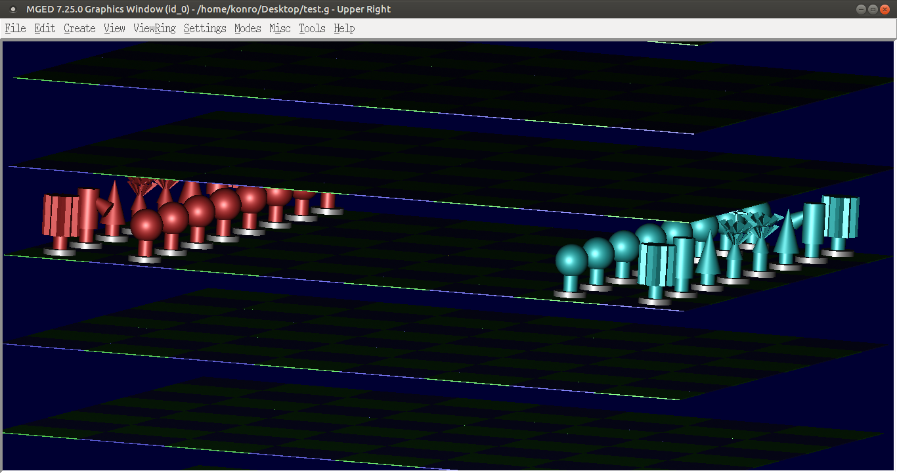
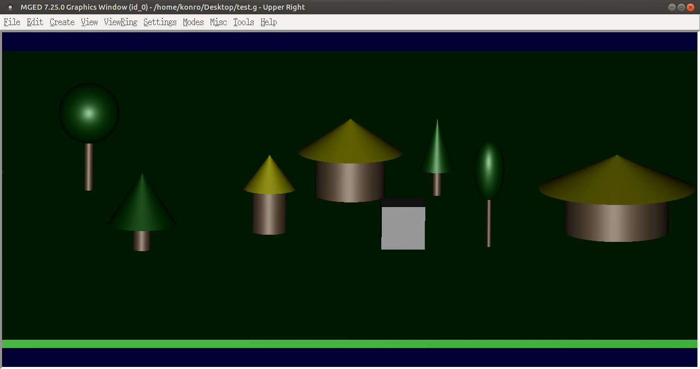

# GSoC 2015 development logs

## Community Bonding Period

I have began this period by going through and adhering to the BRL-CAD
[Summer of Code/Checklist](/wiki/Summer_of_Code/Checklist)

\- Working on replacing the FreeWRL dependency on automake to cmake and
generate a shared library from src/lib of the FreeWRL source code.

## Coding Period

### 25 MAY 2015

\- Resolving linking issues with shared library generated from src/lib
of the FreeWRL source code.

\- Resolving FreeWRL X3D parser dependence on libxml(may need to set
compilation as optional in order not to break the BRLCAD build process)

### 26 MAY 2015

\- Trying to finalize work on shared library generation from src/lib of
the FreeWRL source code.

\- Still working on resolving issues with shared library

### 27 MAY 2015

\- Finished generating shared library

\- Studying the FreeWRL thread implementation

### 28 MAY 2015

\- Still studying the FreeWRL thread implementation to resolve issues

\- Testing functionality of the shared library

\- I was not able to do much work today due to lack of electricity
through out the day

Time put in 3 hours

### 29 MAY 2015

\- Doing more research on the FreeWRL thread implementation to resolve
issues

\- Futher testing functionality of the shared library (writing code to
parse input file)

\- As a GDGBuea organiser, I spend most of the day hosting the Google
I/O with other organisers for the GDGBuea community

\- I would makeup for lost time today and yesterday by putting in more
hours the following days

Time put in 3 hours

### 30 MAY 2015

\- Made progress with debugging and just realised that issues (SIGSEGV)
are as a result of improper casting with structures and thus poor memory
allocation.

\- I spent alot of time today working on the issues but have not yet
full resolved it.

Time put in 6 hours

### 31 MAY 2015

\- Resolved issues(SIGSEGV) which were as a result of improper memory
access.

\- Futher exploited FreeWRL source code to learn more on how to
implement the parser

### 1 JUNE 2015

\- Futher exploited FreeWRL source code to learn more on how to
implement the parser(need to understand how to retrieve nodes from scene
graph)

### 2 JUNE 2015

\- Working on futher understanding the FreeWRL parser

### 3 JUNE 2015

\- Finalizing on futher understanding the FreeWRL parser

### 4 JUNE 2015

\- Successfuly built FreeWRL within brlcad src/other

\- Started implementing load() function for X3D parser

### 5 JUNE 2015

\- Futher work implementing load() function for X3D parser

### 6 JUNE 2015

\- Futher work implementing load() function for X3D parser (ensures that
nodes and properies are parsed properly)

### 7 JUNE 2015

\- Working on load function

### 8 JUNE 2015

\- Working on load function

### 9 JUNE 2015

\- Implemented init_res() function in FreeWRL to intitialize all
required resources

\- Started work on main() function for the x3d parser

### 10 JUNE 2015

\- Finalized work on init_res() function in FreeWRL to intitialize all
required resources

\- Did more work on main() function for the x3d parser(basic input and
outfile handling)

### 11 JUNE 2015

\- Started working on parse_scene() used to traverse the node of the
scene-graph and retrieve properties

### 12 JUNE 2015

\- I did not do any coding today as I have been trying to figure out an
efficient way to implement the conversion routines and also extract the
nodes and their properties from the root node

### 13 JUNE 2015

\- Read the HACKING BRL-CAD again paying attention to note on global
variables

\- Continued work on parse_scene() taking into consideration what I
learn from reading the HACKING guide.

### 14 JUNE 2015

\- Started work on the do_color() function which is called by
parse_scene() to assign color values to shape nodes

### 15 JUNE 2015

\- Working on convert() function in FREEWRLwrapper

### 16 JUNE 2015

\- Futher work on convert() function in FREEWRLwrapper

### 17 JUNE 2015

\- Futher work on FREEWRLwrapper, ensuring PROTO(userdefind type nodes)
are handled properly

### 18 JUNE 2015

\- I did not do any work today as I had lots test to do at school,
giving the teachers are rush to give us our first assesment before the
exams start next week.

\- I would make up for this time After my exams

### 19 JUNE 2015

No work done 0 on 5 hours put in.

### 20 JUNE 2015

\- So far I have not been able to work on my project due to some school
work. This means I have lost about 20 hours from the 18-20(today) of
June, given that I had to put in about 10 on saturday as stated on my
proposal.

\- I would make up for this by working for about 15hours tomorrow and
then the rest would be covered after my exams.

### 21 JUNE 2015

\- Futher work on convert() function in FREEWRLwrapper (implementing
do_transforn() function as helper function to convert())

### 22 JUNE 2015

\- Spent more than six hour trying to relsolve issues with x3d ROUTE and
Script node which depened on javascript for scene-graph animations.

\- Since this nodes would not be imported into BRL-CAD they would be no
need to parser them and their javascript dependency which would need to
be handled with care given the way FreeWRL parses input.

### 23 JUNE 2015

\- Further work on node transformation (implementing
transform_points())

### 24 JUNE 2015

\- I am unable to work consistenly as I am begining with me exams
tomorrow so would just try to clean up the work I have done to far in
preparation for mid-term evaluation.

### 25 JUNE 2015

\- Could not do any work today because of my exams

### 26 JUNE 2015

\- Cleaned up and modified cmake files

### 27 JUNE 2015

\- Redefined OpenGL types making it possible for the code to compile
without OpenGL dependencies.

### 28 JUNE 2015

\- Cleaned up code and uploaded patches to github.

1.) <https://github.com/djkonro/GSoC2015/blob/master/x3d_parser.patch>

2.) <https://github.com/djkonro/GSoC2015/blob/master/freewrl.patch>

### 29 JUNE 2015 to 5 JULY 2015

\- I was unable to do any work because of my exams

\- Given the fact that I made the effort to put in more than 45hours a
week before this period I would have made up for some of this lost time
and I would also put in more time after my exams to meet up with my
project.

## POST MID-term Evaluation

### 6 JULY 2015

\- Finished my exams today

\- Started working on issues identified by my mentor

### 7 JULY 2015

\- Handled parsing for Indexedfaceset

\- Started working on BRLCADWrapper.c

### 8 JULY 2015

\- Figured out an efficient way to handle script nodes

\- Implementing and testing solution

### 9 JULY 2015

\- Reconfigured cmakefile for parser to make use of libxml in
misc/tools/xmltools/libxml of the BRL-CAD source code

\- Resolved issues with dependencies and made patch which applies and
compile without any dependency required.

### 10 JULY 2015

\- Developed Writesphere() function for conversion of x3d sphere node to
BRL-CAD sphere primitive

### 11 JULY 2015

\- Resolved issues with ROUTE and Script instances

### 12 JULY 2015

\- Developed Writecone() function for conversion of x3d cone node to
BRL-CAD cone primitive

### 13 JULY 2015

\- Split convert() function in BRLCADWrapper.c to init_convet() and
finalize_convert in order to avoid code repetition

### 14 JULY 2015

\- Conversion function does not work well after transformation

\- Trying to resolve issues with transformation

### 15 JULY 2015

\- Successfuly resolved issues with transformation

\- Implemented and tested write_cone() function with success

### 16 JULY 2015

\- Implemented and tested write_cylinder() adding support for x3d
cylinder node

### 17 JULY 2015

\- Implemented write_box() function and cleanedup code hoping to create
a ticket any time soon

\- So far I have completed work on importing x3d Geometry3D(primitive)
component

### 16 JULY 2015

\- Started work on x3d rendering component

\- Implemented function for import of IndexedFaceset

### 17 JULY 2015 to 21 JULY 2015

\- I have been unable to do any work through out this time because of
sickness and on the 20th of JULY 2015 I was diagnosed with malaria.

\- I would make up for all the time lost immidiately I get well

### 22 JULY 2015

\- still working on get_poly() function for x3d rendering component

### 23 JULY 2015

\- completed work on get_poly() function for x3d rendering component
(works for IndexedFaceSet currently)

\- started work on generating config.h for FreeWrl library using cmake

### 24 JULY 2015

\- Debugged ROUTE and Script node parsing and added error message.

### 25 JULY 2015

\- Configured cmake to generate config.h from config.h.in automatically.

### 26 JULY 2015

\- Added support for collision node.

### 27 JULY 2015

\- Debugging and testing functionality of converter.

### 28 JULY 2015

\- Traveled home to see my sick father since I am spending my GSoC
period away from home(in my school hostel in another town), so I did not
do any work today.

### 29 JULY 2015

\- Added support for indexedlineset nodes.

### 30 JULY 2015

\- Spent the whole day trying to resolve issue with improper memory
allocation.

\- Issue still not resolved.

### 31 JULY 2015

-Resolved memory issue.

-Uploaded patch and test conversions

<figure>

\- Added support for X3D IndexedTriangleSet

\- Updated code comments

### 2 AUGUST 2015

\- Cleanup code and commenting

\- Modified primitive points assignment to make use of VSET() in node.c

### 3 AUGUST 2015

\- testing and debugging code

### 4 AUGUST 2015

\- Tried resolving issue with libxml as pointed out by my mentor.

\- Got directives from Starseeker on irc that I would need to rework
libxml in other to get it installed since it not installed and just used
for building.

\- Tried doing a make install but getting some errors "cannot find
-lBulletSoftBody and others"

### 5 AUGUST 2015

\- Resolved code compilation issues with mentor

### 6 AUGUST 2015

\- Reading code for g-x3d exporter

### 7 AUGUST 2015

\- Still studying code for g-x3d exporter

### 8 AUGUST 2015

\- Reworking libxml to to install if not found in system

### 10 AUGUST 2015

\- Still studying g-x3d exporter code

\- Adding code comments

### 11 AUGUST 2015

\- Adding support for VRML1_\* nodes

### 12 AUGUST 2015

\- Finalized work on polygonal(INDEXED\*) nodes

### 13 AUGUST 2015

\- Testing and debugging code

### 14 AUGUST 2015

\- Code clean up

\- Updated code to scale points by 1000

### 15-16 AUGUST 2015

\- Took the weekend off to visit my parents, but I still did a little
work on my project

### 17 AUGUST 2015

\- Working on changing freewrl dependency on libxml to another xml
parser as suggested by starseeker

### 18 AUGUST 2015

\- Developed user manual for x3d-g importer

### 19 AUGUST 2015

\- Reworked manual

\- code cleanup

### 20 AUGUST 2015

\- Further code cleanup and testing

\- Resolved compile issues with libxml

### 21 AUGUST 2015

\- Conclude GSoC work (submitted cleaned up patches for importer and
manual) <https://sourceforge.net/p/brlcad/patches/394/#052e>

\- Continued working on g-x3d exporter
