### Development Logs

#### Community Bonding Period

-   During the community bonding period, I read the code and asked some
    questions about the ANSI C boolean evaluation algorithm to better
    understand some concepts and to plan the necessary things to port to
    OpenCL.

<!-- -->

-   I started to write some code in order to get an advance on my
    project. This consisted in creating the kernels in OpenCl to weave
    the segments and to evaluate the partitions, and setting the
    arguments for those kernels. Ended with an initial version of the
    "weave_segs" kernel.

### May 30, 2017

-   Coding Period officially begins!!

<!-- -->

-   Because I misunderstood an important concept about the weave of
    segments, the resulting number of partitions with the initial
    version of the 'weave_segs' kernel was incorrect. Started to
    implement a new version of the code

### Week 1: 30 May - 2 June

-   Finalized the "weave_segs" kernel and the the solution seems ok.
    When testing the code with a simple CSG scene (two spheres
    intersecting), the number of partitions and the number of segments
    in each partition is correct. 1, 2 or 3 partitions per ray at most,
    and the rays with 3 partitions have only 2 segments in the second
    partition, which is supposed according to the testing example.

<!-- -->

-   After evaluating the partitions, the results also seemed correct.
    Every partition evaluated with "TRUE" value is from a ray with 3
    partitions, and only

the middle partition of the ray has the "TRUE" value.

-   Planning to shade the segments from the evaluated partitions next
    week.

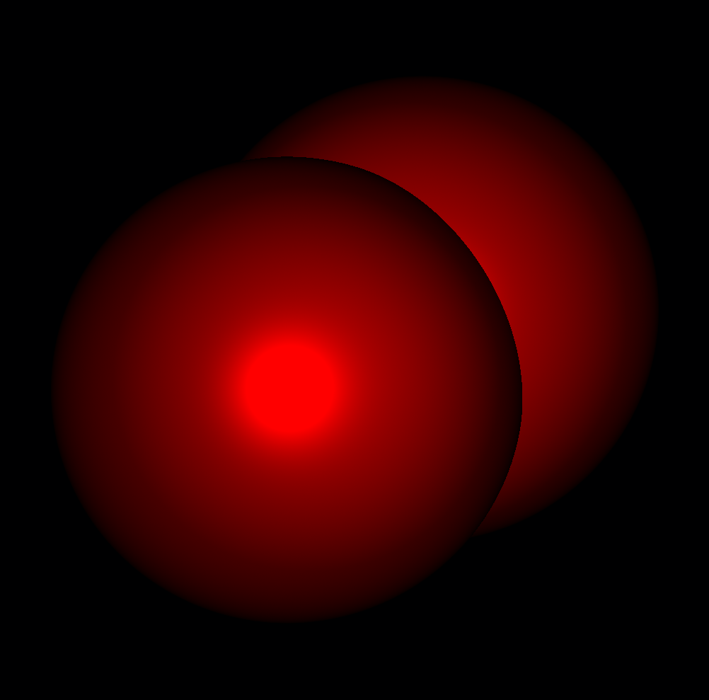

### Week 2:

### 5 June

-   Worked on an initial solution to shade the segments resulting from
    boolean evaluation. The resulting image differs from the expected
    result, so i will have to get back to this and figure out what is
    missing

### 6 June

-   After suggestion from my mentor, implemented a white/black shading
    of the resulting partitions. From the resulting image, I could
    figure out that a large number of partitions that should be
    evaluated with 'true' were missing

### 7-8 June

-   After debugging the 'weave_segs' and the code to evaluate
    partitions, found some issues on the 'weave_segs' kernel that
    caused the missing resulting partitions. After fixing the bugs on
    the code, the total number of partitions evaluated with true by the
    OCL code matched with the total number of partitions evaluated by
    the Ansi C code and the resulting white/black image was correct!

### 9 June

-   Adaptaded the code of the 'shade_segs' kernel to shade the segments
    of the resulting partitions. There are still some problems in the
    resulting image.

<!-- -->

-   The next figure contains images with the results of the OCL code and
    a comparison with the Ansi C code.

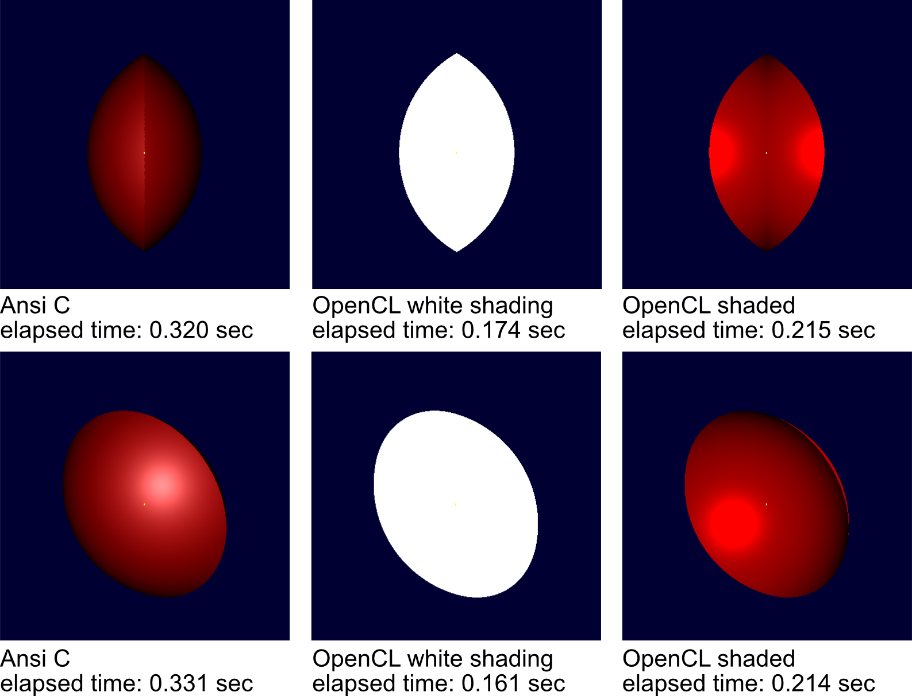

-   Planning to refractor the 'weave_segs' kernel next week to a
    solution that does not use a bounded array for the segments in each
    partition and to clean up the code in order to submit an initial
    patch.

### Week 3

### 12-14 June

-   Implemented the 'weave_segs' kernel without using a bounded array
    to store the segments in each partition. The number of evaluated
    partitions matches the number of evaluated partitions in the ansi c
    code and the resulting image is correct.

<!-- -->

-   Tomorrow I will create some more CSG scenes and will test the code
    with those new scenes to make sure everything is okay before
    submitting the patch to weave segments into partitions.

### 15 June

-   Reviewed the code with my mentor and will make some improvements
    based on the received feedback

### 16-17 June

-   Fixed an issue on the code that would occur when inserting new
    partitions on the partitions list

<!-- -->

-   Implemented a bitvector to represent the segments in each partition

### Week 4

### 19 June

-   Fixed a bug on the code that would cause some missing partitions
    when running the OCL code in the GPU

<!-- -->

-   Refactored the code and submitted an initial patch to weave the
    segments into partitions
    (https://sourceforge.net/p/brlcad/patches/468/)

### 21 June

-   Added a lightmodel to the ansi code to perform white shading, in
    order to have a more exact comparision between the Ansi C and the
    OpenCL code

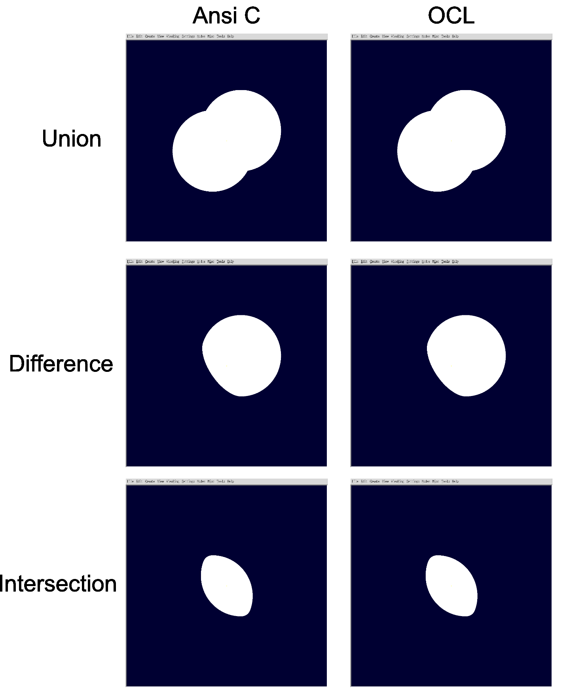

|              | Ansi C    | OCL - Intel i5 4690k | OCL - Nvidia GTX 970 |
|--------------|-----------|----------------------|----------------------|
| Union        | 0,314 sec | 0,098 sec            | 0,173 sec            |
| Difference   | 0,318 sec | 0,098 sec            | 0,175 sec            |
| Intersection | 0,301 sec | 0,097 sec            | 0,164 sec            |

### 22 June

-   Removed pointers from struct cl_partition and updated patch
    (https://sourceforge.net/p/brlcad/patches/468/)

### 23 June

-   shade_segs kernel shading only segments from evaluated partitions

<!-- -->

-   optimized struct cl_partition to store indexes to segments instead
    of cl_segs, making it more memory efficient

### 24 - 26 June

-   working on a list structure to store the partitions instead of an
    array of partitions and implementing a dynamic bit vector to
    represent the segments in each partition. Still some issues to fix

### 27 June

-   Fixed an issue that would occur when duplicating partitions.

<!-- -->

-   Inverted the loop used to perform boolean evaluation with the
    bitvector of segments, which should reduce the total number of
    iterations.

### 28 June

-   Code refactored and cleaned up

<!-- -->

-   Updated the patch with the weave_segs
    (https://sourceforge.net/p/brlcad/patches/468/). The patch contains
    code to perform the weave of segs using a dynamic bitarray to
    represent the segments in each partition and the partitions
    represented in a list structure, which should optimize the insertion
    of partitions

<!-- -->

-   GSOC 2017 Phase 1 Evaluations period

### 29-30 June

-   Started to port rt_boolfinal into OpenCl

<!-- -->

-   Prepared and sent the boolean regions to the 'eval_partitions'
    kernel, instead of sending only the boolean trees

### 3 July

-   Working on an algorithm to create the list with all the boolean
    regions involved in the partition. This requires iterating over all
    the segments of the partition and over all of the regions, which may
    not be the best solution yet.

### 4-5 July

-   Created a regiontable bitvector to hold the boolean regions involved
    in each partition. The regiontable is necessary to evaluate the
    partitions only against all the regions involved, and to resolve
    overlapping partitions.

### 6 July

-   Found and fixed a bug in the insertion of partitions that would
    generate partitions with wrong 'back_pp/forw_pp' pointers. Now is
    possible to iterate over the partitions list in a sequential manner
    in the 'eval_partitions' kernel, and test the partitions against
    additional conditions before evaluation.

### 7 July

-   Removed the pointers from the bool_region structure. Now, I created
    an OpenCl buffer that contains boolean trees from all the regions,
    and I use other buffer to know the offset for each region.

<!-- -->

-   Worked on the shading of evaluated partitions. Before, I was wrongly
    shading segments from the evaluated partitions, but now I shade with
    the information of the 'inhit' and the results seem to match with
    the ansi c results. There are some slightly differences in the
    illumination, but those differences were already there before.

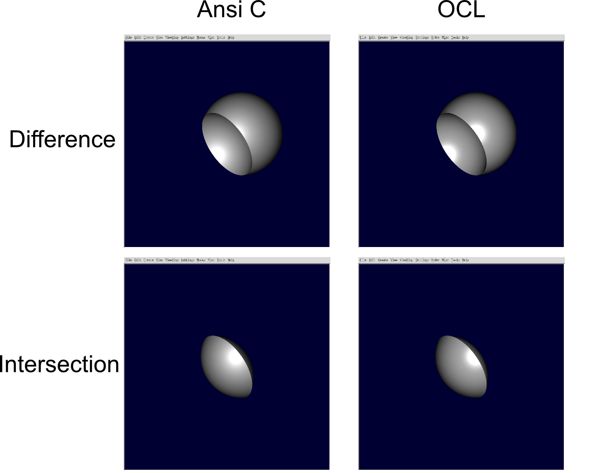

### 10 July

-   Debugged the code trying to identify the cause for the wrong results
    when evaluating partitions in the share/db/operators.g scene, since
    the regiontable seems to be correctly built. By comparing the output
    produced by the ansi c version and the OpenCl version, could
    identify several occurrences of segments in partitions with wrong
    'seg_sti', which would explain the wrong results when evaluating
    partitions. Despite the wrong 'seg_sti', the segments of the
    partitions have the correct values (hit_dist values of the segments
    match the values of the ansi c partitions).

### 11 July

-   After further investigation on the 'seg_sti' issue, it appears that
    the boolean trees have the bits of the ordered primitives, and the
    'seg_sti' calculated by the 'store_segs' kernel are the same as
    the 'rtip-&gt;rti_Solids-&gt;st_bit'. To confirm this, I
    translated the bits of the boolean trees to the
    'rtip-&gt;rti_Solids' bits before sending the boolean trees to
    OpenCL, and was able to get the following results:

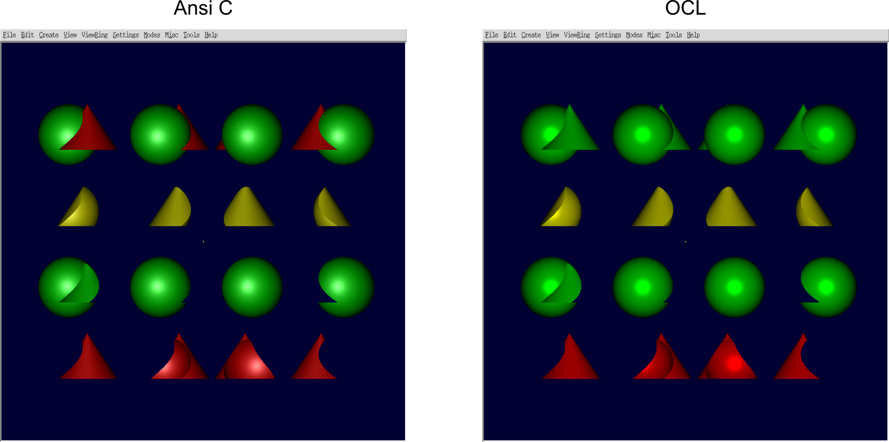

-   Hopefully this help us find the cause for the 'seg_sti' mismatch
    between the segments and the bits in the boolean tree.

### 12 - 14 July

-   Cleaning and refactoring the code in order to submit the patch
    against the opencl branch in svn.

<!-- -->

-   While testing the code against some more complex scenes, found and
    fixed the bug that was causing some of those scenes to take more
    time than expected to render.

<!-- -->

-   Found and fixed the bug that was causing some 'holes' in some views.
    Here is an example of a view that was having this problem, now
    fixed:

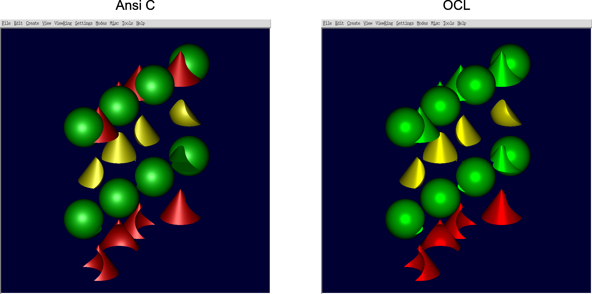

-   Will finish the rt_boolfinal kernel, by implementing the handler
    for overlapping partitions before submiting the patch in the svn.

### 17 July

-   Implemented an overlap handler to resolve the overlapping of
    partitions

<!-- -->

-   Completed the rt_boolfinal kernel. There are still some bugs with
    more complex scenes, that I believe are caused by some partitions
    reporting overlap when they shouldn't (by comparison with the ansi c
    code), but still have to investigate.

<!-- -->

-   Cleaned and refactored the code and submitted the patch in the svn:
    <https://sourceforge.net/p/brlcad/patches/472/> (This was created
    against the opencl code branch)

<!-- -->

-   Planning to optimize the code next, starting by implementing a list
    for the regiontable, instead of using a dynamic bitvector.

### 18 July

-   Debugged the code and found the cause for weird results when drawing
    geometry with the command 'e \*'. It comes from a bug in the overlap
    handler, that might be hard to resolve using bitarrays.

<!-- -->

-   Working on a solution that uses an array to represent the
    regiontable, instead of a bitarray

### 19 July

-   Adjacent partitions should no longer write to the same memory
    positions of the bitarray. This was causing CSG scenes with more
    than 32 regions and/or more than 32 segments per ray to produce
    wrong results.

<!-- -->

-   Optimized the code to iterate over bitarrays, now iterating only
    over set bits in the bitarrays.

<!-- -->

-   Working on a fix to the overlap handler problem

### 20-21 July

-   Resolved the weird results when drawing geometry with the command "e
    \*"

<!-- -->

-   Changed the code to use only 1 regiontable per ray, instead of 1
    regiontable per partition, which reduces the necessary memory.

<!-- -->

-   Prepared the code and submitted the patch in the svn
    (https://sourceforge.net/p/brlcad/patches/472/)

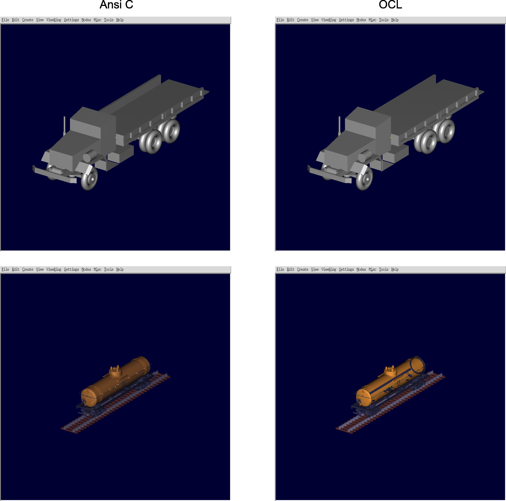

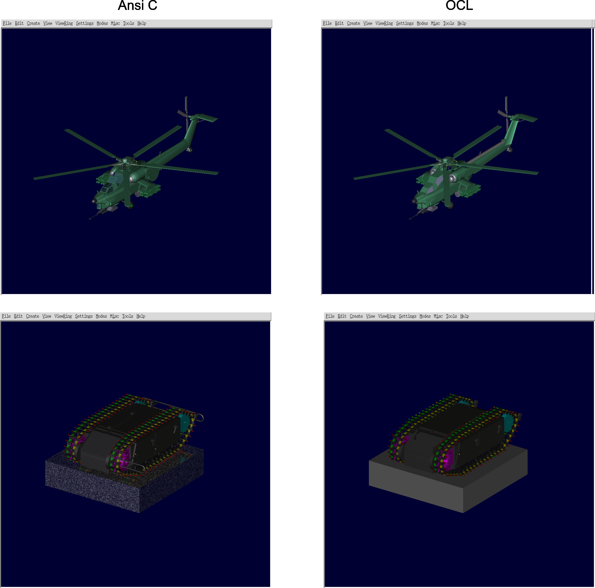

### 24 July

-   Made some changes on the 'shade_segs' kernel to replicate the
    "Surface normals" lighting model. It looks like there is an issue
    with the interior normals, but I am not sure if this comes from the
    known issue of the primitives having the ids in a different order or
    not.

<!-- -->

-   Collected some time measurements over some scenes in the 'share/db'
    directory. Wasn't quite lucky with the profiling tools, so ended
    doing this with the elapsed time given from the ray tracing command.

<!-- -->

-   Tomorrow will add some more measurements and will share the document
    with the results.

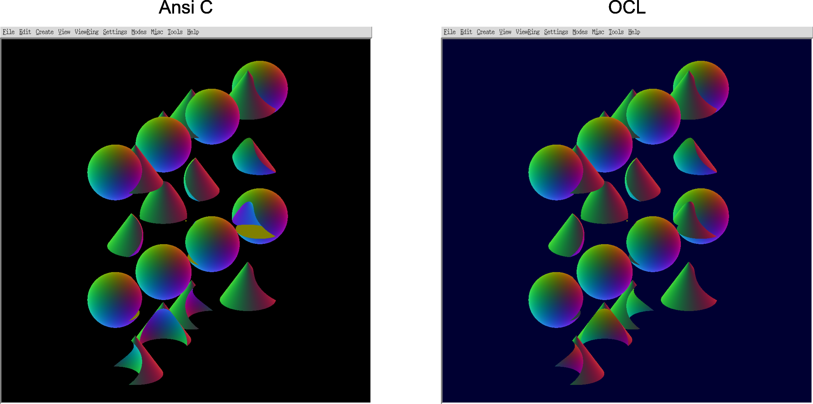

### 25 July

-   Did some further testing over some scenes in 'share/db' to gather
    more statistics to optimize the code

### 26 July

-   Fixed the issue that was causing some interior normals to be wrongly
    represented

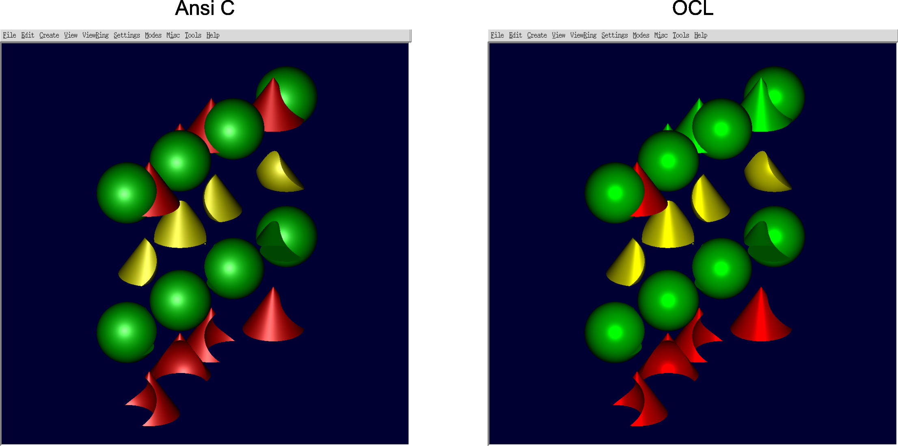

-   Working on a solution to iterate only over partitions evaluated in
    the shading process

### 27 July

-   Optimized the process of building the regiontable by precomputing a
    table with all the regions involved in each primitive instead of
    doing this for each partition in the rt_boolfinal kernel.

<!-- -->

-   This change on the code resulted in a significant improvement on the
    performance, as you can see in the following table:

(Running the OpenCL over the NVIDIA OpenCL SDK on GPU - Debug build)
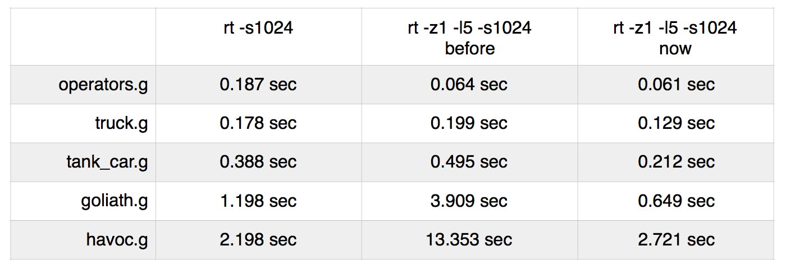

### 31 July

-   Changed the code to skip unevaluated partitions during the shading
    process. This change doesn't appear to have much impact over the
    performance of the code (2.58sec before vs 2.52sec now) for the
    havoc.g scene.

<!-- -->

-   The major bottleneck on the code right now seems to be the
    bool_eval() function. Disabling the function results in rendering
    the havoc scene in only 0.35sec (vs 2.52sec function enabled), for
    what it's worth.

### 1 August

-   Found and fixed the bug that was causing some scenes to shade the
    wrong partitions in the ray. The closest partition in the ray is
    being shaded now.

<!-- -->

-   Example of what was happening before vs what is happening now:

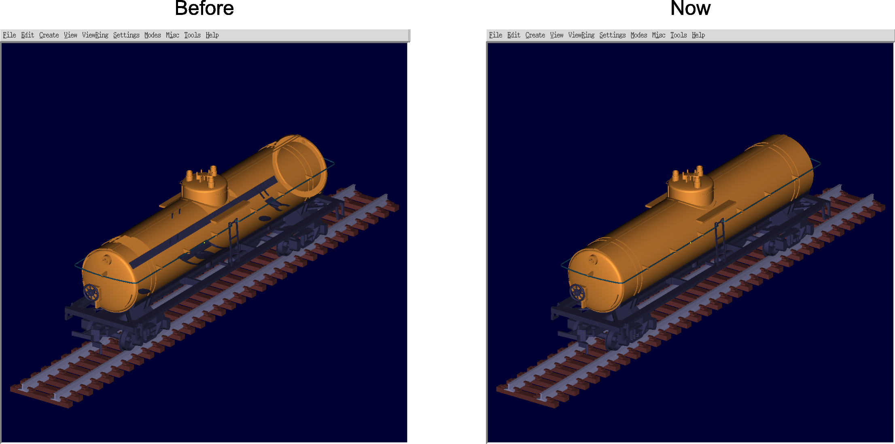

### 2 - 4 August

-   Working on a linearized binary tree representation to perform
    bool_eval() in OpenCL in a similar way of the current code in the
    trunk, instead of using the boolean tree in RPN.

### 6 August

-   Changing the bool_eval() and other auxiliary functions in order to
    use the new tree structure during boolean evaluation.

### 7 August

-   Finished the implementation of bool_eval() using the new tree
    representation. The new code seems to be slightly slower than the
    version on the trunk for some scenes, but still considerable faster
    than the previous method that uses the RPN tree. Thus, porting the
    new code to OpenCL should improve the performance of the code, which
    currently uses the RPN tree method.

<!-- -->

-   Here is a table with a time comparison between the code in the
    trunk, the code with the new tree structure and the code currently
    in the opencl branch (RPN tree):

(Release build) 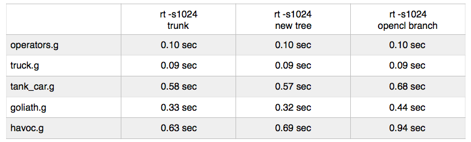

-   Removed the 'next_evalpp' from the partition structure, which
    wasn't necessary in the first place

### 8 August

-   Made some optimizations in the ANSI C bool_eval() prototype and now
    the new code is slightly faster than the code currently in the
    trunk! This difference is more noticeable when rendering the havoc
    scene with the command "rt -s2048": 2.53sec vs 2.18sec.

(Release build) 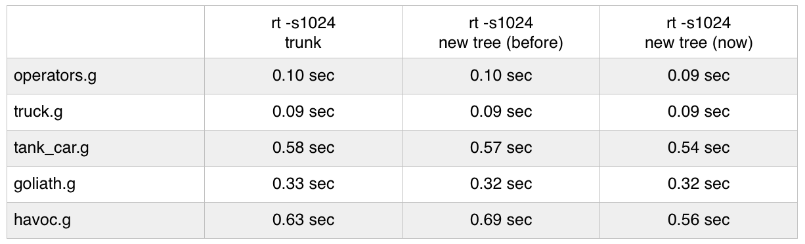

### 9 August

-   Manually merged the new code over the opencl branch code.

<!-- -->

-   Changed the function 'rt_pr_bit_tree()', used to debug the new
    tree structure, so the output matched the output from the union tree
    debug function. (before the function was printing newlines out of
    place)

<!-- -->

-   Updated some structures and some host functions to create the new
    OpenCL buffer with the new tree representation.

<!-- -->

-   Planning to finish the bool_eval() function of the OpenCL code
    tomorrow.

### 10 August

-   Finished the port of the new_bool() function to OpenCL. This new
    bool_eval() function uses a new boolean tree representation, and
    follows the behaviour of the current ANSI C code in the trunk.

<!-- -->

-   Here is a table with the time comparison of the previous
    implementation (bool_eval() with RPN tree) and the current version
    with the new tree representation:

(running the OpenCL over the Intel OpenCL SDK on CPU - Release build)
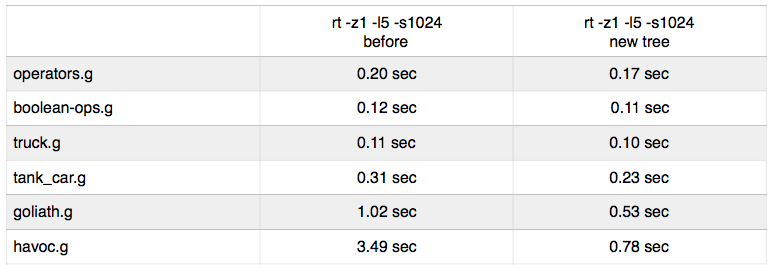

### 11 August

-   Cleaning the code to prepare for commit.

<!-- -->

-   General testing over the ANSI C boolean evaluation and the OpenCL
    boolean evaluation, trying to identify where the bottlenecks are
    located.

<!-- -->

-   Committed the new code to perform boolean evaluation in the opencl
    branch code (https://sourceforge.net/p/brlcad/code/70074/)

### 14 August

-   Discussed with my mentor, Vasco, the plan for the next weeks via
    skype.

<!-- -->

-   Will be cleaning the current code and prepare a patch ticket against
    the trunk with the new CSG boolean evaluation in OpenCL.

<!-- -->

-   Next will start changing the rendering loop of the OpenCL code to
    follow the behaviour of the ANCI C code, where boolean evaluation is
    performed in a parcial fashion.

### 15 August

-   Cleaning and refactoring the code

<!-- -->

-   Preparing patch against trunk code

### 17 August

-   Submitted patch with code to perform boolean evaluation of CSG with
    OpenCL (https://sourceforge.net/p/brlcad/patches/474/)

<!-- -->

-   Started working on new rendering loop, where the 'store_segs', the
    'rt_boolweave' and 'rt_boolfinal' kernels will be merged into a
    single kernel, so the weave of segments and evaluation of partitions
    can take place as soon as new segments are created.

### 18 August

-   Merged the 'store_segs' and 'rt_boolweave' kernels into a new
    kernel. Still trying to avoid repeating the weave of segments
    already weaved in the ray.

<!-- -->

-   Planning to add the 'rt_boolfinal' kernel next to follow the
    behaviour of the ANSI C code.

### 21 - 25 August

-   Changes on 'rt_boolfinal' function in order to add this kernel into
    the single kernel (rt_shootray kernel: store_segs +
    rt_boolweave + rt_boolfinal).

<!-- -->

-   Fixed a bug that caused the ray tracing to crash with this new
    system, by storing the index of the head of partitions for the
    current ray and passing it by argument to the rt_boolweave
    function.

<!-- -->

-   Trying to fix the problem of some partitions being evaluated too
    early, that caused some pixels to shade the incorrect partitions.

<!-- -->

-   In the end, I couldn't figure out a way to weave and evaluate
    partitions in a partial way using the BVH (bounding volume
    hierarchy) because the BVH nodes aren't in spatial order. This
    optimization was promising and it should work if we change the code
    to store the nodes in a spatial subdivision structure like the
    kd-tree, as the Ansi C code does.

<!-- -->

-   Since we are processing all the hits before weaving segments and
    evaluating partitions, there is no need to keep evaluating
    partitions after the first opaque partition in the ray is evaluated.
    Because the partitions are already ordered by its in_hit point, and
    because all segments of the ray are processed, there is no
    possibility to have a partition closer to the ray origin after
    evaluating the first partition, so it is unnecessary and expensive
    to keep evaluating partitions for the ray.

<!-- -->

-   By stopping the evaluation of partitions after the first partition
    evaluated of the ray is found, the performance of the OpenCl code
    increased significantly, as we can see in the following table:

(running the OpenCL over the Intel OpenCL SDK on CPU - Release build)
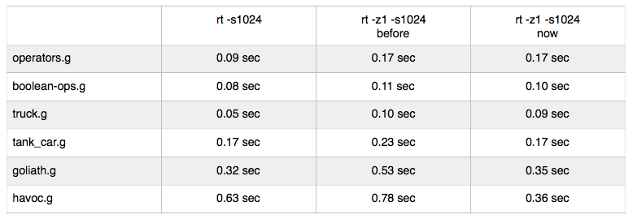

### GSoC17 is Over!!

-   Google Summer of Code 2017 comes to an end! It was an amazing
    experience and I couldn't be happier with this first introduction to
    open source software development!

<!-- -->

-   I would like to thank the BRL-CAD community for giving me this
    opportunity and for always being available to help!

<!-- -->

-   A special thanks to Vasco Costa, for the great mentoring and
    guidance through the summer!!

<!-- -->

-   Here is the work product link that I submitted:
    <https://github.com/MarcoSDomingues/GSoC17>
