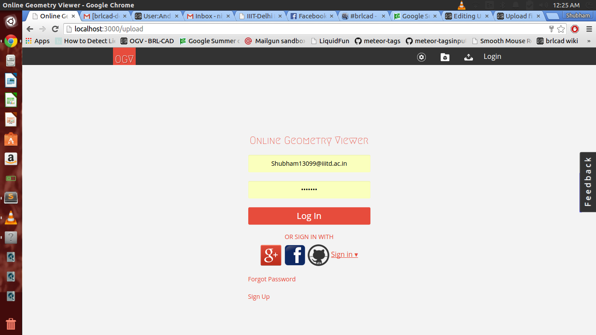
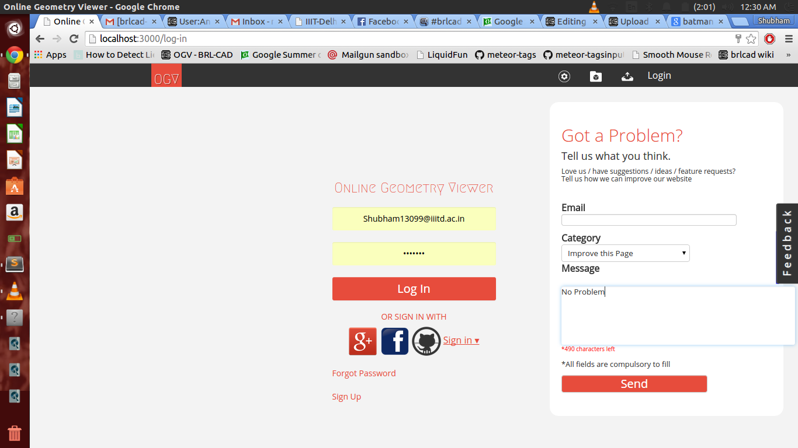
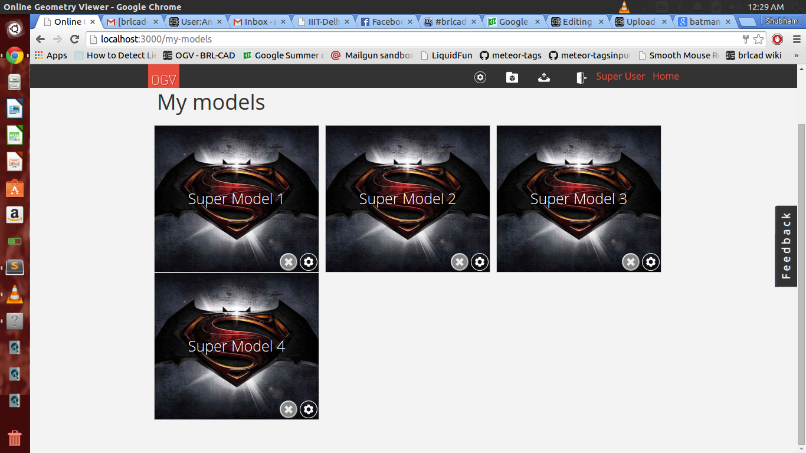
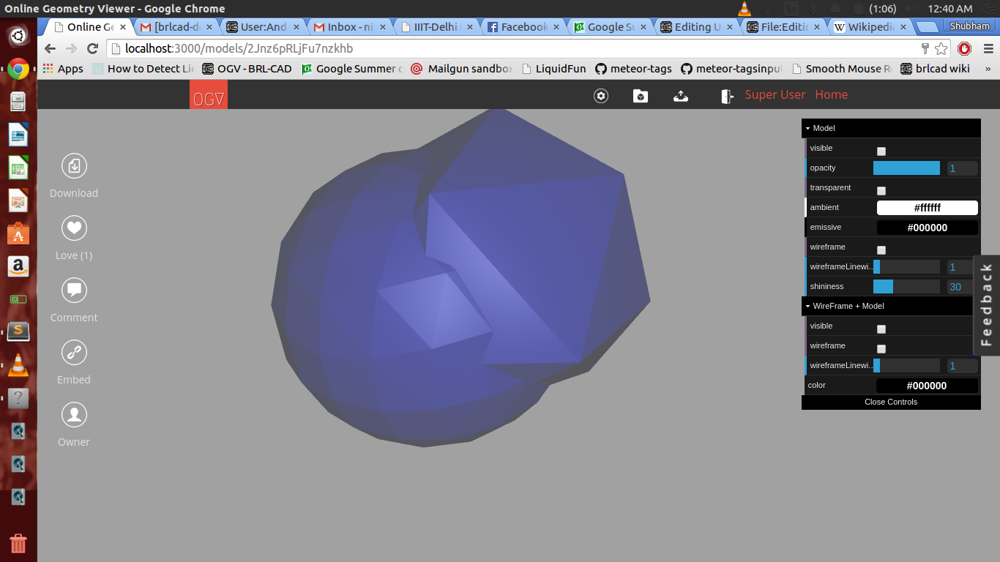
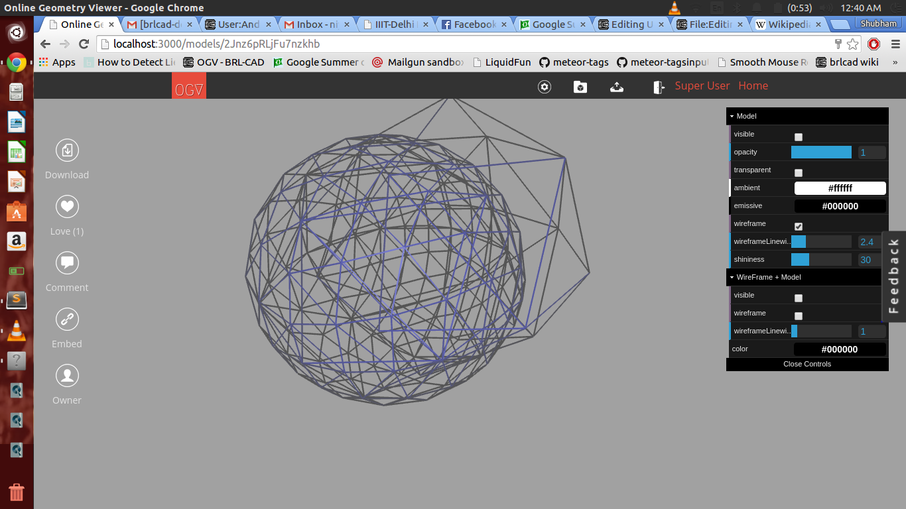
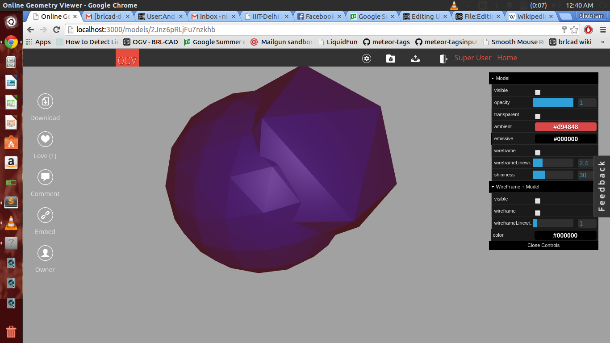
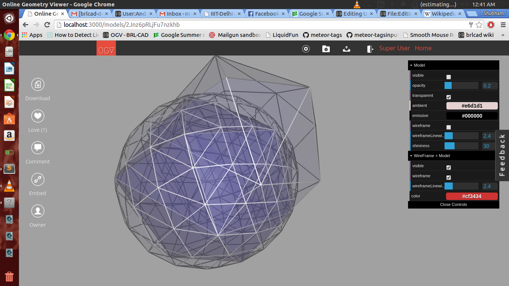
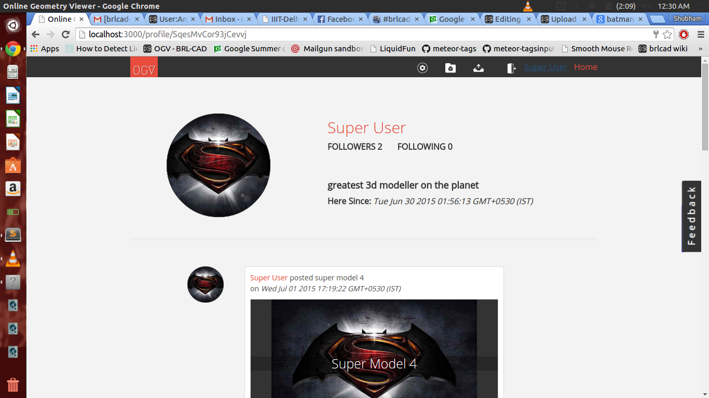
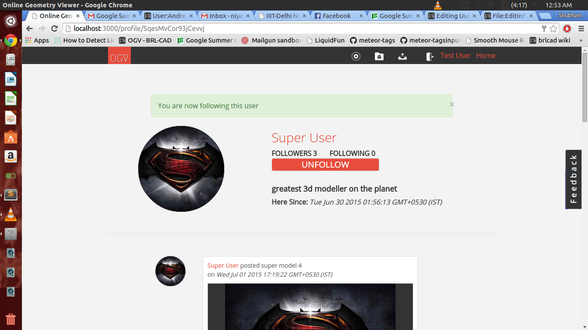

# **Midterm Summary**

All the following features/implementations were merged in a single
branch by the name
**[backend](https://github.com/meShubham99/OGV-meteor/tree/backend)**

**I am attaching some snapshots so that one can get an idea about what I
am referring to.
But the work does not confide to the mere visual of the
implementation.
There are many other features that are at play, but cannot be
displayed.**

## **Login**

-   I made an account on gmail by the name ogv.mailer@gmail.com for
    configuring and testing omniAuth and mailgun accounts.
    I worked on email Verification and reset/forget password mails
    (using mailgun).
-   I also added omni-Auth functionality for google and github and
    facebook. The backend code for omniAuth is ready and working,
    but needs to be configured by brlcad accounts (after deployment).

## **Feedback**

-   Made a separate feedback page. Implemented mailing to the developer
    directly using formspree.io.
-   There are some issues in formspree validations in safari browser, so
    maybe I'll have to change the working, remove formspree,
    and use default forms, and mailgun back end.
-   Also developed a frontend such that the feedback template will be
    visible to the user at all times and the user can fill
    in the feedback form at all times, without stopping any of his work.

## **Edit info of Model**

-   Added a field for "category" (pre-defined categories) in the form,
    which will be stored in the model-document as an array.
    This array of "categories" will help in exploring/searching the
    models of particular category.
-   Earlier user was unable to update any information regarding the
    model, which has been enabled.
-   The user can now delete uploaded models as well. On deletion,
    previous thumbnails also gets deleted. Same goes for when you update
    a thumbnail.
-   This particular part had many other bugs regarding file-storing
    (thumbnails being stored repeatedly), and routing problems, which
    have been resolved.

 

## **Model Viewer**

-   Added dat.GUI library enabling the user to view his models with
    different attributes being changed and seeing its effects in
    real-time.
    These attributes include shininess, transparency, opacity, ambient,
    emissive, wireframe+model, only wireframe and wireframe line width.

## **Follower/following format for users**

-   I have made user profile pages, that show info about the user and
    his uploaded models (with decent front-end).
-   Small things like showing google+ profile picture of users if he is
    logging in through google have been taken care of.
-   A working FOLLOW & UN-FOLLOW button that pushes/pulls user Id's
    in/from an array inside the user document.
    The user only sees the model-uploads made by the user he is
    following. The user can see popular models as well.
    Need to make an intelligent newsfeed.
-   A basic model for a social platform has been setup.

The first picture depicts the view of user's own profile.
And the second one is when the same profile is being viewed by another
user. That is when the user clicks the follow button.

