# Log

## Community Bonding

-   May 2
    -   Downloaded the source code of the latest revision from svn
        checkout and got more familiar with subversion.
    -   Compiled and built the source both in Ubuntu and Windows (Visual
        Studio 2010) successfully.
-   May 13
    -   Found and fixed a small bug in eto_brep (the rotation axis of
        eto is wrong), and submitted a patch on sourceforge.net.
-   May 15
    -   Modified the eto_brep patch with the test case provided by
        Cliff.
-   May 16
    -   Continued working on the conversion of eto.
    -   Tested the brep conversion of hyp, but found the raytrace result
        of implicit CSG hyp quite strange.
-   May 17
    -   The raytrace of implicit hyp is wrong when H is not
        perpendicular to A.
    -   Fixed the conversion to brep of hyp (havn't commited yet).
-   May 18
    -   My first SVN Commit: fixed the shearing direction of hyp.

## Week 1

-   May 21
    -   Fixed the bug of wrong id & od for pipe b-rep, by changing some
        prevp to curp.
    -   Dealt with duplicated points by deleting them from the linklist.
-   May 22
    -   Added some control to deal with special cases in pipe_brep.cpp
        and add a few comments.
-   May 23
    -   Read and tried to understood the code in revolve_brep.cpp, but
        got confused by the implicit definition.
    -   Changed the revolution axis and origin of the sketch plane of
        revolve_brep.
-   May 24
    -   Changed the position of the sketch in extrude_brep according to
        the parameters.
    -   Fixed the plane direction of circle arcs in sketch_brep as well
        as in revolve_brep.
-   May 25
    -   Dealt with non-full revolution of revolve_brep. It took a long
        time to get the expected result, but I got more familiar to
        NURBS/BREP during that procedure.

## Week 2

-   May 27
    -   Tested and examined the implemented brep conversions. Checked
        the current status of my work.
-   May 28
    -   Added the implicit -&gt; brep conversion to conversion.sh, so
        that massive testing will be more convenient.
-   May 29
    -   Tested the functionality of conversion.sh and brep conversions.
        Made a small change.
    -   Modified brep.c in libged to check whether the conversion is
        successful.
-   May 30
    -   Read the code in clone.c, and began to implement the temporary
        unevaluated conversion of comb in the brep command in MGED.
-   May 31
    -   Extended the functionality of the brep command in MGED to deal
        with comb. Unevaluated breps are generated. More tests are
        needed.
-   June 1
    -   The unevaluated conversion for comb has been implemented.
        Changed conversion.sh accordingly. And the whole elasped time
        for each object is evaluated.
    -   Handled some exceptions in brep_debug.cpp.
    -   Freed memories and corrected the "name existed" output in brep.c
        in libged.
-   June 2
    -   Tested the brep conversion on ktank.g, m35.g, etc. with
        conversion.sh.
    -   Modified brep_debug.cpp to deal with empty combs.

## Week 3

-   June 3
    -   Fixed the wrong malloc size and freed tmpname before returning
        in brep_debug.cpp.
-   June 4
    -   Modified openNUBRS_ext.cpp to quell set-but-unused warnings.
    -   Tested brep conversion of all /db/\*.g files. Looked into the
        log to find out what to do next.
    -   Found a bug in pipe_brep.cpp dealing with colinear points.
-   June 5
    -   Modified pipe_brep.cpp. It's much better now, but problems
        still remain.
-   June 6
    -   Fixed a concealed bug in pipe_brep.cpp. Now it works properly.
-   June 7
    -   Fixed the destruction failure in pipe_brep.cpp by duplicating
        the curves.
-   June 8
    -   Modified brep_debug.cpp to skip the conversion of half when
        converting a comb. The implicit primitive of half remains in the
        hierarchy.
    -   Explored the usage of ON_BrepRegion to represent an infinite
        halfspace, but had no good luck.

## Week 4

-   June 11 - June 18
    -   Final examination week in our school.

## Week 5

-   June 18
    -   Final exams finished. Started to work!
    -   Added pnts to the ignore list when converting a comb.
    -   Modified the describe and ifree functions in pnts.c checking
        whether count==0 to avoid segmentation fault.
-   June 19
    -   Corrected the wrong comments in arb8_brep.cpp and
        arbn_brep.cpp.
    -   Add a brep conversion function to ars, which first converts it
        to an nmg and then to b-rep.
-   June 20
    -   Use ft_brep functions for half and pnts, returning a NULL brep
        pointer, and check within brep_conversion() and
        brep_conversion_tree().
-   June 21
    -   Tried implementing rt_part_brep() for primitive part. Things
        get much closer now after much tests and modifications.
-   June 22
    -   Finished a raw version of brep conversion for part. Some special
        cases need to be considered later.
-   June 23
    -   Enhanced some special cases (sphere) in part_brep.cpp.

## Week 6

-   June 24
    -   Fixed the wrong normal direction of the brep form of part.
-   June 25
    -   Studied the primitive metaball. Found it quite hard to get
        started.
-   June 26
    -   Studied the two papers Cliff provided on metaballs, but still
        cannot find the answer.
    -   Copied the transformation matrix when converting the leaves in a
        tree. (Later adjusted to copying all data from the old tree
        first)
-   June 27
    -   Evaluated the results and uploaded the screenshots to the log
        page. (See "Test Results")
    -   Modified dsp_brep.cpp, using the dsp_stom matrix to do the
        transformation, instead of using the magic numbers.
-   June 28
    -   Implemented a b-rep conversion function for superell.
-   June 29
    -   Tested the results of conversion of superell. (See below)
-   June 30
    -   Uploaded the raytracing results of superells with e or n &gt; 2.

## Week 7

-   July 2
    -   Added conversion functions to cline. We first convert cline to
        an implicit pipe, and then convert the pipe to b-rep.
-   July 3
    -   Modified superell_brep.cpp to generate multiple surfaces for
        superells with e or n &gt; 2.
    -   Uploaded images with the modified b-rep conversion routine for
        superell.
-   July 4
    -   Uploaded images of the raytrace results of cline (both implicit
        and b-rep).
    -   Fixed the wrong weight when the center (origin) is set to be
        control points (superell_brep.cpp).
-   July 5
    -   Some minor modifications on brep_debug.cpp, half_brep.cpp and
        pnts_brep.cpp.
    -   Add a b-rep conversion function to grip, but it just returns a
        NULL ON_Brep pointer because grip is a pseudo solid and doesn't
        have its own shape.
-   July 6
    -   Implemented degree reduction to Bezier curves to simplify the
        representation of the dsp top surface. But still a long way to
        go. As I tested it with terra.g, the result made me very upset.
        There were great differences in the middle of the curves. For
        dsp with smaller xcnt & ycnt, the result was quite accurate. But
        it's big xcnt & ycnt that counts, because this is introduced to
        shorten the raytrace time of dsp with large maps.
    -   TODO: Calculate the accumulated deviation. A torelance value TOL
        might be used to decide whether the result is acceptable or not.
        Or replace it with a better algorithm. (e.g. The specific way
        for DSP Cliff mentioned in E-mail)
-   July 7
    -   Thought over the specific way to reduce control points on the
        dsp top surface, but found that finding local minimum and
        maximum is not quite suitable for Bezier surfaces as this
        results in non-uniform control points (cannot form a rectangular
        grid). To keep it uniform may result in even nothing reduced at
        last. So I'd like to go on with the corrent routines at present.

## Week 8

-   July 8
    -   Added b-rep conversion function to hf: hf -&gt; dsp -&gt; brep.
-   July 9
    -   Added a tolerance variable to control the max error in degree
        reduction in dsp_brep.cpp.
    -   Tested the results of b-rep conversion for dsp. For the 30\*30
        displacement map, it can be reduced to 16\*26 within the
        tolerance (see the images below), while the 256\*256 map in
        terra.g can only reduced to 254\*254 within the tolerance (maybe
        a bigger tolerance value should be used).
    -   Next step for my project: start studying and implementing NURBS
        surface-surface intersection.
        [(/wiki/NURBS_Intersections)](/wiki/NURBS_Intersections)
        Even if I cannot completely finished this project as there is
        not much time left in this summer, adding some useful "pieces"
        of it can still be helpful.
-   July 10
    -   Read some papers on surface-surface intersection. It's really a
        HARD project. Two approaches came to mind:
    -   1\. Using subdivision methods. The two surfaces can be
        decomposed into small parts, and the calculation turns to the
        intersection of these small parts. Two papers Cliff offered seem
        to use this method (One uses surface triangulation, the other
        uses small bounding boxes). It might be a rather simple
        approach, but I'm worried about the performance and accuracy of
        this method.
    -   2\. Using marching algorithms. This approach usually achieve
        good performance, but lots of math is required. After I went
        through several papers, I still cannot come up with a complete
        solution of the first step: Finding starting points using
        curve-surface intersection. So although this method sounds quite
        ideal, but the reality is that it's not easy to implement it.
-   July 11
    -   No longer used dynamic memory allocations in hf_brep.cpp.
    -   Add comment to mark the unused functions in
        primitives/brep/brep.cpp.
    -   Went on studying papers on NURBS surface-surface intersection
        and read the existing code in brep.cpp as well as
        opennurbs_ext.cpp(h). Things got much closer, but discussions
        are still needed before a final solution is formed.
-   July 12
    -   In present we decide to focus on the subdivision algorithm which
        is described in: Adarsh Krishnamurthy, Rahul Khardekar, Sara
        McMains, Kirk Haller, and Gershon Elber. 2008. Performing
        efficient NURBS modeling operations on the GPU. In Proceedings
        of the 2008 ACM symposium on Solid and physical modeling (SPM
        '08). ACM, New York, NY, USA, 257-268.
        DOI=10.1145/1364901.1364937
        <http://doi.acm.org/10.1145/1364901.1364937>
    -   Taken the first step of NURBS surface-surface intersection.
        Surface trees of the two surfaces are generated and
        intersections of the bounding boxes are calculated.
    -   Added the SSI function to opennurbs_ext.h and
        opennurbs_ext.cpp.
-   July 13
    -   Continued working on SSI with subdivision - the second step is
        to estimate the intersection points with trigonal
        approximations. Implemented a function to calculate the
        intersection of two triangles (it sounds simple, but the code is
        rather long). Finished a draft of the whole second step. But I
        havn't tested it yet.
    -   It seems that m_u and m_v in the bounding box tree do not
        work. So maybe I should calculate the u domain and v domain
        beforehand, or modify the SurfaceTree function to update m_u
        and m_v when building the surface tree.

## Midterm summary

-   The original milestones of my project:
    -   **The remained problems with implemented conversions like ehy,
        hyp, revolve, sph, ell, tor, extrude, pipe, etc. are fixed.
        Patches will be updated promptly. (Some have been done now,
        verification needed.)** - After several tests on the solids in
        db/\*.g files, they seems to work well now.
    -   **Conversions of non-orgin located primitives are implemented
        (if they have not been implemented now)** - Worked on them
        together with fixing other bugs, completed.
    -   **The missing conversions of implicit primitives are
        implemented.** - Most of them are implemented, except metaball,
        pnts, joint, submodel, constraint, and anno.
    -   **At last a converter working for a whole CSG tree is built (The
        user interface of my work).** - The brep command in MGED can
        convert a comb now (the code is in brep_debug.cpp and
        libged/brep.c), and conversion.sh can convert the objects in a
        file.
-   About the remaining half of GSoC
    -   Work on the NURBS surface-surface intersection project.

## Week 9

-   July 15
    -   Just did some clean up in opennurbs_ext.cpp - remove unused and
        shadowed variables to avoid compiler warnings.
-   July 16
    -   m_u and m_v is updated in the surfaceBBox() and initialBBox()
        functions so that they are valid when we calculate the surface
        sub-patches.
    -   Fixed some small bugs in the surface-surface intersection
        function (copy-paste un-modified). Now that the second step of
        SSI is finished - points on the curve have been created.
-   July 17
    -   Fit the points into NURBS curves using polyline approximation.
    -   TODO: (1) Calculate max_dis according to the size of the
        biggest bounding box. Tests are needed to define a better
        threshold. (done) (2) Implement a method to test SSI (maybe
        extend the brep command in MGED with an option "intersect").
        (done)
-   July 18
    -   Fixed the copy crashing by using pointers to the intersection
        curves.
    -   Added an option to the brep command in MGED to test
        surface-surface intersection. The syntax is: brep obj1.brep
        intersect obj2.brep i j . This syntax is used mainly because
        it's easy to implement.
-   July 19
    -   Fixed the bu_malloc(0) failure in
        surface_surface_intersection().
    -   Uploaded an image of the intersection of a sph and an ehy.
    -   TODO: The current intersection routine doesn't work well with
        plane surfaces, because the bounding box of a plane surface has
        no volume. (done)
-   July 20
    -   Calculated the threshold according to the size of bounding-box.
    -   Uploaded an image of the intersection of an epa and a tgc. (Two
        intersection segments)
-   July 21
    -   Modified the brep command so that the max_dis value can be
        inputted manually within the command for testing.
    -   There are still problems with the current intersection:
        sometimes we get too few points to fit an ideal intersection
        curve.

## Week 10

-   July 23
    -   Intersection with a plane surface works well now - for a BBNode
        with no children within the max depth, copy itself as its child.
        (An image of related results was uploaded.)
-   July 24
    -   There is a trade off between performance and result quality. If
        we use bigger INTERSECT_MAX_DEPTH (i.e, 10 instead of 8), we
        get better results but it costs more time.
    -   Calculated the coordinates of the intersection points in UV
        parameter spaces. The next step is to make use of these
        coordinates to create 2D trimming curves.
-   July 25
    -   Do not generate the whole surface tree - only a small useful
        subset is generated simultaneously with the intersection
        process. Much faster.
    -   TODO: use the tolerance value instead of a constant
        INTERSECT_MAX_DEPTH.
-   July 26
    -   Do not copy the node as its child - just pass it to the next
        iteration.
    -   Fixed the memory leak introduced by this morning's modification.
-   July 27
    -   Calculated the intersection curves in UV parameter spaces
        (trimming curves), and extended the brep command to test them.

## Week 11

-   July 30
    -   Modified brep_debug.cpp to plot the 2D trimming polyline curves
        better. Used KnotCount - 1 as the plotres to avoid the
        interpolation problems.
-   July 31
    -   Some minor changes to the b-rep conversion functions in
        brep_debug.cpp. Free the allocated spaces.
-   Aug 1
    -   The first step of manipulating booleans on NURBS b-rep objects.
        Added a function to /primitives/brep/brep.cpp which is going to
        deal with the boolean operations of b-reps.
-   Aug 2
    -   Added a function in to deal with NURBS curve-curve intersection,
        which will be useful in evaluating booleans on NURBS.
-   Aug 3
    -   Continued work on evaluating booleans on NURBS - generate new
        trimmed faces with intersection curves (not all situations are
        considered now, still WIP).

## Week 12

-   Aug 6
    -   Continued working on dividing trimmed surfaces. It's really
        quite complicated. Lots of further work and tests are needed.
-   Aug 7
    -   The current method for partitioning a trimmed surface is not
        elegant and convenient. Looked for some materials online and
        found some valuable resources.
    -   Used a new method for partitioning a surface. Followed the
        algorithms described in: S. Krishnan, A. Narkhede, and D.
        Manocha. BOOLE: A System to Compute Boolean Combinations of
        Sculptured Solids. Technical Report TR95-008. Department of
        Computer Science, University of North Carolina, 1995. Appendix
        B: Partitioning a Simple Polygon using Non-Intersecting Chains.
-   Aug 8
    -   Finished a draft of partitioning a surface. Modifications for
        special cases and tests are needed.
    -   Before starting to write code dealing with inside-outside tests,
        which is the final step to evaluated NURBS, the current routine
        of partitioning should be finished beforehand. But it's still a
        long way to go. I hope I can have good luck with it.
-   Aug 9
    -   Added an option to the brep command in MGED to test boolean
        evaluations (currently only "union").
    -   The evaluation processes are still WIP. The final b-rep
        structure cannot pass IsValid() at present because edges and
        vertices are not added. Besides, lots of other modifications are
        needed.
-   Aug 10
    -   Added trims, vertices, edges, etc. to the b-rep structure and
        checked its validity.

## Week 13

-   Aug 13
    -   Continued working on adding elements to the ON_Brep structure,
        trying to make IsValid() succeed. Did some clean up and fixed
        some bugs, and make the common parts into a separate function.
    -   Today is the suggested "pencils down" date. As for the project
        of evaluating NURBS objects, I think I do not have enough time
        left to finish it all. At present, faces can be partitioned into
        several trimmed faces, but some conditions are not considered
        and problems may still exist. As for the week left, I'd like to
        go back to the code I wrote all these months, do some clean up,
        add necessary documents, etc.
-   Aug 14
    -   Modified add_elements() and tried using the
        ON_Surface::Pushup() method first.
    -   Some clean up on dsp_brep.cpp: modified comments, renamed a
        variable with typo, eliminated the debug output, and reduced
        using dynamic allocated pointers.
    -   Added comment before surface_surface_intersection() to
        describe the algorithm used in SSI.
-   Aug 15
    -   Modified cline_brep.cpp, ehy_brep.cpp, epa_brep.cpp,
        eto_brep.cpp and extrude_brep.cpp and eliminated the memory
        leak.
-   Aug 16
    -   Modified hyp_brep.cpp, part_brep.cpp, pipe_brep.cpp,
        revolve_brep.cpp, rhc_brep.cpp, rpc_brep.cpp,
        sketch_brep.cpp and tgc_brep.cpp and eliminated the memory
        leak.
    -   Did some clean up and added comments to /libged/brep.c.
-   Aug 17
    -   Add documentation of the brep command in MGED to the wiki page.
        See: [1](/wiki/MGED_CMD_brep)

## Final summary

-   The "Implicit to NURBS conversion" project was mainly done before
    mid-term evaluation. The milestones and previous goals in the
    original proposal are finished.
-   After mid-term, I focused on the "NURBS Intersection" project, and
    add many useful features to BRL-CAD, such as calculating
    surface-surface intersection curves (both in 3d space and 2d UV
    space), splitting surface and generating new trimmed surfaces, etc.

# Test Results

The brep conversion has been tested on several db/\*.g files. Below are
the screenshots of the raytrace results.

-   m35.g: component (left: implicit + csg, right: brep + csg)

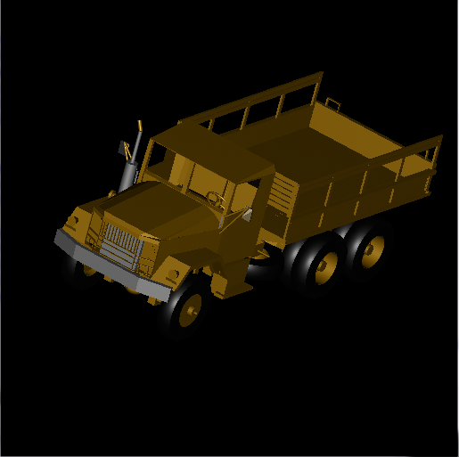
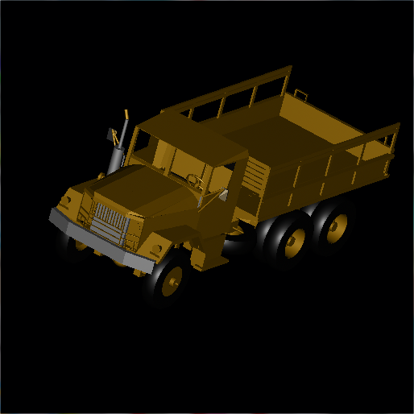

-   ktank.g: tank (left: implicit + csg, right: brep + csg)

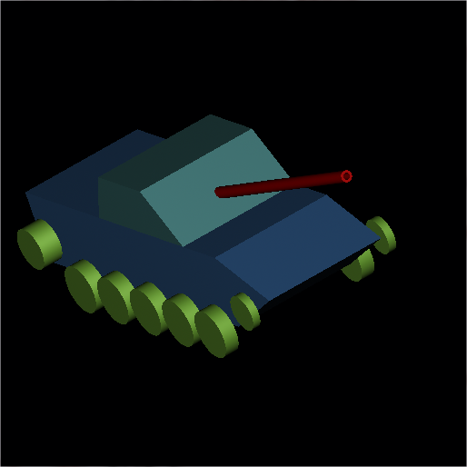

-   havoc.g: havoc (the raytrace of brep+csg takes a too long time, so
    the result hasn't been generated yet)

<!-- -->

-   A DSP primitive with a 30\*30 map: (first: implicit, second: brep,
    third: reduced to a 16\*26 map (sorry for the slightly different
    views))

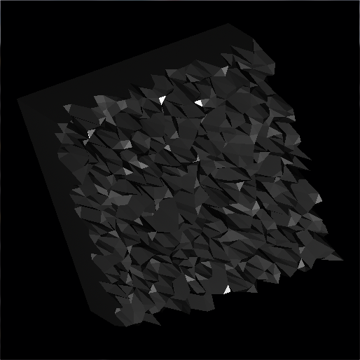
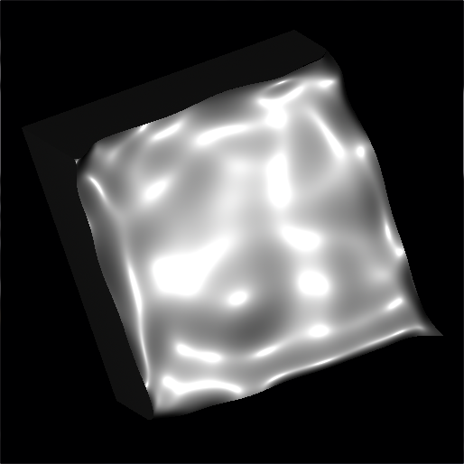 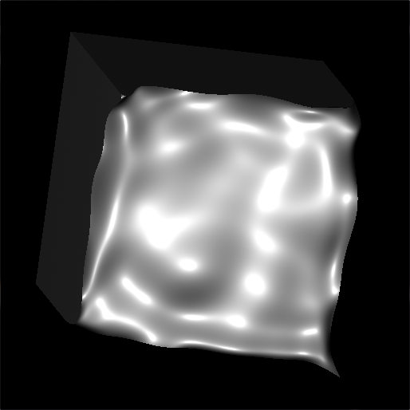

-   Brep form of superell primitives with axes of the same magnitude:
    (left: n = 0.8, e = 0.2, right: n = 1.0, e = 2.0)
    -   Reference page: <http://paulbourke.net/geometry/superellipse/>

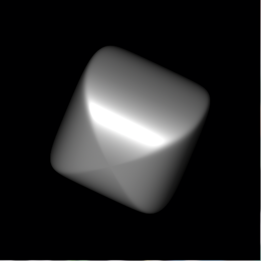
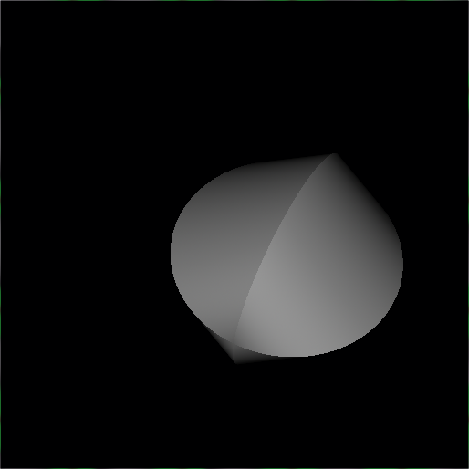

-   -   There is still some problems when n &gt; 2 or e &gt; 2. (left: n
        = 0.2, e = 3.0, right: n = e = 3.0)

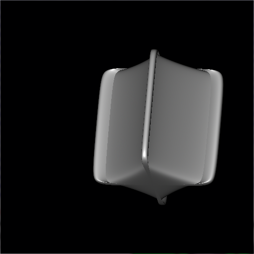
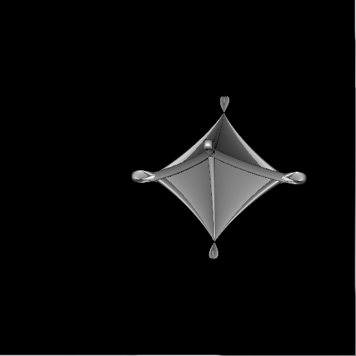

-   -   The problem above was fixed in r51405. (first: n = 0.2, e = 3.0,
        second: n = e = 3.0, third: n = 3.0, e = 0.2)

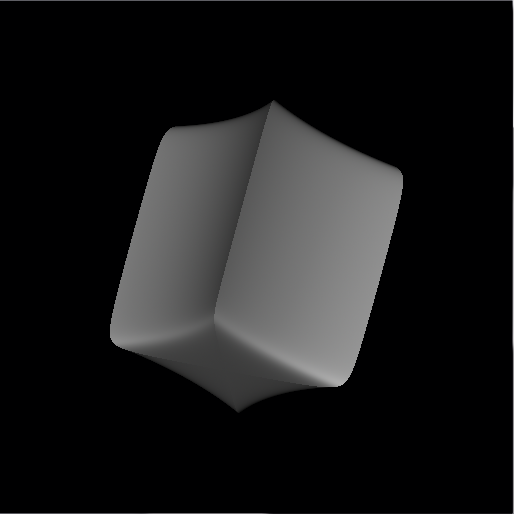
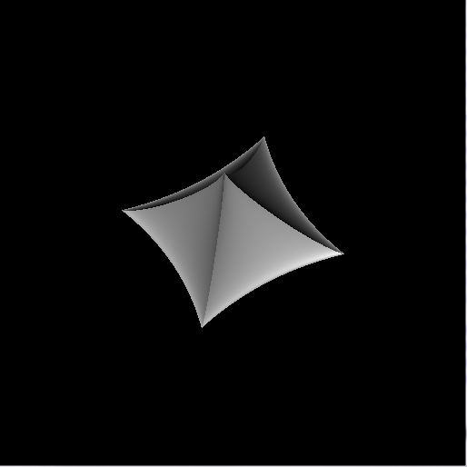
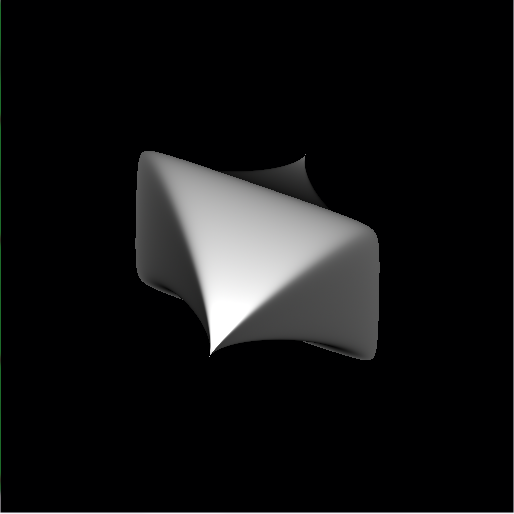

-   A cline primitive raytraced in different views. You can see that
    it's a primitive whose raytrace is view-dependent. We use a pipe to
    represent it when it's converted to b-rep, whose raytrace is
    view-independent. The shape of the pipe is according to what we see
    when plotting a cline with the draw command in MGED. (Two different
    views, left: implicit, right: brep)

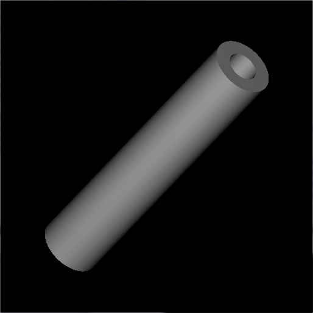
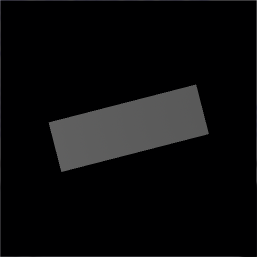
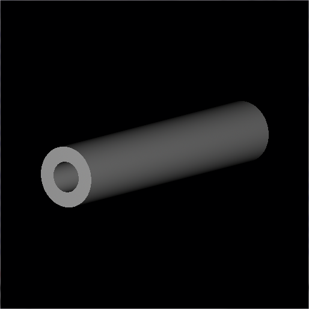

-   The intersection curve (green) of a sph (red) and an ehy (blue).

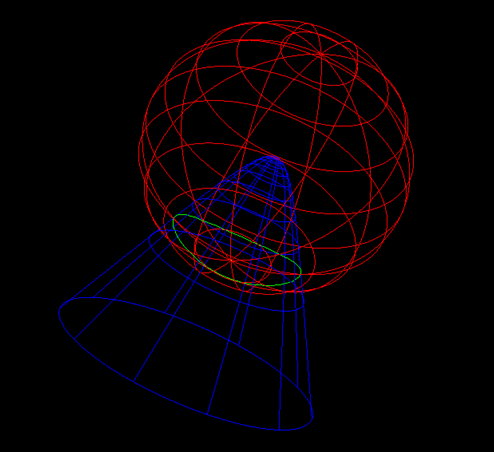

-   The intersection curves (green) of a tgc (red) and an epa (blue).
    (Two segments)

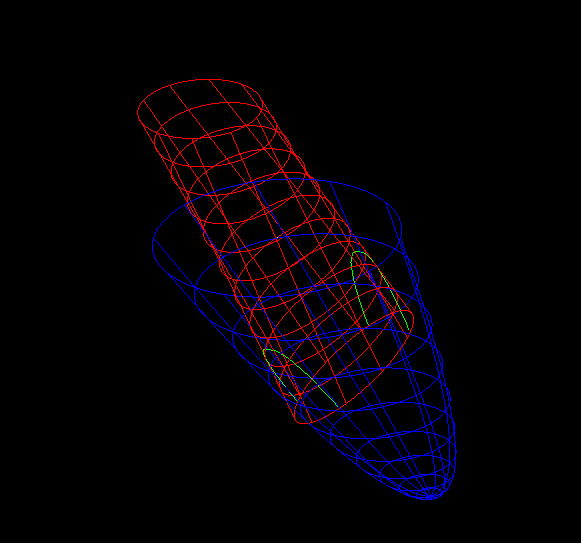

-   The intersection curve (green) of a plane surface (red) and an ehy
    (blue).

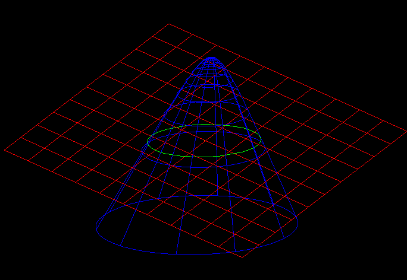

# Original development timeline

-   \- May 21 (\~4 weeks)
    -   Study materials on NURBS/BREP etc
    -   Read the codes in librt/primitives
    -   Get familiar to OpenNURBS
    -   Fix some bugs and make patches
    -   Implement a method for convenient testing (finished)

<!-- -->

-   May 21 - June 10 (\~3 weeks)
    -   Modify implemented conversions if not finished
        -   pipe
        -   sph, ell, tor, hyp
        -   eto, extrude, revolve, etc.

<!-- -->

-   June 11 - June 18 (\~1 week)
    -   Final examination week in our school

<!-- -->

-   June 19 - July 1 (\~2 weeks)
    -   Still work on existing conversions
    -   Work on non-origin primitives
        -   Deduce transformation matrices
        -   Apply the transformation
        -   Test the results and write documents

<!-- -->

-   July 1 - July 29 (\~4 weeks)
    -   Add new conversions to missing primitives
        -   Test whether it works well
        -   Write clear documents
        -   From easy ones to hard ones
    -   July 1 - July 8 (1 week)
        -   rec
        -   ars
        -   half
        -   ell1
    -   July 8 - July 15 (1 week)
        -   metaball
        -   pnts
        -   part
        -   grip
    -   July 15 - July 22 (1 week)
        -   superell
        -   cline
    -   July 22 - July 29 (1 week)
        -   hf
        -   other missing primitives

<!-- -->

-   July 29 - August 13 (\~2 week)
    -   Write a convert for whole
        -   Write a function to walk the tree
        -   Add a command to MGED
        -   Discussions and documents
    -   Test the work and fix bugs

<!-- -->

-   August 13 - August 20 (\~1 week)
    -   Pencil down data
        -   Improve documentation
        -   Evaluations

<!-- -->

-   Post-GSoc
    -   Further involvement with BRL-CAD :)
