# Log

## Community bonding

-   May 28
    -   Create the log page
    -   Things have done:
        -   Test program for SSI and a test geometry file
        -   Some improvement with SSI and API design
-   June 3
    -   As I will have my final exams during the first week that coding
        begins, so I'd like to move some work ahead.
    -   Begin to add P/P, P/C and P/S support. Implement ON_PX_EVENT
        for reporting the intersections.
    -   TODO: Implement P/C, P/S and ON_PX_EVENT::IsValid().
-   June 4
    -   Eliminate max_dis in the brep command for SSI.
    -   Extended the brep command to handle P/P, P/C, P/S, C/C and C/S.
    -   Modified the wiki page of the brep command.
    -   Fix the format of ON_PX_EVENT::Dump(). (Add "\\n")
-   June 7
    -   Try to add PS support using get_closest_point().
    -   Test the functionality of the PS function - it seems that
        there's a problem when try (0,0,5) on a sphere of radius 5 and
        centered at the origin (it should be an intersect, but
        get_closest_point() returns (0,0,-5) resulting in no
        intersections).
-   June 12
    -   Calculate point-curve intersection using sub-division.
    -   Do some simple testing on PCI. It works.

## Week 1

-   June 17
    -   Coding period begins!
    -   Put the tolerance into consideration in the IsPointIn() test in
        PCI.
    -   Write a test program on sphere to test P/P, P/C and P/S.
        -   <s>It seems that get_closest_point() is not always robust.
            :( Maybe it's not a good choice for P/S.</s>
-   June 18
    -   Use macros to represent default tolerance and change it to 0.001
        (the same as the default tolerance of curve/curve,
        curve/surface, surface/surface defined by openNURBS)
    -   Consider the input u_domain and v_domain for the result of
        point-surface intersection.
-   June 19
    -   Busy with the course projects and preparing a final exam. Didn't
        have much time for BRL-CAD.
-   June 20
    -   Found the problem causing get_closest_point() to fail
        -   get_closest_point() sometimes give us the 'farthest'
            point.
        -   =&gt; getClosestPointEstimate() didn't work.
        -   =&gt; The surface tree are not built correctly.
        -   =&gt; It seems that we inappropriately prepTrims when
            m_removeTrimmed is false, causing get_closest_point() to
            fail. Someone who wrote this code needs to check whether
            this change is correct.
    -   Use a smaller depth for PSI to improve performance.
-   June 21
    -   Added Newton-Raphson iteration in PCI to improve accuracy (using
        the one from subdivision and linear approximation as a starting
        point)
        -   After test, it can work with tolerance set to
            ON_ZERO_TOLERANCE!

## Week 2

-   June 24
    -   The plane was delayed for a long time. It took almost the whole
        day to get to Beijing. :(
    -   Set removeTrimmed to false, otherwise the surface tree cannot be
        built correctly - since the last change raised a raytrace
        problem.
-   June 25
    -   Began to implement curve-curve intersections.
        -   First using sub-division to find the intersecting bounding
            boxes.
        -   Then use Newton-Raphson iterations to get an accurate
            result.
        -   Finally check the validity of the solutions and check
            overlap.
    -   More tests and improvements are needed.
    -   Added the new CCI and CSI functions to brep_debug.cpp.
-   June 26
    -   Improvements and bug fixing of curve-curve intersection
        -   Add tolerance value in the bounding box intersections.
        -   Check duplication before appending to the array x.
        -   In the Newton-Raphson iterations, if the inverse fails, we
            try another two directions.
        -   More work on the tolerance value to get a more accurate and
            correct result.
    -   Add a test program for curve-curve intersections.
-   June 27
    -   Continued improving curve-curve intersection
        -   Merge the overlap events that are continuous.
        -   Eliminate the intersection points that are inside the
            overlap events.
        -   Some special handling for linear curves.
    -   Add another test for overlaps.
-   June 28
    -   More work on CCI
        -   Assign values to m_a\[1\], m_A\[1\], etc. even if it's
            ccx_point event (according to openNURBS declarations in
            other/openNURBS/opennurbs_x.h)
        -   Fixed the wrong curve used in detecting overlaps.
    -   Added more comments to document the intersection approaches.
    -   Studied materials on curve-surface intersections and ready to
        get started.

## Week 3

-   July 1
    -   Began to implement curve-surface intersections
        -   Use sub-division and Newton-Raphson iterations.
        -   It's similar to curve-curve intersections.
-   July 2
    -   Added tests for curve-surface intersections.
    -   Improved curve-surface intersections
        -   Check the endpoints of the line segment when computing its
            intersection with a boundary plane.
        -   Consider NaN.
        -   Add fabs() when calculating the line_t.
    -   Fixed a typo in brep.c ("CS" for curve-surface rather than
        "PC").
-   July 3
    -   Added another test for CSI (line & torus).
    -   Continued improving curve-surface intersections.
        -   Reused surface tree - avoid generating the surface tree
            again and again.
        -   Added some special splitting machanism for polylines.
        -   Comparing doubles cannot use minus directly.
        -   If the starting point is good enough, we don't need Newton
            iterations.
        -   When merging, m_b should be consistent with m_a.
        -   Values of 3D and 2D spaces should have different tolerances.
            And consider the 2D tolerance when merging.
-   July 4
    -   Started to work on surface-surface intersections (TDD)
        -   Did some clean up to the original code.
        -   Split the two steps (intersecting bounding boxes and
            triangular approximation).
        -   Dealt with single points, and checked validity of the
            solutions.
    -   Using tests (csgbrep.g): brep sph.brep intersect tor.brep 0 0
-   July 5
    -   Improve SSI
        -   Dealt with surface boundaries (using CSI).
        -   Some special handling for closed surfaces - added function
            closed_domain().
        -   Eliminated duplicated points using a naive approach.

## Week 4

-   July 8
    -   Continued SSI
        -   Fixed bugs of triangle intersections - wrong line_normal
            for B, floating point issues (== is not sufficient),
            coincident planes cases, and calculate the barycentric
            coordination with ON_Solve2x2() in case that the inversion
            fails.
        -   Calculate max_dis using the length of bounding box
            diagonal, in case that both volumes are zero.
    -   Modified brep_debug.cpp and test_ssi.cpp to deal with
        intersection points (use spheres to represent the points).
-   July 9
    -   Uploaded some test images to this log with arb_intersect.g and
        csgbrep.g
    -   Use 2D intersection tolerance with the 2D distances.
    -   Linear fitting with the 2D intersection curves.
-   July 10
    -   Perform Newton iterations to get more accurate surface-surface
        intersection points. (newton_ssi() in intersect.cpp)
    -   Fixed a bug in triangle intersections raised by
        points_on_line.
    -   More elegant SSI result display.
    -   Did more tests and uploaded result images. (A problem comes out
        with the tests, as described below)
-   July 11
    -   Worked on fitting the curves that SSI generates.
        -   Used an independent function to work on curve fitting.
        -   Added more fitting machanisms.
        -   Arc fitting - use ON_Curve::IsArc(). But tests seems that
            it cannot work well. I'll figure out why this happens.
        -   Ellipse fitting - ON_Curve::IsEllipse() cannot work because
            it only calls IsArc() in it. And it can not figure out when
            the curve is an elliptical arc. So I first wanted to use
            least square fitting provided by
            <http://citeseerx.ist.psu.edu/viewdoc/summary?doi=10.1.1.83.7803>,
            but found that openNURBS provided us with
            ON_GetConicEquationThrough6Points() and
            ON_IsConicEquationAnEllipse() which are very useful and
            decided to use them. The code works well, and these
            functions are also very helpful in other conic fittings
            (hyperbola, parabola).
-   July 12
    -   Fixed a bug of fitting
        -   The original code cannot deal with elliptical arcs that
            cross the point where t=0 - Duplicate the ellipse curve to
            make its domain \[0, 4\*pi\].
    -   Tests and fixing the SSI code.
        -   Use a plane and an elliptic parabolic surface (epa). See the
            images below.
        -   Use max_dis_u (v, s, t) seperately as the scale of their
            domains may differ a lot. Before this, the result is totally
            a mess, but after this it's much better.
        -   Eliminate unnecessary collinear points on the polyline
            curves.
        -   Remove the arc fitting code, because
            ON_PolylineCurve::IsArc() always returns false. The
            elliptical arc fitting code below will work for this.

## Week 5

-   July 15
    -   Normalized the intersection curves (use domain \[0, 1\]), and
        checked tangent events.
    -   Checked domain parameters passed to ON_Intersect().
    -   Used seaming curves to handle intersecting intersection curves.
        -   If two curves have points whose distance is less than
            max_dis (also consider the 2D distances), and they
            originally don't intersect (use curve-curve intersections),
            we generated a seaming curve to 'link' them together.
            Sometimes the seaming curves can be merged if they are
            continuous to one of the old curves.
-   July 16
    -   Read papers to get ideas to handle overlaps in surface-surface
        intersections.
    -   Discusses with other developers on the mailing list.
    -   Two approaches come to mind:
        -   If we assume the two surfaces are C-infinity, we can use the
            theorem 3 in paper
            <http://libgen.org/scimag1/10.1016/S0010-4485%252896%252900099-1.pdf>
            (Thanks to Bryan Bishop). This can be reduced to several
            curve-surface overlap problems (already implemented) because
            the overlap region is bounded by surface boundaries.
        -   Otherwise, we need to get points inside the overlap region
            (using surfA-&gt;NormalAt(u,v) and surfB-&gt;NormalAt(s,t)),
            and then find the boundary (merge the triangles using the
            points as vertexes). These approach doesn't require
            continuity, but is very slow (too many bounding boxes and
            intersection points) and may lack accuracy (we may not have
            points on the boundaries)
-   July 17
    -   Some slight modifications to SSI (Commit 56091)
    -   Solved the under-determined system with Newton iterations using
        pseudo-inverse. (ON_Matrix::Invert()) can do this)
    -   Began working on overlaps:
        -   Bezier patches satisfy the theorem 3 mentioned above. Since
            the Bezier patches for a NURBS surface are always bounded at
            the knots, we actually don't need to generate the Bezier
            patches explicitly, and we can get the boundaries of them
            using IsoCurve() on knots.
        -   Get the 3D overlap boundary segments. (2D is working in
            process because CSI doesn't report a 2D curve on the
            surface)
        -   Some tests and bug fixing.
-   July 18
    -   Generate a 2D curve on the surface for csx_overlap, so that we
        can have two 2D curves for ssx_overlap. (Debugged for a long
        time, because \~ON_CurveArray() will delete the curves)
    -   Linked the curves together to form a loop. (Continued to discuss
        about solutions of overlap cases with Cliff)
    -   Changed the direction of curves if necessary to satisfy the
        requirements of ON_SSX_EVENT. (For ssx_transverse events, the
        3d curve direction agrees with SurfaceNormalB x SurfaceNormalA.
        For ssx_tangent events, the orientation is random. For
        ssx_overlap events, the overlap region should be to the LEFT of
        that \*m_curveA\*.)
-   July 19
    -   Read a paper provided by Cliff regarding sub-surface
        intersections using quasi-interpolating control net. But
        unfortunately it doesn't provide much help. Continued to discuss
        about solutions to surface-surface overlaps on the mailing list.
    -   Recognized that there might be inner loops, so the original code
        only make sure that the left on the curve is the closed region,
        but not the overlap region if it's an inner loop. Used
        point-surface intersections to determined which side of the
        curve is actually the intersection.

## Week 6

-   July 22
    -   Eliminate the bounding boxes completely inside the overlap
        region, and intersection points inside the overlaps.
    -   Determine inner loops and outer loops of the overlap region.
    -   Pass trees to the point-surface intersections to avoid
        repeatedly generate the surface trees.
    -   Test whether the overlap curve is an inner segment by testing
        whether the two sides of it are shared or not.
-   July 23
    -   Posted my progress on the mailing list.
    -   Coding part:
        -   Dealt with closed domains for the overlap curve segments.
        -   Fixed the return values of ON_Intersect()s when x may not
            be empty initially.
        -   Normalized the curves for ssx_overlap.
        -   Some code clean up and added some comment to document the
            new features.
    -   Tested the overlaps and uploaded images to this log.
-   July 24
    -   Handled degenerated cases (the curve is degenerated to a point)
        for C/C and C/S intersections.
    -   Fixed two bugs of SSI
        -   A variable (knots) is deleted before where it's used.
        -   Set the pointer to NULL after it's deleted otherwise Split()
            will failed if the pointer is passed in.
    -   Tested on the an extreme geometry provided by Cliff, and figured
        out what I should do next for the overlap case of SSI.
-   July 25
    -   Fix a bug in linking overlap segments (the index should start
        from 0)
    -   Use surface normals to help determine overlaps. The normals of
        the two surfaces should be parallel.
    -   Modified the CSI sub-division routine. The sub-division should
        only stops when the curve is linear AND the surface is planar.
        Otherwise there might be problems with csx_overlap.
    -   Continued to modify the surface-surface overlaps with the test
        case: extreme_ssi_test.g (added to source tree). The
        modification is not finished yet.
-   July 26
    -   Improved SSI with the extreme test case.
        -   Used a struct to represent the overlap segments. Split the
            curves with the intersection points (with other curves), so
            that we can get closed regions.
        -   Fixed a bug that cause sub_curve() to crash.

## Week 7

-   July 28
    -   Removed debug messages.
    -   Uploaded test result (2D intersection curves) of
        extreme_ssi_test.g.
    -   Still some work needed before we can have the final result.
-   July 29
    -   Generating 2D overlapping curves in CSI used to have a wrong
        ordered point list. Fixed this by ignoring some inner points.
    -   Removed the duplicated overlap curves.
    -   There is something wrong with the screen of my laptop. So I sent
        it to repair. Hope I can get it back soon and continue to work.
-   July 30
    -   Struggled to build up the environment using virtual machines on
        our school's computer since I cannot use my own laptop now.
    -   Fixed the wrong logic of determining whether a bounding box (or
        a point) is inside an overlap region or not.
-   July 31
    -   Discussed about r56303 on the mailing list.
    -   Take the tolerance into consideration when deciding whether a
        box is inside the overlap region.
    -   Delete the OverlapSegment when its curves are NULL.
    -   Some code clean up
        -   Eliminate compiler warnings.
        -   Avoid using dynamic memory allocation for the events.
        -   Use build_curve_root() instead of duplicating that
            routine.
        -   Use sub_curve() instead of repeating that routine.
-   Aug 1
    -   Testing "brep arb8.brep intersect ehy.brep 0 1 on csgbrep.g"
        failed. It seemed that J.invert() doesn't work. Used explicit
        pseudo-inverse.
    -   Some code clean up.
    -   Tried to implement PSI in a similar fashion of other
        intersections, so that further the surface tree structures can
        be easily reused during different intersections.
-   Aug 2
    -   Reuse the surface trees and curve trees during multiple
        intersections to reduce repeat computation.
    -   Tested the SSI and fixed several bugs:
        -   The tests on the overlap cases failed again. Tracked the
            changed since the last correct routine to find the problem.
        -   Found several slight bugs and fixed them, and the result is
            correct now.
        -   Committed the changes separately.
-   Aug 3
    -   More powerful handling for the direction of overlap curves. Try
        another two options if the mid point is not sufficient.
    -   Upload the final result of the extreme case.

## Mid-term summary

The week 7 is the mid-term evaluations. During the first half of GSoC, I
focused on the NURBS intersections, implemented P/P, P/C, P/S, C/C, C/S
intersections, and also made lots of improvements on the SSI implemented
last year, e.g. Newton iterations, overlap cases. Now according to the
schedule, we are going to the next half of GSoC next week, and I'll
start working on evaluating NURBS booleans.

A friendly remind of how to tests my results. If you want to have a
quick test on P/P, P/C and P/S, you can run
src/libbrep/test_point_intersect, or
src/libbrep/test_curve_intersect for C/C and C/S. If you want to test
SSI, you need to run librt/tests/test_ssi, but it doesn't have build-in
test cases, so you need to specify a .g file, and the objects in it.
Also, you can use the brep command in MGED, which can test all of these
six intersections.

## Week 8

-   Aug 5
    -   Start to work on evaluating NURBS booleans.
        -   Move the existing code in librt (written last summer) to
            libbrep, and use a separated file libbrep/boolean.c.
        -   Fixed a small bug in the existing code (m_curveA =&gt;
            m_curveB)
    -   Help eliminate compiler warnings (and errors) in other files.
-   Aug 6
    -   Make sub_curve() a global export function, and mark all other
        functions that should be only used within intersect.cpp with
        HIDDEN.
    -   Revisited the code in libbrep/boolean.cpp, and lots of updates:
        -   Used ON_Curve rather than ON_NurbsCurve for better
            generality.
        -   Eliminated the polyline curve assumption.
    -   Tests the existed boolean evaluations, and found problems that
        I'm going to fix. (brep arb8.brep u ehy.brep union for
        csgbrep.g)
-   Aug 7
    -   Modified split_trimmed_face() in libbrep/boolean.cpp
        -   Fixed some bugs.
        -   Used an enum to improve readablity of m_in_out.
        -   Special handling for the first and last point.
        -   Multiple inner loops (using std::vector)
        -   Implemented IsPointInsideLoop() to help determine a curve is
            completely inside a loop or not.
    -   Fixed a bug in CCI
        -   The result after the Newton iterations might be nan.
-   Aug 8
    -   Modified add_elements()
        -   Added vertexes correctly.
        -   Use ON_Curve rather than ON_NurbsCurve to reduce
            unnecessary conversions.
    -   Fixed a bug in splitting surfaces - if the SSI event is not
        curves events, we don't need to do anything.
    -   Found some cases that SSI curves may intersect, and the surface
        splitting routine only assumes that they are non-intersecting
        chains. Struggled to find a way to deal with this.
-   Aug 9
    -   Fixed two bugs in split_trimmed_surface()
        -   Don't call Split() when t is on the boundary of domain.
        -   The first point is not always on the first segment, so we
            might need to duplicate more than one segments.
    -   Linked the curves if they share an end point
        -   They can be from intersections with different surfaces
        -   Or they are discontinuous in the other surface's domain, so
            not linked originally.

## Week 9

-   Aug 12
    -   Continued working on splitting trimmed faces.
        -   Implement a function to check the validity of the outer loop
            before adding a trimmed face.
    -   Some code clean up in libbrep/boolean.cpp.
-   Aug 13
    -   Modified split_trimmed_face().
        -   Take care of the intersection tolerance, and "fix" the
            "gaps" if necessary.
        -   Fixed bugs - NormalizedParameterAt() =&gt; ParameterAt();
            floating point comparisons.
        -   Renamed a used macro (DEBUG =&gt; DEBUG_BREP_BOOLEAN)
-   Aug 14
    -   Used a better method to determine m_in_out - don't always
        assume that the starting point is outside, but use
        IsPointInsideLoop() to check around that point to determine it's
        going inside or outside.
    -   Some other minor modifications - move link_curves() to
        ON_Boolean(), and ignore ssx_overlap curves when partitioning
        the face.
-   Aug 15
    -   Tried improving surface partitioning
        -   Handled the case when an SSI curve overlaps with the outer
            loop.
        -   Implemented get_subcurve_inside_faces().
        -   Ignored UNSET IntersectPoints when maintaining the stack.
-   Aug 16
    -   Finished surface partitioning
        -   Eliminated the usage of sorted_pointers\[\] - once the
            array intersect\[\] is enlarged (with a new capacity), the
            pointers stored in sorted_pointers\[\] is no longer valid.
        -   Tests, verification, and some minor changes.
        -   Code clean up and added comment.

## Week 10

-   Aug 19
    -   Studied the paper about connectivity graphs.
    -   Added basic support of connectivity graph. And built
        connectivity graphs for the original structure.
        -   Tests and fixed bugs.
-   Aug 20
    -   Struggled to find a way updating the connectivity graph after
        surface partitioning.
        -   More information about the edge sharing during the splitting
            procedure is needed.
        -   Tried several ways but sucked, and finally came out an
            awkward implementation.
-   Aug 21
    -   Continued working on connectivity graphs
        -   Defined a macro to make the connectivity graph an optional
            choice.
        -   Use an array of intervals to represent which part of the
            parent's outer loop that a TrimmedFace occupies.
-   Aug 22
    -   Code clean up - rename class members with "m_" prefix, use
        ON_ClassArray rather than "new" and "delete" operators.
    -   Keep the information of the usage of SSI curve, so that we can
        know the connection between two trimmed faces (split from two
        surfaces), and get the connectivity graph of the new geometry
        after boolean evaluation.
-   Aug 23
    -   Keep the original curve segments in LinkedCurve so that we can
        then share an edge with a neighboring face after we get the
        final evaluated structure.
        -   But this is still not enough. Maybe it should be postponed
            until we get to that stage, so that we can know actually
            what information are needed.
    -   Start to work on inside/outside tests
        -   Use curve-surface intersections to determine a point is
            inside a Brep or not.
        -   Sean suggests using rt_brep_shot(). I'll look into that
            routine in brep.cpp (using for NURBS ray tracing) and find
            what can be reused.

## Week 11

-   Aug 25
    -   Looked into rt_brep_shot(). It needs to build the whole
        surface tree before we can process. I think it's not a good
        option for our inside/outside test. With CSI, deciding whether a
        point is inside a brep is quite easy.
-   Aug 26
    -   Implemented IsFaceInsideBrep() to decide whether a trimmed face
        is inside another brep.
        -   Used randomly generated points.
        -   Used it to decide whether the trimmed faces belong to the
            final structure according to type of the operation.
    -   Modified the brep command in MGED.
-   Aug 27
    -   Flip the face if necessary (according to the operation and
        original face's bRev)
    -   Made use of the connectivity graph to reduce inside/outside
        tests (if the USE_CONNECTIVITY_GRAPH flag is set).
    -   Upload images to the wiki to show the result of NURBS boolean
        evaluations (intersection).
-   Aug 28
    -   Tried to pass ON_Brep::IsValid().
        -   Added seaming trims, using the methods similar to the
            checking code in IsValid().
        -   Dealt with singular trims and closed trims.
        -   Solved trim & vertex mismatch.
-   Aug 29
    -   Some code clean up.
    -   Fixed wrong face direction.
    -   Added another boolean operation - XOR.
    -   Tested boolean evaluations and uploaded result images.
-   Aug 30
    -   Began to implement comb -&gt; brep conversion, as the NURBS
        evaluations are ready now.
        -   Currently we need to pass the db_i\* param all the way,
            because the comb tree only stores the names in the leaves,
            and we need the db to find the solid. Is there any more
            elegant way to deal with this?

## Week 12

-   Sept 2
    -   Solve some invalid ON_Brep representations
        -   Avoid duplicated vertexes.
        -   ISO type should be checked before we decide whether to share
            seam curves.
    -   Some code clean up.
-   Sept 3
    -   Correctly reuse surface trees and curve trees.
-   Sept 4
    -   Renamed some variables.
        -   db =&gt; dbip
        -   brep_conversion =&gt; single_conversion
    -   Performed Xform on the leaves.
    -   Checked 3D distance (not included in ON_Brep::IsValid()) when
        looking for seam trims.
    -   Generated the connectivity graph for the new solid (after
        evaluation)
    -   Discussions about db_i passing in rt_comb_brep().
-   Sept 5
    -   Fixed wrong face direction of arbn =&gt; brep conversion
        -   The problem existed in rt_nmg_brep().
    -   Fixed a bug in trimmed face splitting
        -   Pointers may be invalid if the ON_SimpleArray's capacity is
            enlarged.
-   Sept 6
    -   Tests and fixed some bugs in libbrep/boolean.cpp
        -   get_subcurve_inside_face(): It should be the intersection
            of the two merged intervals, not union. And there might be
            no intersections (e.g. for an inner loop)
        -   A slight bug: m_a =&gt; m_b (wrong param used)
        -   Uploaded images to wiki.

## Week 13

-   Sept 9
    -   The school starts...
    -   Improved the boolean evaluations
        -   Use the same surface if they are split from the same face.
        -   Fix wrong vertex for the singular trims.
        -   Detect whether the surfaces are the same - don't need SSI if
            they are the same.
-   Sept 10
    -   Surface equality checking
        -   Also checked their degree (order) and knots
    -   "Robustness Issues"
        -   Improve inside/outside tests for the cases with overlap
            surfaces.
-   Sept 11
    -   Some minor changes in libbrep/boolean.cpp
    -   Installed and studied valgrind
        -   Fixed memory leaks in test_point_intersect and
            test_curve_intersect.
-   Sept 12
    -   Continued using valgrind to fix the memory leaks.
        -   boolean.cpp
        -   SSI (intersect.cpp)
-   Sept 13
    -   Still fixing memory leaks.
        -   Face splitting.
        -   Tree conversion.
        -   Passed valgrind tests well after lots of efforts.

## Week 14

-   Sept 16
    -   Scheduled pencils down date...
    -   Begin to do some code clean up and improve documentations
        -   Use rt_db_internal instead of ON_Brep for the interface
            between libged and librt.
-   Sept 17
    -   Added an "--no-evaluation" option, using the old routine of
        converting comb without NURBS evaluations (CSG tree + brep)
    -   Scrub the code.
-   Sept 18
    -   Scrub the code - src/libbrep/intersect.cpp
        -   Reused sub_curve() and sub_surface().
        -   Added and corrected some comments.
-   Sept 19
    -   Rewrite the code of merging intervals in CCI and CSI
        -   Use only one pending interval.
    -   Corrected some comments.
-   Sept 20
    -   Added more comment to the code, to make it more understandable.

## Final summary

-   During GSoC '13, I implemented 6 independent intersection routines
    (point/point, point/curve, point/surface, curve/curve, curve/surface
    and surface/surface), tested and verified them, and they proved to
    be robust with the input I gave (even the extreme case). The most
    challenging task is the overlap cases in SSI (the result is 2D
    rather than 1D), which takes several weeks and hundreds lines of
    code.
-   After mid-term evaluation, I started to focus on NURBS boolean
    evaluations with the well-performed intersection routines. The main
    steps include splitting a trimmed face, inside/outside tests and
    forming the final b-rep structure. I'm pleased that I stayed on
    schedule during all these time, and finally finished a working NURBS
    evaluation routine and COMB conversion. Connectivity graphs take
    quite a lot of time to implement, and still not completed in some
    way (e.g. the information lost after the evaluation, because the
    edges are not shared), but it doesn't effect the performance a lot
    so finally we just disable this option. If it turns out to be useful
    later, we can enable it again, and do some modifications if needed.

# Test Results

-   src/librt/tests/arb_intersect.g
    -   Intersection point: brep A_brep intersect B_brep 0 4 (The
        intersection point is marked with a sphere)
        -   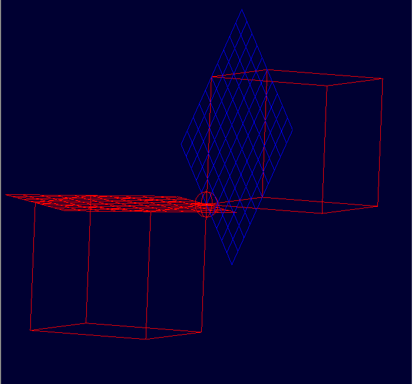
    -   Intersection curve (a line segment): brep A_brep intersect
        B_brep 0 1 (The intersection line is marked as green and
        purple)
        -   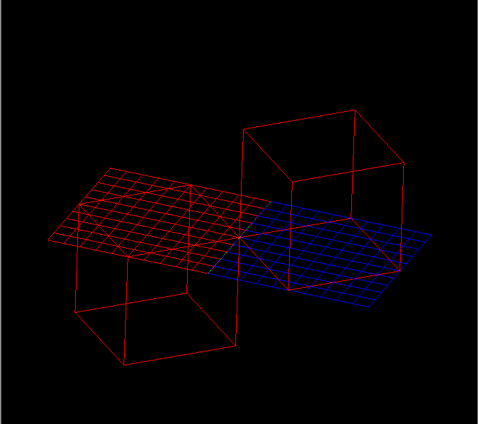
-   csgbrep.g
    -   brep tor.brep intersect sph.brep 0 0
        -   2 intersection curves (2 circles)
        -   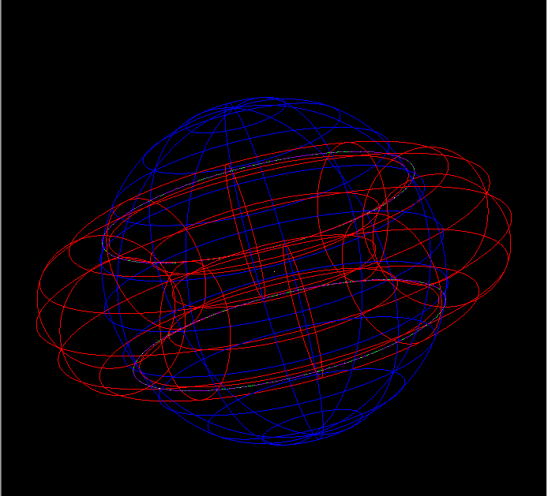
        -   3D intersection curves (generated by test_ssi as pipe
            primitives)
        -   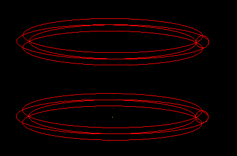
        -   2D intersection curves (generated by test_ssi as sketch
            primitives): as you can see, they are two line segments.
        -   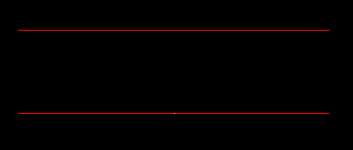
            
-   Intersection of two rcc's (They both have a bottom face that
    overlaps with each other, and the intersection curve of their side
    faces is a circle displayed in green.)
    -   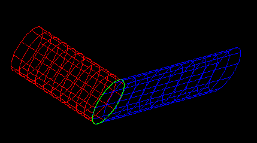
-   We translate and rotate the blue rcc, and intersect again its side
    face with the red one's side face, and get a 3D intersection curve.
    (Displayed in green)
    -   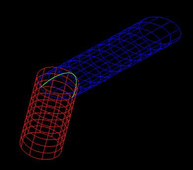
-   This time, their bottom are in the same plane, but only partly
    overlapped. The intersection of their side faces should be two
    points (If you look at the image below carefully, you can see a
    green point in the intersection).
    -   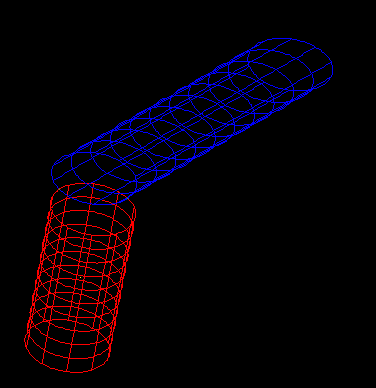
-   The below intersection has been described in paper
    <http://www.sciencedirect.com/science/article/pii/0010448596000139>.
    At a glance, the intersections look perfect (The left are 3D
    intersections and the right are 2D parametric ones.) But if you zoom
    the view, you can see some difference (The third image)
    -   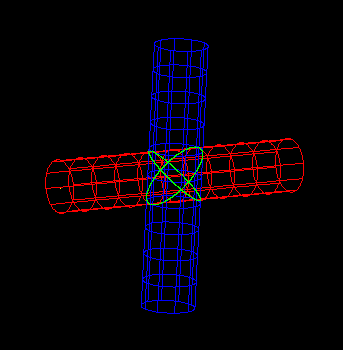
        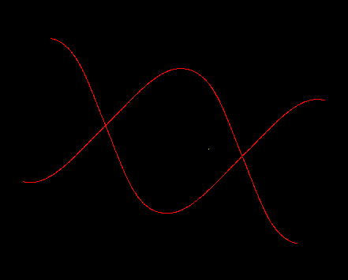
        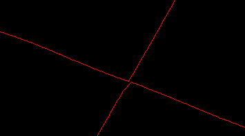
    -   ***This problem raised because the two intersection curves
        intersect with each other, but according to our fitting
        mechanism, one intersection point can only belong to ONE curve,
        and points can not be duplicated. So you can see that the two
        curves are actually separated when zoomed. How to solve this
        problem? I'm still struggling to find a solution. Hope anyone
        who see this log can share your ideas. :)***
    -   ***Some work on July 15 (using seaming segments) is to solve
        this problem.***
-   An elliptic parabolic surface (epa side face) and a plane.
    -   The left image is the result before we use separate max_dis_u
        (v, s and t). The right image is the result after we fix this.
        The problem raises because the domain of the two parameters
        differ a lot (one is \[0, 6.28\] and the other is \[0, 2000\]).
        For example, two points (0, 0) and (6.28, 1) should not be
        neighbors, of course, but in the global scale majorly determined
        by the large domain \[0, 2000\], they become neighbors and the
        result is totally messy.
    -   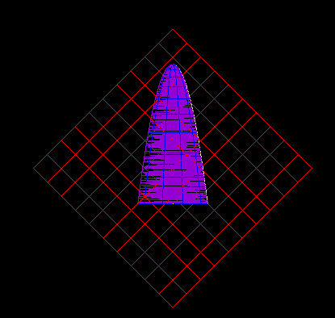
        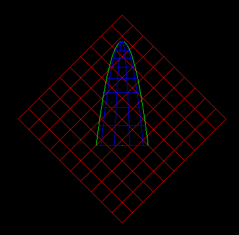
    -   The below are 2D parametric curves. The left is the projection
        on the plane surface (it's a parabola) and the right is the
        projection on the parabolic surface (it's some line segments).
    -   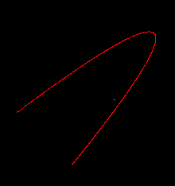
        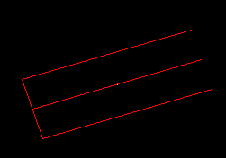
-   Test ssx_overlap on planes (src/librt/tests/arb_intersect.g).
    -   brep A_brep intersect C_brep 0 1
    -   Part of the two surfaces overlap.
    -   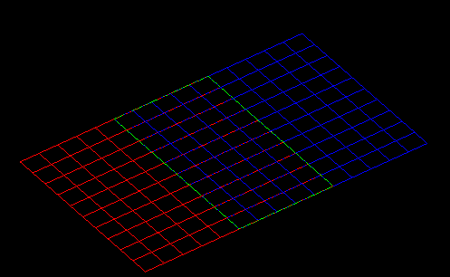
    -   brep A_brep intersect A_brep 0 0
    -   We intersect two surfaces that are exactly the same. Maybe this
        case can be optimized (Detect it's a duplicated surface and
        return the boundary of the whole surface directly).
    -   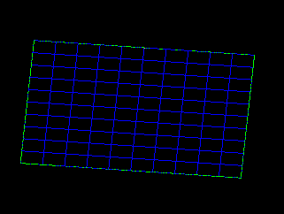
-   The extreme test case (src/librt/tests/extreme_ssi_test.g):
    -   The 2D intersect curves generated as sketch primitives by
        test_ssi: test_ssi extreme_ssi_tests.g surface_1.s
        surface_2.s 0 0 (the 2D curves on surface A and those on
        surface B is the same). (New: the right one includes two
        intersection curves)
    -   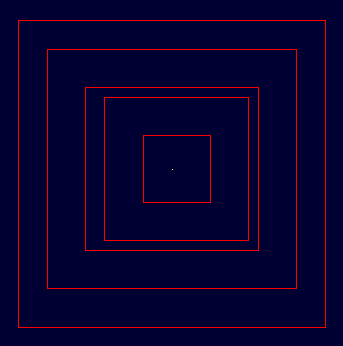
        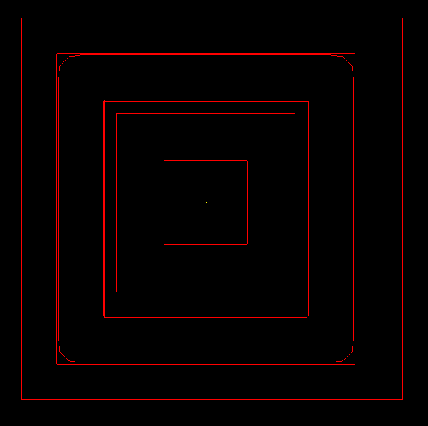
-   NURBS boolean evaluations (intersection)
    -   An arb8 and an ehy (left: original structures; right: result of
        intersection)
    -   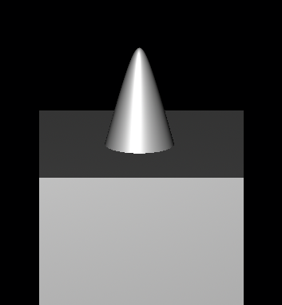
        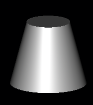
    -   A sph and a torus (left: original structures; right: result of
        intersection)
    -   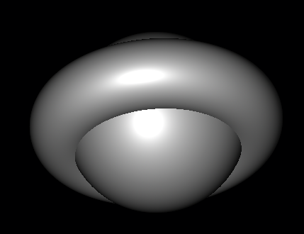
        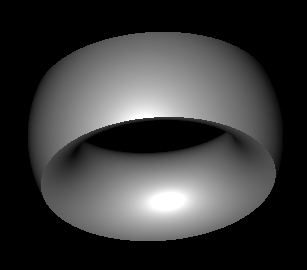
    -   Two spheres (first: result of union; second: result of
        intersection; third: result of difference)
    -   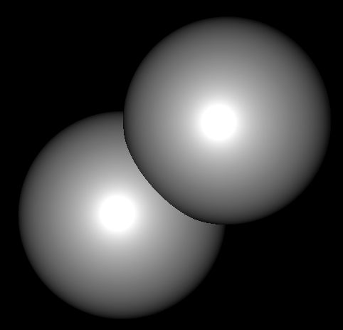
        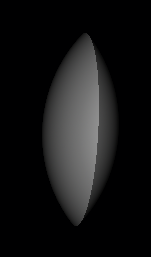
        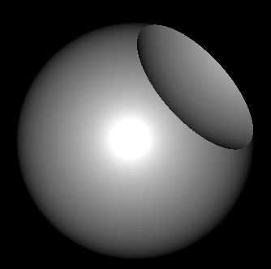
    -   Two arb8 (first: union, second: intersection, third: diff)
    -   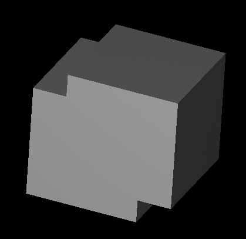
        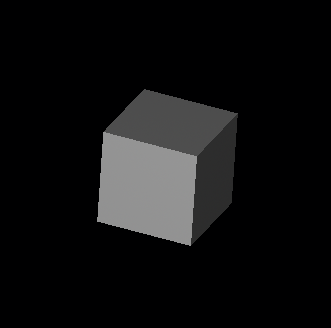
        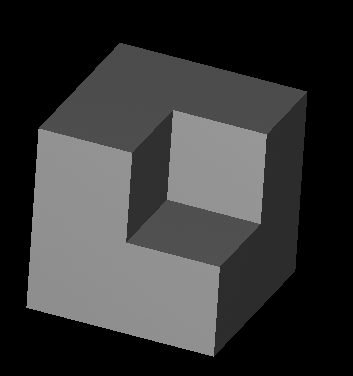

# Original development timeline

-   \- June 17 (\~4 weeks)
    -   Study the papers on this topic
    -   Discuss with other developers
    -   Some code clean up in the current SSI routine
    -   Write a test program to test SSI
-   June 17 - June 23 (1 week)
    -   Lower dimension intersections
        -   P/P, P/C, P/S
        -   With the support of openNURBS
    -   Tests and documentations
-   June 24 - July 7 (2 weeks)
    -   Intersections regarding curves
        -   C/C, C/S
        -   Subdivision - curve trees, surface trees
    -   Tests and documentations
-   July 7 - Aug. 4 (4 weeks)
    -   TDD on SSI
        -   Test the SSI
        -   Find the problems
        -   Fix the bugs
        -   Find more bugs and fix them
        -   Degenerated cases
    -   Try to get the code faster
        -   Fit the curve to a lower order if possible
    -   Documentations
        -   Comment in code
        -   Write some extra document on SSI (algorithms, problems,
            TODOs...)
    -   Mid-term evaluation in July 29 - Aug. 2
-   Aug. 5 - Aug. 18 (2 weeks)
    -   Finish the surface partitioning
        -   Polygon partitioning
        -   Curve-curve intersection
    -   Tests
        -   Trims may intersect
-   Aug. 19 - Aug. 25 (1 week)
    -   Add connectivity graph support
        -   Generate connectivity graphs for objects
        -   Design proper data structures for the graph
-   Aug. 26 - Sept. 1 (1 week)
    -   Inside-outside tests
        -   Curve-surface intersection
        -   BFS of the graph to determine inside/outside
-   Sept. 2 - Sept. 8 (1 week)
    -   Generate valid ON_Brep objects
        -   Read code in IsValid() functions
        -   Add elements (trim, edge, etc.)
        -   Try to pass the validation
    -   Extend the brep command in MGED
-   Sept. 9 - Sept. 15
    -   Robustness Issues
        -   Deal with the degenerated cases
        -   All 3 steps should be modified
    -   Tests
        -   Fix bugs
        -   Improve performance
-   Sept. 16 - Sept. 22 (1 week)
    -   Pencils down
        -   Code clean up
        -   Documentation (wiki pages)
-   Sept. 23 - Sept. 27 (1 week)
    -   Final evaluation
    -   Submit code to Google
