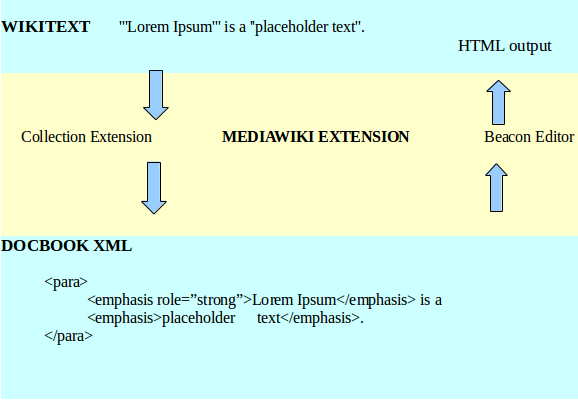

# Personal Information

**Name:** Richa Jain
**E-Mail:** richa.jain1912@gmail.com
**IRC Nick:** richa (\#brlcad on freenode)
**Github:** richajain

## Background Information

Hi, I am Richa Jain, a third year Undergraduate student from Indian
Institute of Technology Roorkee. I am currently a developer at Software
Development Section of my institute. I have mostly worked on projects
based on PHP and JavaScript although I also use C, C++ regularly. I was
also an intern at Wikimedia Foundation last year and now I am looking
forward to work with BRL-CAD.

# Project Information

## Project Title

Synchronize wiki with Docbook

## Brief project summary

BRL-CAD’s documentation is available in a variety of formats but the
best way of maintaining documentation is docbook XML. However, as we
know that a general user finds it easier to edit a wiki page rather than
a docbook. Conversion between XML markup (docbook) and wiki syntax is
not that easy. Using tools like pandoc for this, some markups are lost
and ultimately the data is ruined. So, the main aim of this project is
to Synchronize wiki and docbook so that any changes made to the wiki
appears in the docbook and vice-versa without any loss of data. The
project will be implemented as a separate mediawiki extension which
shows the docbook XML in the edit window and after they have edited it,
the XML is processed to produce the HTML web output. If a user prefers
to edit wiki markup, then after the editing, the docbook XML can be
downloaded.

## Detailed project description

### Why is Docbook format important?

Docbook is an XML language. Docbook provides you a large number of
semantic element tags. These tags give some structure to the document
and this structured document can be published in a variety of formats
including HTMl, XHTML, PDF, etc. without any change to the source code.
Most of the organisations maintain their documentation in the docbook
format due to its easy maintainance. BRL-CAD also focuses on maintaining
its documentation in docbook format so that it can be more easily
managed by revision control system.

### Tools available for conversion between Wiki to Docbook and Vice-Versa:

There are some tools available which convert docbook to wiki or
vice-versa which can be used for this project:

1.  [Pandoc](https://github.com/jgm/pandoc) converts from one markup to
    another. However, while conversion between wiki and docbook, some of
    the tags are lost and hence the data is not preserved.
2.  Mediawiki’s
    [Collection](https://www.mediawiki.org/wiki/Extension:Collection)
    Extension allows user to collect articles and generate downloadable
    versions in different formats (including XML format too). It is
    configured by default to use the server
    <http://tools.pediapress.com/> . For high traffic, we need to set up
    [mwlib](http://mwlib.readthedocs.org/en/latest/installation.html)
    and setup our own render server which will generate the docbook XML
    output. The source code is available
    <https://github.com/wikimedia/mediawiki-extensions-Collection>
3.  Fedora’s
    [Beacon](http://fedoraproject.org/wiki/DocBook_Editor_Documentation)
    project which was a done as GSoC 2009 is an XML editor which allows
    user to upload, create or edit docbook and parse the XML and return
    the HTML weboutput. The source code is available
    <https://github.com/satya/beacon>

### Basic Layout of the project:

1.  User will be given two edit options - wiki markup or Docbook XML.
2.  If a user chooses editing Docbook, the docbook XML will be displayed
    in the editing window rather than wiki syntax. When the user clicks
    on “save”, the entire XML is processed and converted to wikitext and
    the HTML output is displayed.
3.  If a user prefers to edit wiki markup, then after clicking “save”
    button the wiki markup is converted to docbook and the user is given
    an option to download the XML file.

### Approach for the project

There are basically two approaches for this project:
1. We can use a combination of Mediawiki's Collection Extension and
Beacon Editor inorder to fufill the goal of this project.
**Conversion from wiki to Docbook -** Collection Extension focuses on
creating books by collecting articles and exporting this book to a
variety of formats including the docbook XML format. This extension
works as a special page. For our project, instead of this being
implemented as a special page, we need to call this extension whenever a
user chooses to edit the wiki.

**Conversion from Docbook to wiki -** Since Beacon project is an XML
editor. This can be used to fetch XML to the edit window and then
parsing this XML to generate the HTML web output.

2\. Instead of using combination of different tools, we can define our
own mediawiki extension which intelligently maps wiki markup to docbook
XML markup and serves both the purposes simultaneously. This can be done
with mediawiki parser functions.

I am strongly in favour of following the first approach since there are
already tools available which can fulfill the purpose. This may need a
few quick experiments to be done with these tools. I will utilize the
community bonding period and figure out which of them would require
lesser effort and is more efficient.

## Deliverables

-   A mediawiki extension having options to edit wiki syntax and Docbook
    XML.
-   Providing XML markup instead of wiki when a user chooses "Edit the
    Docbook format".
-   Mapping Docbook and wiki by using any of the approaches described
    above such that there exists a synchronization between the two
    edits.
-   Adding an option to download the XML file once a user has finished
    editing wiki markup.
-   Creating documentation which describes the technologies used for
    future developers ( Documentation for the code will be written as I
    write the code )

## Development Schedule

I will start working on my project as my exams will get over (on 30th
April). The basic plan and estimated timeline of my project are:
(timeline may change a little during the project)

-   **May 1 to May 18 (Community bonding period):** Investigating the
    two approaches described above, making few experiments with Beacon
    and Collection Extension and deciding which of the two will be
    better.

<!-- -->

-   **Week 1-2 (May 19 to June 1):** Making a skeleton for the extension
    and giving options to edit in Docbook XML format and wiki format.

<!-- -->

-   **Week 3-5 (June 2 to June 22):** Work on Wiki to Docbook Conversion
    (This includes integration with the Collection Extension, providing
    the user with an option to download the XML file generated)

<!-- -->

-   **Week 6-8 (June 23 to July 13):** Work on Docbook to Wiki
    Conversion (This includes fetching of XML in the edit window and
    parsing this XML to generate the Web output)

<!-- -->

-   **Week 9 (July 14 to July 20):** Work on improving the User
    Interface part.

<!-- -->

-   **Week 10 (July 21 to July 27):** Check for errors and fixing bugs.

<!-- -->

-   **Week 11 (July 28 to August 3):** Writing relevant documentation

<!-- -->

-   **Week 12-13 (August 4 to August 17):** Prepare for final
    Evaluations

## Time availability

-   **Time Zone:** UTC+5:30 (IST-India)
-   **Typical working hours:** 12 noon to 1 am before July, 6pm to 3am
    after July

I am quite flexible with the timings and will try to dedicate most of my
time to this project.

## Past Experiences

-   I was a Google Summer of Code 2013 student under Wikimedia
    Foundation. I worked on making a Mediawiki Extension (Annotator)
    which allows user to make inline comments on a wiki article. This
    project was based on PHP, JavaScript. The source code can be seen
    [here](https://github.com/wikimedia/mediawiki-extensions-Annotator).
    Here is a complete list of bugs that I have solved for Mediawiki
    [Bugs I have Worked
    On](https://gerrit.wikimedia.org/r/#/q/owner:%2522Rjain%2522,n,z). I
    was also a speaker at FOSSASIA 2014 (Asia's largest open source
    conference) where I gave a talk on "Annotator" Extension that I
    built for Mediawiki.
-   My open source projects can be seen on
    [github](https://github.com/richajain).

## Why me

I will work hard and bring this project to completion. I am always
logged in to IRC (\#brlcad) whenever I work and also do respond to the
emails quickly whenever I am awake. I will keep a repository of this
project on github and make frequent commits. I will always be in touch
with my mentor and the community and taking help from people around
whenever I am stuck.

I have also submitted one pull request for OGV
<https://github.com/harman052/geometry_viewer/pull/2>

## Why BRL-CAD

I was searching for projects in which my skills can be utilized and when
I tried out with BRL-CAD, the thing which I liked the most is that the
community here is very helpful and reponsive on the mailing list and
IRC. The guidelines are well-defined for GSoC students and it motivates
people to make improvements.

## References

\[1\] <https://www.mediawiki.org/wiki/Extension:Collection>
\[2\] <http://fedoraproject.org/wiki/DocBook_Editor_Documentation>
