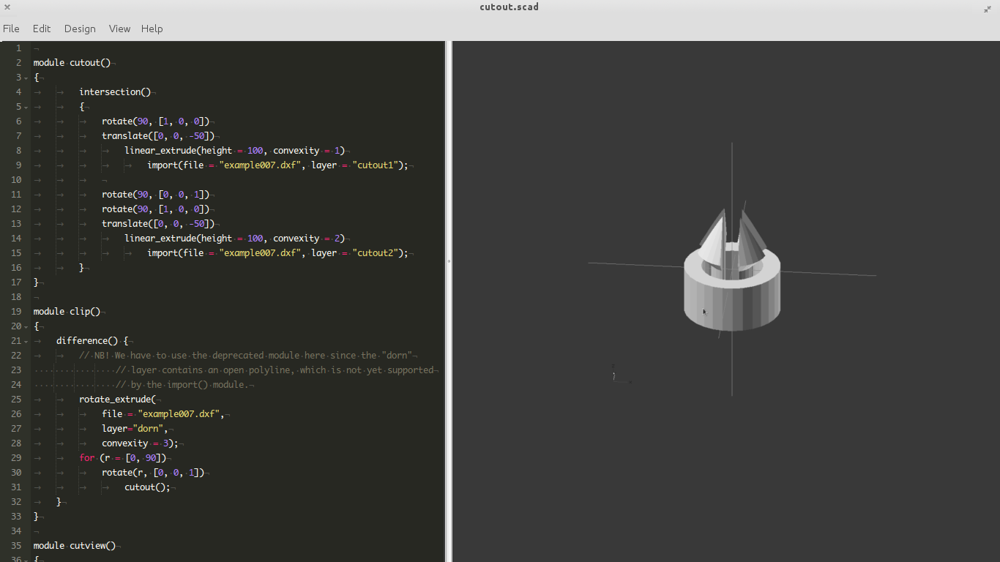
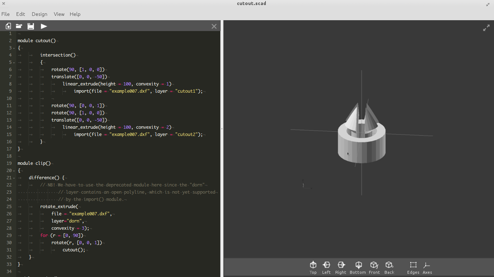
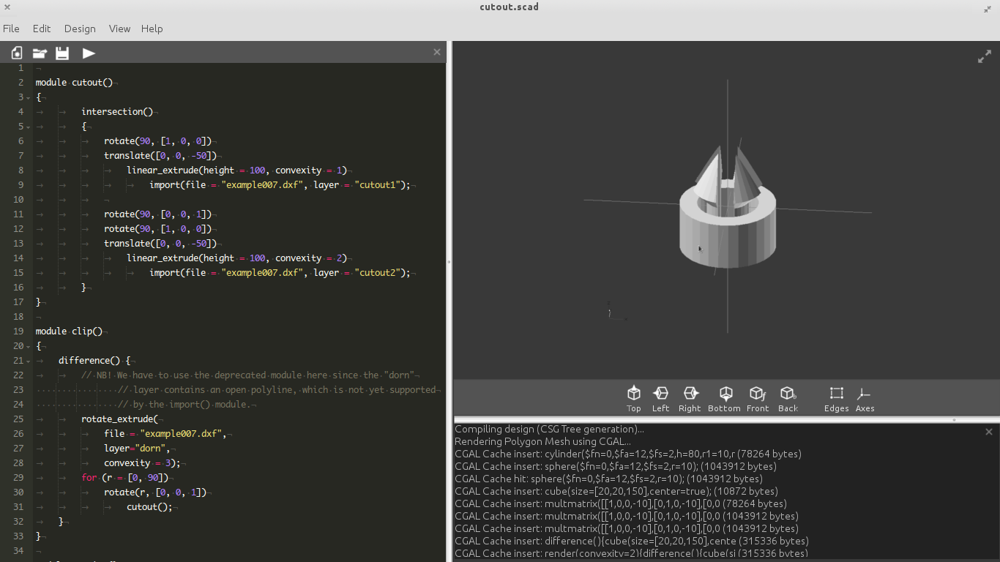
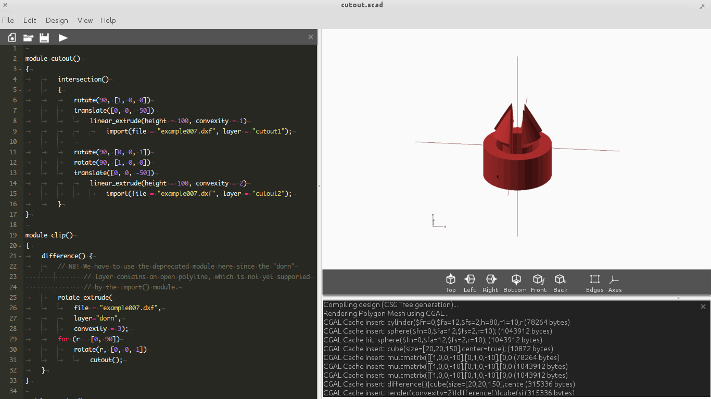

**User Interface Brushup** Brief Description: The present Openscad user
interface is just a window splited into three parts- a code editor,
rendered object and a console. Under this project, interface will be
brushed up by removing existing bugs and adding new features.

## Personal Information

-   **Name**: Shaina Sabarwal
-   **Email-address**: iamshainasabarwal@gmail.com
-   **IRC username**: shaina_
-   **Contact Number**: +917837091321
-   **Blog**: shainasabarwal.wordpress.com

## Background Information

-   Computer Science Engineering bachelor student at Guru Nanak Dev
    Engineering College, Ludhiana, Punjab, India. Presently studing in
    3rd year.
-   Working in C, C++, Wt(www.webtoolkit.eu) for last 2 years. I, in a
    team of 4 students developed a blogging engine in Wt. It is released
    under open source GPL license and the code is at
    <https://github.com/GreatDevelopers/LBE>
-   Deeply interested in front-end development. Recently developing a
    wordpress theme for our blog cpp-tricks.com where C++11 will be
    promoted and different tutorials will be provided for Fundamentals
    of C++, Wt, Qt, boost. Screen Shots of the theme are:
    <http://bit.ly/PDdNfq>
-   I am an active member of Linux User Group, Ludhiana where the
    students are made aware about the open source technologies and
    motivated to contribute in them.
-   I am quite familiar with git. Commit my work on git using github
    account(github.com/shaina7837).

## Project Information

### Title: OpenSCAD User Interface Brushup

### Brief Summary

This project aims to make the User Interface of the software OpenSCAD
elegant. OpenSCAD is a great software for making 3D solid models and
parametric designs but its user interface is lacking interesting
features. The present menu is little messy. The code editor and 3D
interaction requires proper detailing which increase the scope of the
software to a higher level.

### Detailed Description

Understanding the various requirements of the users of this software,
following features will be added under the scope of this project.

**Full Screen Editing and Viewing (Detatchable View Pane):-** It would
be nice if we'll be able to detach the render window and make it
fullscreen. Currently we can hide the editor and console to get the
output at full screen, but there is no option to detach it from the main
window. The <http://qt-project.org/doc/qt-4.8/qdockwidget.html>
QDockWidgetcan be used to detatch from the main window. For Full screen
distraction free code editing or viewing we can also hide widgets and
use Qt size policy to keep the editor expanding when viewer is hidden
and vice versa.

**Better Code Editor Colors:-** This option should be added in
preferences to change the color of the syntax. Currently we can change
the font and size of coding syntax but not the color. For long terms
coding, the color scheme we chose has a direct effect on strain that our
eyes suffer. A low contrast theme is advised but at the end it comes to
personal taste. So I propose to add following color schemes in code
editor along with an option to choose whatever color scheme the user
desires

-   Zenburn <http://slinky.imukuppi.org/zenburn/>
-   Solarized <http://ethanschoonover.com/solarized>

Can add more if required by developers. This will require diving into
highlighter.cc and adding more color themes. 

**Custom designed toolbar:-** Finding the right menu through the menubar
is a hectic task for the user. It takes lots of clicks and hassle going
through various menus and submenus to just say change the font-size. So
a custom designed toolbar will be designed and added to the application
so that the icons which user like to use very often can be added to the
toolbar. This way, it will provide ease to use and precious time of the
user. Though this toolbar is designed with intention of not covering
much space of the editor, still there will be option to hide this
toolbar. Qt has a class QStyle that will be used to develop this
toolbar. 

**Better Model Colors:-** ALso we can change the color of output window
from prefrences but options are less .There should be different themes
for colors of rendered model. Currently, we can have figures in yellow
and green color. That must have more options. 
)

**Other Editors Review**

These are the editors we can integrate into OpenSCAD application and
have a better user experience of programming.

<http://www.riverbankcomputing.co.uk/software/qscintilla/intro>

<http://bellard.org/qemacs/>

<https://github.com/pasnox/qodeedit>

One of these will be chosen and integrated according to the agreement of
mentor and feedback of the community

**Launching Screen**

A get started window will be provided to ask the user, what is his next
approach like the one we have in Qt Creator application. Different
approaches can be

-   Examples
-   Get started tutorial
-   Open existing file
-   Create new project

**Code line numbers** An option will be provided in the menu to add line
number before each line of the code.

**Error Highlighting** The line having error will be highlighted along
with the line number.

**Better Console** Errors and warning will be shown in better way.
Warning will also show line number with it. A cross sign to hide the
console will be on the console itself.

**Export Dashboard** A separate dialog box will be provided to export
the model in different file formats.

**Code line numbers** An option will be provided in the menu to add line
number before each line of the code.

**Error Highlighting** The line having error will be highlighted along
with the line numbers.

## MILESTONES

**Community Bonding Period**

-   Talk to the community members
-   Get to know the code

**Week 1(19th May)**

-   Get started and remove the bug given in issue
    [\#408](https://github.com/openscad/openscad/issues/408)
-   Get comfortable with the code

**Week 2(26th May)**

-   Take community feedback on the editors that can be integrated.
    (Given above in editors section)
-   Decide one editor and start working on integrating it with openscad.

**Week 3(2nd June)**

-   Improve on and integrate a good code editor.

**Week 4(9 June)**

-   Read about color contrast, and theory about designing themes for
    code editors.
-   Add themes to the code editor, at-least three of the proposed
    themes. 'ZenBurn', 'Monokai' and 'Solarized'
-   Give option to users to edit colors and addressing the issue
    [\#643](https://github.com/openscad/openscad/issues/643)

**Week 5(16 June)**

-   Add Better Highlighting and warnings.
-   Work towards a better console, line numbers are not shown correct
    even counts them from include files.

**Week 6(23 June)**

-   Make the View pane detatchable as requested in issue

[\#233](https://github.com/openscad/openscad/issues/233) and issue
[\#451](https://github.com/openscad/openscad/issues/451).

-   Add various views, and allow user to switch between them.

**MID TERM EVALUATION**

**Week 7(30 June)**

-   Take community feedback on toolbar and start working on toolbar.
-   Give an option to hide/show toolbar

**Week 8(7 July)**

-   Add more navigational elements in both editor and viewer. (Expand,
    Detach etc.)
-   Ability to change themes from the toolbar.

**Week 9(14 JuLy)**

-   Read color theory.
-   Work on colors of the viewer.
-   Add few color themes (after community feedback) to the viewer.

**Week 10(21 July)**

-   Create an export dashboard, where a single dialog box can be used to
    export to various formats as adressed in issue
    (https://github.com/openscad/openscad/issues/649 )

**Week 11 (28 July)**

-   Create a first launch screen, where various examples made in
    openscad will be showcased.

**Week 12(4 August)**

-   Do heavy testing and clean the code.
-   Time to make up for missed milestone (if any).

**Week 13(11 July)**

-   More testing and cleaning.

**Week 14(18 July)**

-   **FINAL EVALUATION**

## Deliverables

-   Better Code Editor
-   A Ribbon UI
-   Better View Plane
-   Better rendered model
-   Better render grids

## Communication

### Time Availability

I will be available 40 to 48 hours / week, can spend more, if needed.

### Email/Mailing List

My email address is iamshainasabarwal@gmail.com, I have subscribed to
both brlcad and openscad mailing lists. I have been in contact through
these mailing lists with other community members.

### Real-Time Contact

I can interact with the mentors through OpenSCAD's IRC
channel(\#openscad) on freenode. My nick name on IRC is shaina_ . I am
also comfortable with talking to my mentor via telephone if need arises.
**Contact Number**: +91 7837091321

### Code Review

My mentor will be able to see my progress as I push the code to the git
repository of project
(https://github.com/shaina7837/UI-Brushup-of-OpenSCAD)

## Why OpenSCAD?

OpenSCAD is an open source CAD software application used to make 3D
solid models. It has various applications in mechanical, civil,
electronics and designing hardware tools for research and education
purposes. The software has potential to be used by the large number of
professionals and hardware developers. I personally like the community.
This is the first time, I am contributing into an open source community
and participating in GSOC but while discussing on various topics, like
problems in compilations, issues, projects and proposal on mailing list
(OpenSCAD@rocklinux.org) and IRC (\#openscad), I felt very confortable
to discuss and come up with new ideas.

## Why UI interface project?

When I decided to work under this community. I explored various
projects, I can work in and finally liked this one the most. As I am
very much intersted in working UI. UI are not just looks and colors and
providing shortcuts. One has to identify the audience and its interest
and work accordingly. I am sure, I will be able to make the software
more alive. Also the interface is in Qt and I have great experience in
Wt(www.webtoolkit.eu) so working effiently in Qt won't be a big deal for
me. I have also explored various classes and libraries of Qt also to
make my self ready for working in this project.

## Why Me?

I am very much passionate for the programming and always wanted to work
under an open source community. Even after the completion of the
project. I will love to keep on contributing and maintaing various
projects of the community. Also graphics is my favourite field, I will
be able to keep on working with full zeal and interest for long. Working
in this project will enhance my programming, and UI skills and give me
chance to come up with new ideas to solve real time problems that I will
love to. Also I personally like to use such softwares for 2D and 3D
model designing, so I can understand well what a user can expect while
working with these softwares.

## Future scope

-   Add some of the vim bindings to the to code editor
-   Store themes in separate theme files which can be then shared among
    other users
-   Improving the Wireframes
-   Improving the mouse interaction
