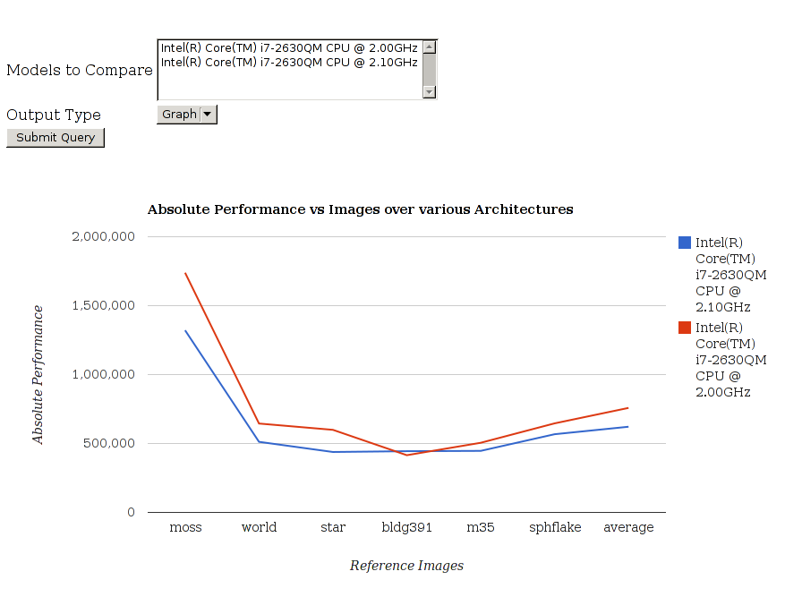
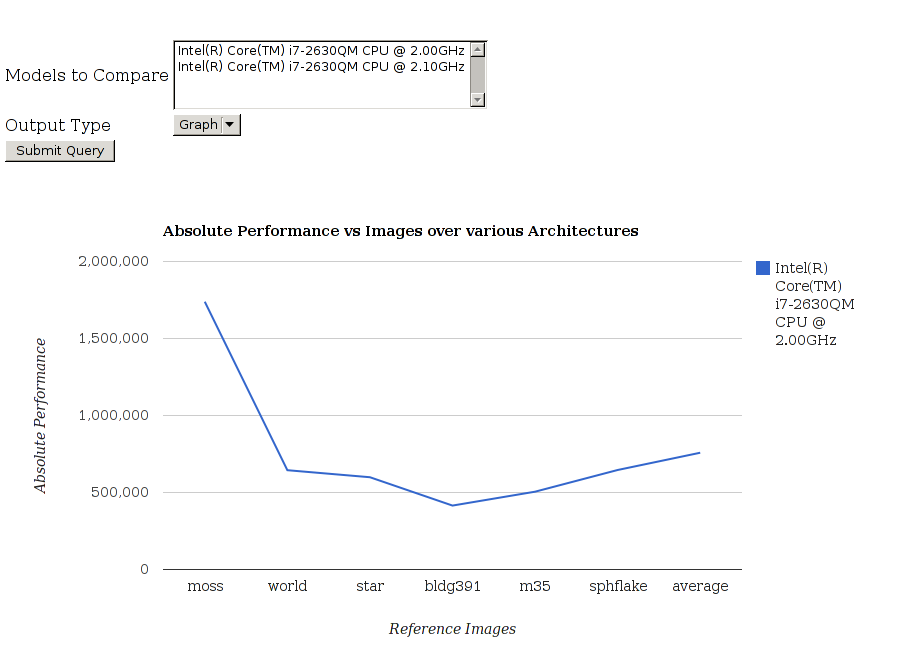
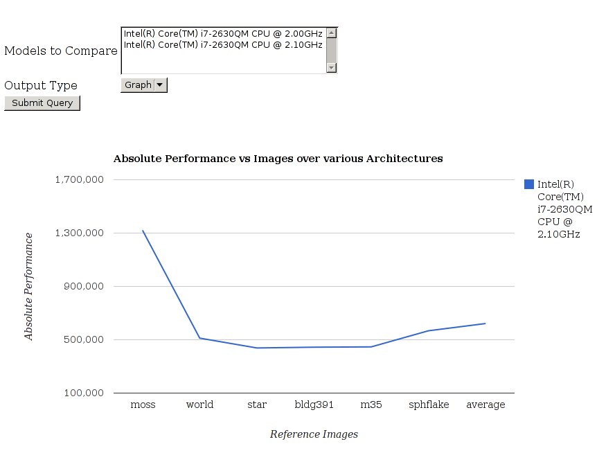
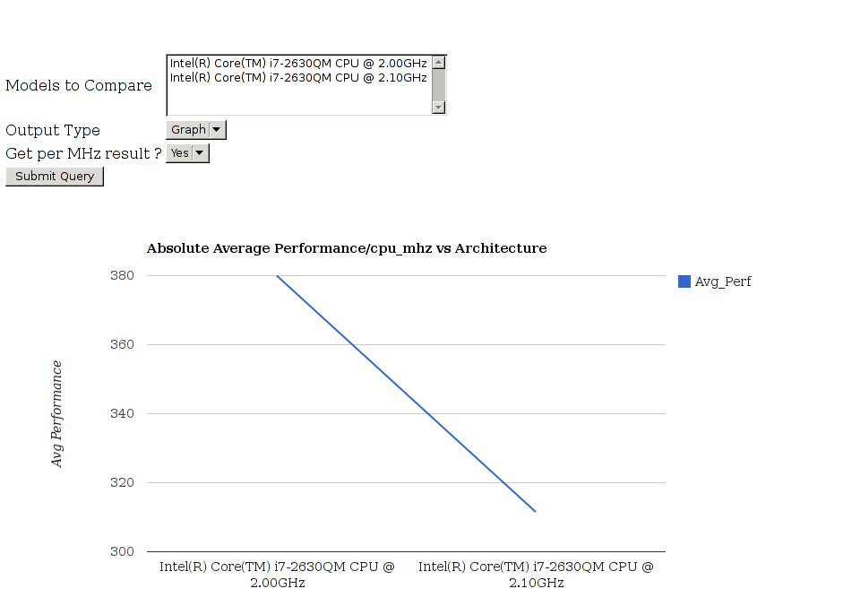
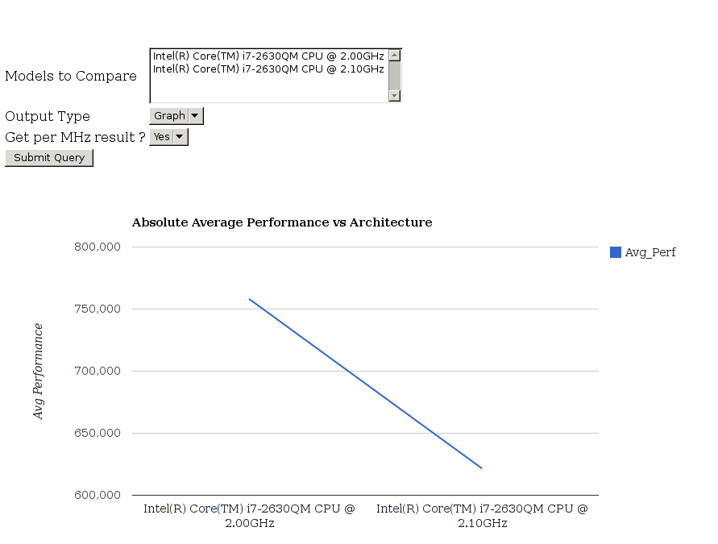
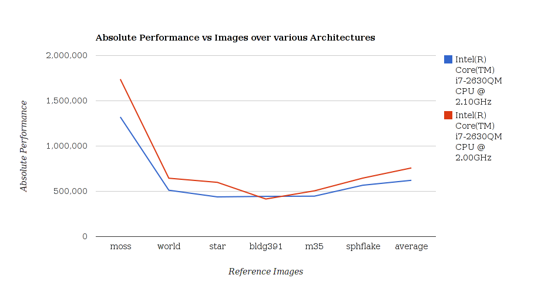
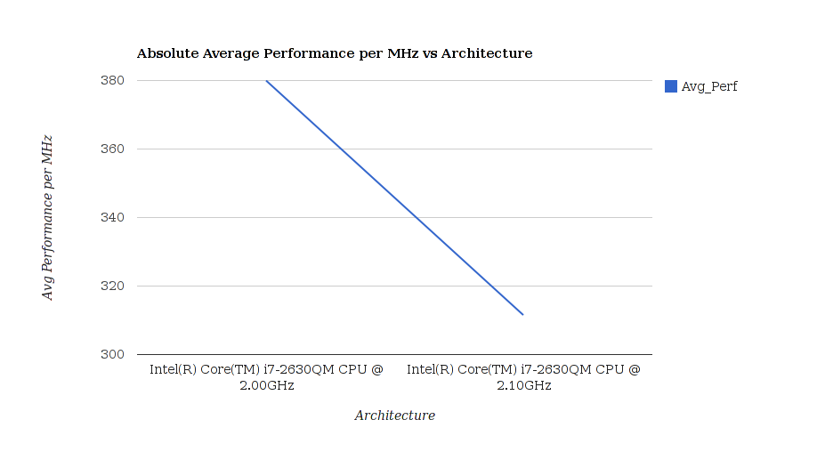
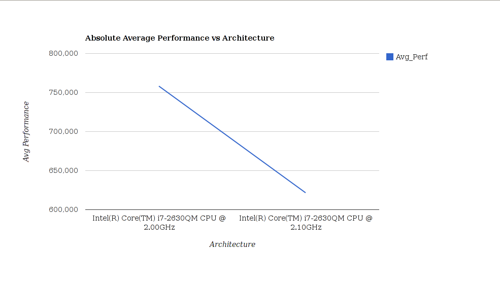

### 22 August 2012

-   Tried running the bottle app on multi-threaded and asynchronous
    servers. Tested out Tornado. Currently running on python-paste

### 20 August 2012

-   Documentation

### 17-19 August 2012

-   Rolled out the crude website which is hosted at
    <http://88.198.223.105:8080/>
-   Upload page working on the localhost but buggy on the VPS
-   Documentation
-   Full of bugs, project immature

### 15-16 August 2012

-   Added views for the plots and configured the output to be presented
    via the template in the view
-   Made changes to existing folder structure for the Bottle app to run
-   Configured and made a run_server.py script
-   Source is at <https://bitbucket.org/suryajith/benchmark/src>
-   Awaiting Dr.Rai's perusal of the patches.

### 12-14 August 2012

-   Necessary changes in the db structure for the data needed for graphs
-   Necessary changes to the Parser script
-   Implemented
    -   Absolute Performance vs Reference images over various
        architectures
    -   Average Performance vs Architectures
    -   Average Performance per CPU MHz vs Architectures
    -   Absolute Performance vs CPU over various architectures
    -   Absolute Performance vs CPU over various images for specific
        architecture
-   Forms for comparision between various architectures
-   Three modes of data displayed : text, table, graph
-   Below are some examples of the graphs generated from the data in the
    database

### 8-11 August 2012

-   MVC framework using bottle
-   Developed controllers for upload and basic charting libraries
-   Charting libraries : Wrapper over the GCharts by generating and thus
    embedding the js code

### 1-6 August 2012

-   More failed attempts at working with mediawiki

### 28-29 July 2012

-   Implemented a custom form renderer.
-   Results to be integrated.

### 21 July 2012

-   Realized that simpleforms do not help much and have begun writing
    the forms natively in PHP.

### 20 July 2012

-   Still figuring out the forms and the implementation of the actions

### 17-18 July 2012

-   Playing around with the Simple forms extension. Naive html forms
    wouldn't help as the action can't be hard coded.
-   It has some issues with mediawiki 1.20(alpha) due to some
    deprecations in the mediawiki codebase but figured out a few of
    them.

### 11-12 July 2012

-   Upload form on the special page.
-   Read up on Google charts embedding. Thoughts on the features
    required for the frontend.

### 9-10 July 2012

-   Documentation and fixing the flow. logging cleanup.
-   Frontend

### 5 July 2012

-   Read up the forms implementation for the frontend of mediawiki
    extension

### 3 July 2012

-   Web API set up. Mail has been sent to the mailing list asking folks
    to submit the logs through the API and mail.
-   Documentation, implement logging through out.
-   Read up about frontend forms for upload and data request.
-   The frontend is being setup through a special page which is the view
    part of the mediawiki extension.

### 1 July 2012

-   Setting the demo server up. It is hosted at <http://88.198.223.105>
    and that is being configured now for the demo purposes.
-   Documentation of the work

### 30 Jun 2012

-   Integrating all the things worked on. Testing the process.

### 29 Jun 2012

-
