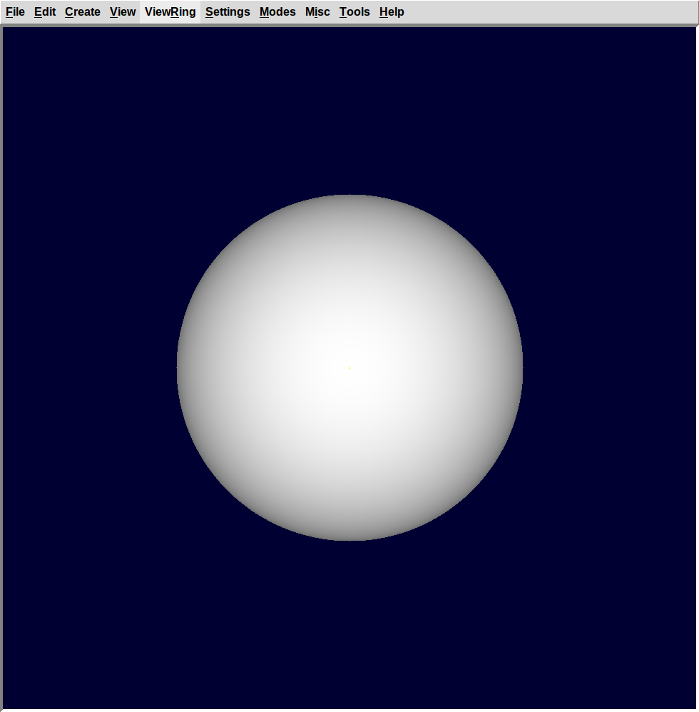

# Community Bonding Period

I made two patches for OpenCL (OCL) shot code. One patch refactors the
existing SPH (Sphere) shot code, and the another patch implements EHY
(Elliptical Hyperboloid) shot code.

# Background Research

-   <http://graphics.cs.kuleuven.be/publications/LD08CFRGRT/>
-   <http://research.microsoft.com/en-us/um/people/cloop/garanzhaloop2010.pdf>

# Development Status

| Milestone | Description                                                                                                                 | Patch | Status     |
|-----------|:----------------------------------------------------------------------------------------------------------------------------|-------|:-----------|
| M0.1      | fix OCL SPH shot routine compilation errors.                                                                                | \#341 | **TRUNK**  |
| M0.2      | EHY shot routine in OCL.                                                                                                    | \#346 | **TRUNK**  |
|           |                                                                                                                             |       |            |
| M1        | ELL and ARB8 shot routines in OCL.                                                                                          | \#370 | **TRUNK**  |
| M2        | <s>refactor dispatcher, shoot, optical renderer to process many rays in parallel in C when rendering an image or block.</s> |       | *see M5*   |
| M3.0      | <s>grid spatial partitioning in C.</s>                                                                                      | \#379 | *see M3.2* |
| M3.1      | <s>grid spatial partitioning in OCL.</s>                                                                                    | \#379 | *see M3.2* |
| M3.2      | HLBVH object partitioning builder in C. traversal in OCL.                                                                   |       | **TRUNK**  |
| M4        | GPU side database storage of OCL implemented primitives.                                                                    | \#392 | **TRUNK**  |
| M5        | port compute intensive or critical parts of the dispatcher, <s>boolean evaluation</s>, optical renderer to OCL.             |       | **TRUNK**  |
| M5.1      | OCL dispatcher that performs the shot routines for a whole frame.                                                           |       | **TRUNK**  |
| M5.2      | OCL rasterizer that does the pixel pushing for a whole frame.                                                               |       | **TRUNK**  |
| M5.3      | OCL lighting modes: Phong, Diffuse, Surface Normals.                                                                        |       | **TRUNK**  |
| M5.4      | OCL lighting modes: Multi-hit transparent.                                                                                  |       | **TRUNK**  |
| M6        | TOR and TGC shot routines in OCL.                                                                                           | \#393 | **TRUNK**  |
| M6.1      | REC shot routine in OCL.                                                                                                    |       | **TRUNK**  |
| M6.2      | Surface normal routines for all seven OCL implemented primitives.                                                           |       | **TRUNK**  |
| M7        | BOT shot routine in OCL.                                                                                                    |       | \-         |
| M7.1      | Simple BOT shot routine in OCL that computes triangle hits and normals brute force.                                         |       | **TRUNK**  |
| M7.2      | CPU HLBVH BOT shot construction with OCL traversal and interpolated per pixel normals.                                      |       | **TRUNK**  |

The ARB8, ARS, BOT, EHY, ELL, SPH, REC, TOR, TGC, shot routines are in
SVN trunk.

SVN trunk also contains solid database device storage and a render
function which given a view2model matrix, width, height, can generate an
RGB8 bitmap. Diffuse and Surface Normal light models are supported. The
renderer does BVH accelerated ray tracing and ignores the CSG operators.
It is integrated as a render option in **mged**.

# Development Phase

### Week 1 : 25-31 May

-   Created some example .g files in mged for the primitives to be
    implemented this week. The Quick Reference Card proved to be quite
    useful.
-   Do the matrix ops for EHY (Elliptical Hyperboloid) in the OCL side.
    -   <https://sourceforge.net/p/brlcad/patches/346/>

<!-- -->

-   Made patch for ELL (Generalized Ellipsoid) and ARB8 (Arbitrary
    Polyhedron) OCL shots.
-   *M1 complete: ELL, ARB8 shot routines in OCL*.
    -   <https://sourceforge.net/p/brlcad/patches/370/>

<!-- -->

-   Tried out a bunch of code browsing tools (cscope, LXR, doxygen,
    etc). The NetBeans IDE seems the most promising.

### Week 2 : 1-7 Jun

-   Read code to better understand the main rendering loop. It seems to
    be something like this:

  
`do_frame() → do_run() → worker()* → do_pixel()* → rt_shootray()* → rt_*_shot()`

<!-- -->

  
The code is recursive (which is problematic for OCL). I'll work on a
simplified version of the rendering loop which only does the primary
rays in C as a first approach. After I get the non-recursive parallel
friendly C code I'll work on the OCL port.

-   Updated project proposal on Google Melange.

<!-- -->

-   SVN r65153 fails to compile with a bogus error of an unused variable
    that's actually being used its just that GCC 4.9.1 is too dumb to
    figure that out.
    -   <https://sourceforge.net/p/brlcad/bugs/365/>

<!-- -->

-   Upgraded Ubuntu and GCC.

<!-- -->

-   Made simple ray generation code in C.
-   Made simple frame buffer write code in C.
-   Made simple diffuse shading code in C.

### Week 3 : 8-14 Jun

-   Added the main boolean weaving code to our minimal renderer.
-   Eliminated some gotos and made the code more thread safe.
-   The simple renderer patches are in the
    [mailing-list](https://sourceforge.net/p/brlcad/mailman/message/34191546/).

### Week 4 : 15-21 Jun

-   Added OpenMP compile support. Use OpenMP constructs to launch the
    rendering threads. This work still has some bugs in it.
-   *Alpha M2 patch.* in
    [mailing-list](https://sourceforge.net/p/brlcad/mailman/message/34191546/).

<!-- -->

-   Read code to better understand the main spatial partition
    construction routines. They seem to be something like this:

  
`rt_prep_parallel() → rt_cut_it() → rt_nugrid_cut()`

<!-- -->

  
We need something less complex that is more amenable to porting to OCL.
So I will be implementing the Lagae & Dutré compact grid construction
algorithm published at EGSR. First I will program in ANSI C then I will
port the code to OpenCL.

-   Started work on *M3: grid spatial partitioning in OCL*.
-   ANSI C Lagae & Dutré grid construction code.

### Week 5 : 22-28 Jun

-   *Took time off from the project to go to the CGI'15 conference.*

### Week 6 : 29 Jun-5 Jul

-   *GSoC Midterm Evaluations.*

### Weeks 7-8 : 6 Jul-12 Jul, 13 Jul-19 Jul

-   Evaluating algorithms for grid construction.
-   Selecting OCL kernels we can use to support grid construction. It
    seems PyOpenCL has some kernels we could use. Now the question is
    how to extricate the OpenCL/C from the Python...

<!-- -->

-   ANSI C grid traversal code.
-   OCL grid construction on the GPU.
-   *M3 complete: grid spatial partitioning in OCL*.
    -   <https://sourceforge.net/p/brlcad/patches/379/>

### Weeks 9-10 : 20 Jul-26 Jul, 27 Jul-2 Aug

-   Implemented GPU side solid database storage infrastructure.
-   The OCL EHY shot code now uses the GPU solid database instead of
    creating the input buffers on every call.

  
The code allows the primitive to decide how it is stored without
imposing a convention. So one can use SoA, AoS, or whatever to store the
data.

-   Implemented GPU side solid database storage for SPH, ELL, ARB8.
-   Extracted out some duplicated OCL code.

<!-- -->

-   *M4 complete: GPU side database storage of OCL implemented
    primitives.*
    -   <https://sourceforge.net/p/brlcad/patches/392/>

<!-- -->

-   OCL TOR (Torus) shot routine. Includes the higher order equation
    solver code.
-   OCL TGC (Truncated General Cone) shot routine.
-   Put equation solver in separate .cl file.

<!-- -->

-   *M6 complete: TOR and TGC shot routines in OCL*.
    -   <https://sourceforge.net/p/brlcad/patches/393/>

<!-- -->

-   General overhaul and cleanup of the OCL shot patches.

<!-- -->

-   Upgraded NVIDIA OpenCL drivers on my computer to CUDA 7.0.

<!-- -->

-   I drew up a tentative algorithm for the CSG raytrace:

`# GPU execution`  
`GEN_RAYS(args)`  
`lengths = COMPUTE_LEN_SEGMENTS(rays, db)`  
`segs = ALLOC_SEGMENTS(lengths)`  
`segs = COMPUTE_SEGMENTS(rays, db, segs)`  
  
`# CPU execution`  
`waiting_segs = READ_SEGMENTS(segs)`  
`# merge with CPU computed segments for non-accelerated primitives`  
`finished_segs = RT_BOOL_WEAVE(waiting_segs)`  
`partitions = RT_BOOL_FINAL(finished_segs)`  
`pixels = VIEWSHADE(rays, db, partitions)`

  
This allows us to ultimately reuse the CPU code for boolean weaving,
primitive normals, shaders, to have a 100% pixel accurate result. At the
expense of a lot of memory traffic and CPU-side computation of some
fairly maths intensive parts like the normal compute and shade. However
I presently see no other way of having a 100% accurate result in the
time we have available.

-   Made OCL EHY shot code look exactly like the ANSI C version.
    Cleanups.

<!-- -->

-   Ran tests on OCL shot code to check for accuracy vs existing code:

`# e.g. test for tgc`  
`make tgc tgc`  
`e tgc ; rt -o rt_tgc.pix # OR e tgc ; rt -o cl_tgc.pix`  
`pixdiff rt_tgc.pix cl_tgc.pix | pix-fb `

`# test results:`  
`arb8: pixdiff bytes:  777500 matching,    8932 off by 1,       0 off by many`  
`ehy:  pixdiff bytes:  760977 matching,   25443 off by 1,      12 off by many`  
`ell:  pixdiff bytes:  764588 matching,   21844 off by 1,       0 off by many`  
`sph:  pixdiff bytes:  736942 matching,   49490 off by 1,       0 off by many`  
`tgc:  pixdiff bytes:  783191 matching,    3241 off by 1,       0 off by many`  
`tor:  pixdiff bytes:  774138 matching,   12294 off by 1,       0 off by many`

| **RT (EHY)**                                                                                                                   | **OCL (EHY)**                                                                                                                  | **PIXDIFF (EHY)**                                                                                                                      |
|--------------------------------------------------------------------------------------------------------------------------------|--------------------------------------------------------------------------------------------------------------------------------|----------------------------------------------------------------------------------------------------------------------------------------|
| 
| 
| 

-   The off by many problem with EHY is probably related to rounding
    errors with *sqrt* in OCL for NVIDIA using a different rounding mode
    than X86. It is possible to use PTX assembly, i.e.
    `asm("sqrt.rp.f64 %0, %1;" : "=d"(b) : "d"(a));`. OCL 1.1 and over
    have [no support for setting rounding
    modes](http://wok.oblomov.eu/tecnologia/gpgpu/opencl-rounding-modes/)
    without using inline assembly.

### Week 11 : 3 Aug-9 Aug

-   Sean applied patches \#341 and \#346 to SVN trunk.

<!-- -->

-   Got SVN write access.
-   Applied patches \#393 and \#370 to SVN trunk.
-   SVN trunk now has OCL shot evaluation for SPH, EHY, ELL, ARB8, TOR,
    TGC primitives.
-   Refactored SPH (remove duplicate code, etc) and applied it to trunk.
-   Move declarations to top level in order to eliminate duplicate code
    in trunk.

<!-- -->

-   Pass struct with primitive data to OCL as an initial step to an AoS
    device primitive database. Move constants into common.cl.
-   Generic OCL solid shot handler. Refactored code to remove
    duplicates.
-   Load large OCL vectors on demand to reduce stack footprint per
    function call.
-   Fix memory leak on OCL loaded program source code.

### Week 12 : 10 Aug-16 Aug

-   Add inclusive and exclusive scan OCL code from PyOpenCL to trunk.

<!-- -->

-   Created a private branch for opencl.

<!-- -->

-   *M2 commited to opencl branch: kludge up a simple rendering pipeline
    with grid spatial partitioning traversal acceleration.*

  
The simple ANSI C rendering pipeline only supports Lambertian reflection
with a stock grey material to make things simpler. Golliath scene:

> |          |     |
> |----------|-----|
> | **arb8** | 160 |
> | **ell**  | 2   |
> | pipe     | 10  |
> | **tgc**  | 94  |
> | **tor**  | 22  |

  
We have OCL shot tests for 278 of 288 solids. Only primitive in this
database which is not ported yet is **pipe**.

<!-- -->

  
For future reference I get these timings for the above scene (one OCL
kernel invocation per ray-primitive shot):

SHOT: cpu = 421.568 sec, elapsed = 447.675 sec

-   *M4 commited to opencl branch: add device side solid database
    storage.*

<!-- -->

-   Refactor opencl database storage on opencl branch.
-   Backport solid database storage from opencl branch to trunk.

<!-- -->

-   Simple OCL rendering pipeline which brute force computes all shots
    and returns a silhouette of the view:

> | **RT+OCL (Havoc)**                                                                                                                     | **OCL (Havoc)**                                                                                                                        |
> |----------------------------------------------------------------------------------------------------------------------------------------|----------------------------------------------------------------------------------------------------------------------------------------|
> | 
> | 
> | one OCL kernel invocation per shot with BSP spatial partitioning                                                                       | OCL brute force computation of all shots (2429 solids, 929232 pixels) in one kernel call                                               |
> | elapsed time: 375.68 sec                                                                                                               | elapsed time: 3.22 sec                                                                                                                 |

  
This is not an apples to apple comparison since the work done is a lot
different. The brute force version ignores the CSG operators. We don't
have OCL normal computation. But it's a way to gauge the possibilities
here. If we implemented a BVH we could cut the iterations per pixel from
2429 to around log2(2429)\*depth complexity where log2(2429)=11.25. In
opencl branch.

<!-- -->

  
PS: The missile launcher tubes don't show up. The tgcs degenerate to
recs. So need OCL rec shot to render this properly. Might also be an
issue in other scenes.

-   Add REC shot routine to opencl branch. Fixes the issues with the
    havoc missile launchers as seen above.

<!-- -->

-   Backport REC shot routine from opencl branch to trunk. Add checks
    for NULL results buffer.

<!-- -->

-   OCL normal computation for arb8, ehy, ell, rec, sph, tgc, tor.
-   Backport opencl normal computation for arb8, ehy, ell, rec, sph,
    tgc, tor to trunk.

<!-- -->

-   Add diffuse, surface normals rendering light models to opencl
    branch. Screenshots:

> | **OCL Sphere (Surface Normals)**                                                                                                                                                               | **OCL Sphere (Diffuse)**                                                                                                                                                   | **OCL Havoc (Surface Normals)**                                                                                                                                                            |
> |------------------------------------------------------------------------------------------------------------------------------------------------------------------------------------------------|----------------------------------------------------------------------------------------------------------------------------------------------------------------------------|--------------------------------------------------------------------------------------------------------------------------------------------------------------------------------------------|
> | 
> | 
> | 
> | elapsed time: 0.05 sec                                                                                                                                                                         | elapsed time: 0.05 sec                                                                                                                                                     | elapsed time: 4.20 sec                                                                                                                                                                     |

-   Backport diffuse, surface normals rendering light models from opencl
    branch.

<!-- -->

-   On hindsight I think the grids are not a good option for BRL-CAD on
    the GPU. Spatial partitioning can result in duplicate shots. Shots
    of BRL-CAD primitives can be more expensive than simple ray-triangle
    shots. The alternative is to use mailboxing like the BRL-CAD ANSI C
    code currently does but this requires a lot of per thread memory
    which we can ill afford on a massively parallel architecture like a
    GPU. So I think we would be better served by object partitioning
    namely BVHs. Did another literature search to see if I could come up
    with some papers we could use for the boolean evaluation, BVH
    construction and traversal.

  
As for the boolean evaluator. If we can compute this incrementally this
will have a significant impact on memory loads and memory consumption.

-   Retrofit HLBVH tree builder from pbrtv3 source into opencl branch.
-   OCL BVH traversal in branch.

  
For reference the OCL BVH can render the Havoc scene, as seen above, at
elapsed time: **0.09 sec** vs the 4.20 sec it took with the brute force
code. i.e. it is around 45x faster for this scene. The advantage should
increase for scenes with more solids.

-   The HLBVH code has stabilized enough that I replaced the grids code
    with it.

<!-- -->

-   Added bu\_pool memory pool allocator because it's useful for the
    HLBVH builder.
-   HLBVH CPU builder code has landed on trunk.

<!-- -->

-   Integrated OCL rendering with **rt** (command line option "-z") and
    **mged** (*diffuse* and *surface normals* light models). Currently
    it is fill rate limited. Pixel pushing is done with **view\_pixel**
    on a single CPU core. This should be done on the GPU. The
    framebuffer outputs should also support writing blocks of pixels.
    Currently they use line oriented output. Doing these changes would
    require breaking API compatibility.

### Week 13 : 17 Aug-23 Aug

-   Do heavy duty pixel pushing with the GPU. This speeds up rendering
    of Havok around 2-3x on my system. It should make even more of a
    difference in simpler scenes which are more fillrate than geometry
    performance limited. I figured out a way to do the code for this
    without actually breaking the API. I used a callback to get the
    framebuffer pointer.

<!-- -->

-   I redid the accuracy tests after reimplementing the raster parts of
    the code in OCL to check the accuracy. I got the same accuracy in
    surface normals mode as when we only computed the hit results in OCL
    with one kernel invocation per ray-solid intersection.

> | **RT Hyperboloid**                                                                                                                 | **OCL Hyperboloid**                                                                                                                | **PIXDIFF Hyperboloid**                                                                                                                    |
> |------------------------------------------------------------------------------------------------------------------------------------|------------------------------------------------------------------------------------------------------------------------------------|--------------------------------------------------------------------------------------------------------------------------------------------|
> | 
> | 
> | 
> | elapsed time @ 972x956: 0.35 sec                                                                                                   | elapsed time @ 972x956: 0.06 sec                                                                                                   |                                                                                                                                            |

  
This was the one primitive which had the most differences last time so I
ran the test again.
`ehy: pixdiff bytes: 760757 matching, 25663 off by 1, 12 off by many`. I
got similar results. So the pixel engine shouldn't be more innacurate
than the regular one. What I did find out in surface normals mode was
that the CPU code actually is showing hits with the side of the
hyperboloid (see the blue dots in the figure at the left). Despite this
view being top down. So maybe the GPU version is actually *more*
accurate? The differences show a nice noisy pattern without obvious
banding or moire so there don't seem to be any major issues with the
hits, normals, and raster.

-   Show `-z` OpenCL command line option when running `rt -h`.

<!-- -->

-   Rename table.cl to rt.cl.
-   Replace branches in pixel writing with conditional moves.
-   Refactor sub buffer code.
-   Write depth buffer in network byte order.

<!-- -->

-   Removed scan code from PyOpenCL because of licensing issues. Good
    thing it wasn't being used anywhere yet.

<!-- -->

-   Remove malloc inside framebuffer grabber routine.
-   Require OpenCL 1.2 or greater.
-   Change OCL primitive packing routines to use memory pools.

<!-- -->

-   Initial bot, ars implementation. It just intersects all the
    triangles. No acceleration.
-   Removed the, now unused, one kernel call per ray-primitive
    intersection routines.
-   HLBVH bot construction (experimental) and OCL traversal. Here's a
    screenshot:

> | **Buddha (OCL)**                                                                                                                           |
> |--------------------------------------------------------------------------------------------------------------------------------------------|
> | 
> | 1 million triangles                                                                                                                        |
> | elapsed time @ 972x956: **0.14 sec** (OCL)                                                                                                 |
> | elapsed time @ 972x956: 17.49 sec (RT)                                                                                                     |
> | elapsed time @ 972x956: 0.49 sec (RT bot kd-tree)                                                                                          |

  
All math operations are done in double precision FP.

-   Fix bugs in bot triangle data parsing.
-   Add gamma correction and haze.
-   Fix a bug in hlbvh construction in certain edge cases were the
    primitive bounding boxes are empty.
-   Experimental bot triangle normal support.
-   Phong shading lighting model.
-   Handle UNORDERED, CW, and CCW triangle vertices to fix bot normal
    generation.

<!-- -->

-   Added material colors to OCL render. The colors are kind of buggy
    because there is no easy way, that I know of, getting the actual
    material associated with a solid in the table. The materials are in
    regions and regions are the ones with materials. Any solid may be in
    a number of regions. Figuring out the material without consulting
    the actual CSG tree which has the regions is hence non-trivial.

<!-- -->

-   Added a lightmodel with transparent multi-hit rendering to show the
    multi-hit facilities.

> | **Golliath (OCL)**                                                                                                                                 |
> |----------------------------------------------------------------------------------------------------------------------------------------------------|
> | 
> | elapsed time @ 972x956: 0.33 sec                                                                                                                   |

-   Fix linking errors in AMD OCL SDK.
-   Fix issues with OCL color render.
-   Fix issue when doing a render with nothing on view.
-   Set the local workgroup size when rendering to use subgrids up to
    8x8 size to maximize coherency of accesses. speeds up things like
    2x.

<!-- -->

-   Tested an adaptation of *Understanding the Efficiency of Ray
    Traversal on GPUs. Timo Aila and Samuli Laine, Proc.
    High-Performance Graphics 2009.* Was not significantly better on the
    GTX TITAN compared with just shooting rays in 8x8 blocks. You can
    read more about it here:
    -   <https://sourceforge.net/p/brlcad/patches/416/>

# Post Development Phase

### Week: 24-30 Aug

-   Use less memory to store solid ids and materials. Eliminate some
    more branches and simplify logic in solver.
-   Compute transparency using attenuation.

<!-- -->

-   bool.c cleanups. If we ever are to port the standard BRL-CAD CSG
    evaluator algorithm to OpenCL C, given that there seem to be no
    other major viable options which give sufficiently correct results
    for our project's purposes, this code must be brought to heel. Such
    a task would be immense. I hope I helped this with a series of
    patches to: remove `goto` (not available in OpenCL C), to re-compile
    the bool trees (binary tree of pointers) to a linear postfix array
    form. This form is easier to parse and eval during the rendering
    stage. I did those tasks in these stages:
    -   eliminated all gotos in `rt_default_multioverlap()`.
    -   eliminated all gotos in `rt_boolweave()`.
    -   produced a patch to use the postfix linear tree. I uses a lot
        less memory (64-bits per node) and the traversal is more cache
        coherent. The CSG inference engine supports these operators:
        UNION, INTERSECT, DIFFERENCE, XOR, NOT, SOLID, NOP.

  
  
It might require re-interfacing with db code in particular for the way
XOR operations used to be treated. I reimplemented these functions to
use the postfix bool tree:

`rt_tree_max_raynum()`, `rt_tree_test_ready()`, `rt_booleval()`,
`rt_solid_bitfinder()`.

-   <https://sourceforge.net/p/brlcad/patches/417/>

-   Process segments instead of hit points. Use registers to store
    segments. Make all available rendering modes (full, diffuse,
    normals, multi-hit transparent) work in a single pass. This speeds
    up the full and transparent modes like 2-3x.
-   Also updated the multiple-kernel launch renderer code to work with
    the segment list approach. It might be slower than the single-kernel
    launch renderer but we might eventually need the whole segment list
    in memory at the same time to perform more advanced rendering.
-   Fixed the ocl material colors. It seems a solid's basic material
    color is in the end rather than the beginning of the regions list it
    has...

<!-- -->

-   Well folks GSoC 2015 is finally over! Mission complete! I thank
    everyone who made this possible:
    -   Google: Carol Smith
    -   BRL-CAD: brlcad (Sean), Stragus, \`\`Erik, starseeker.

These were the most notable task supporters to list. The deepest thanks
go to my parents for tirelessly supporting me during this code marathon.
