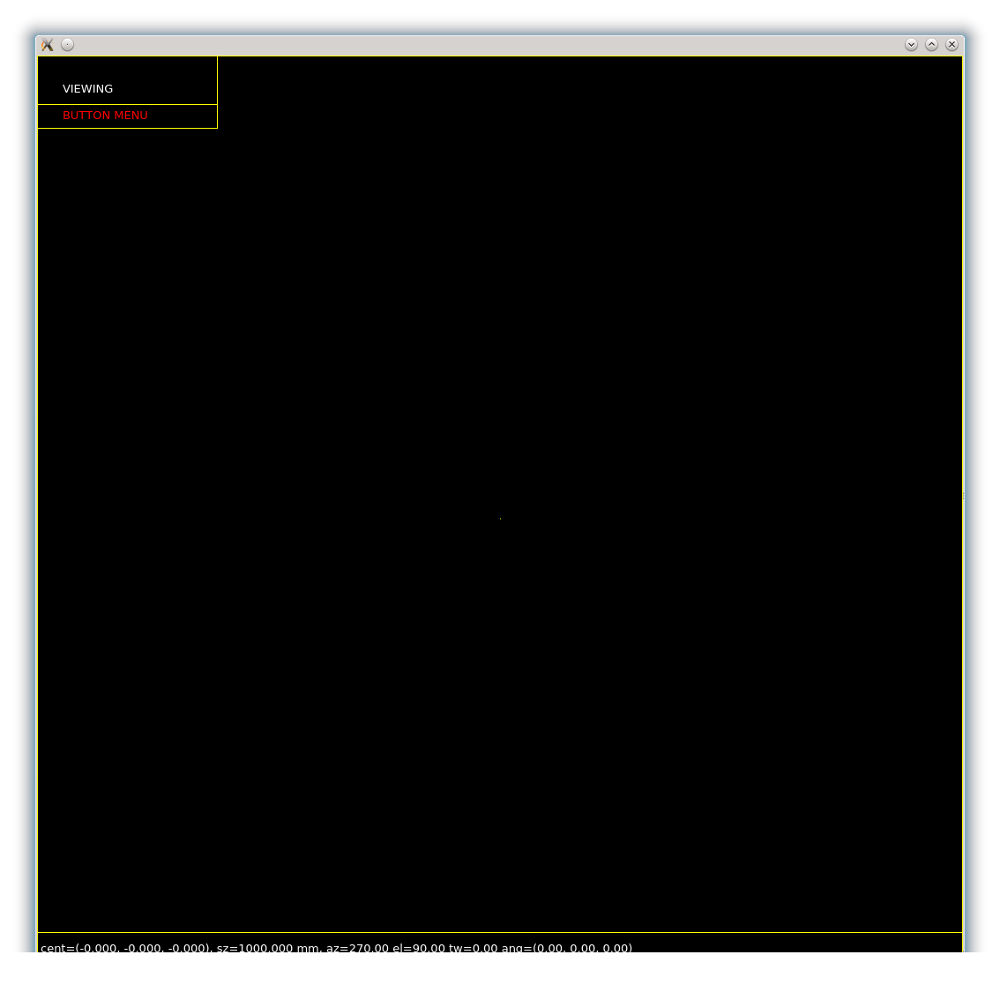
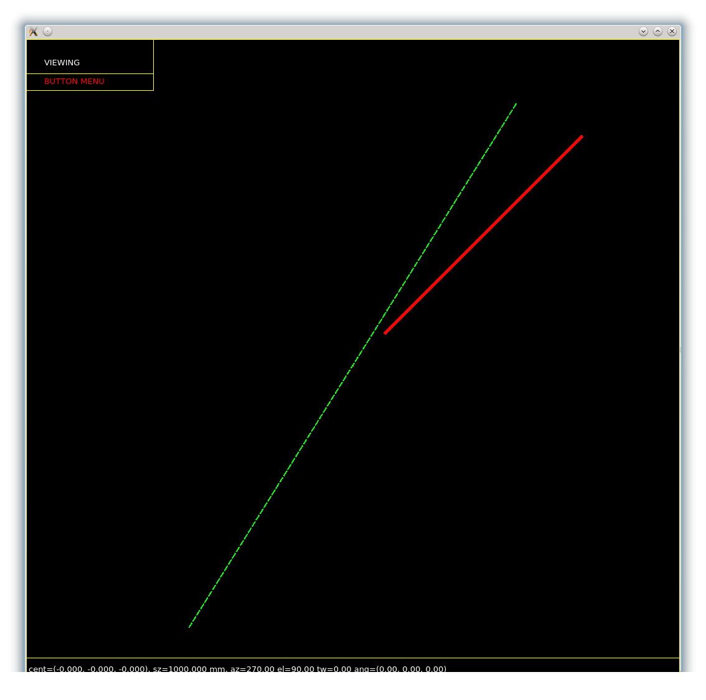
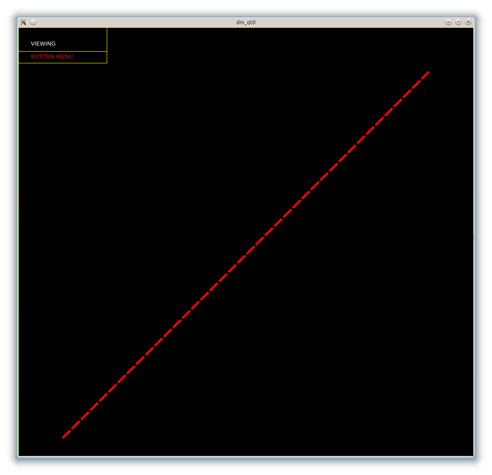
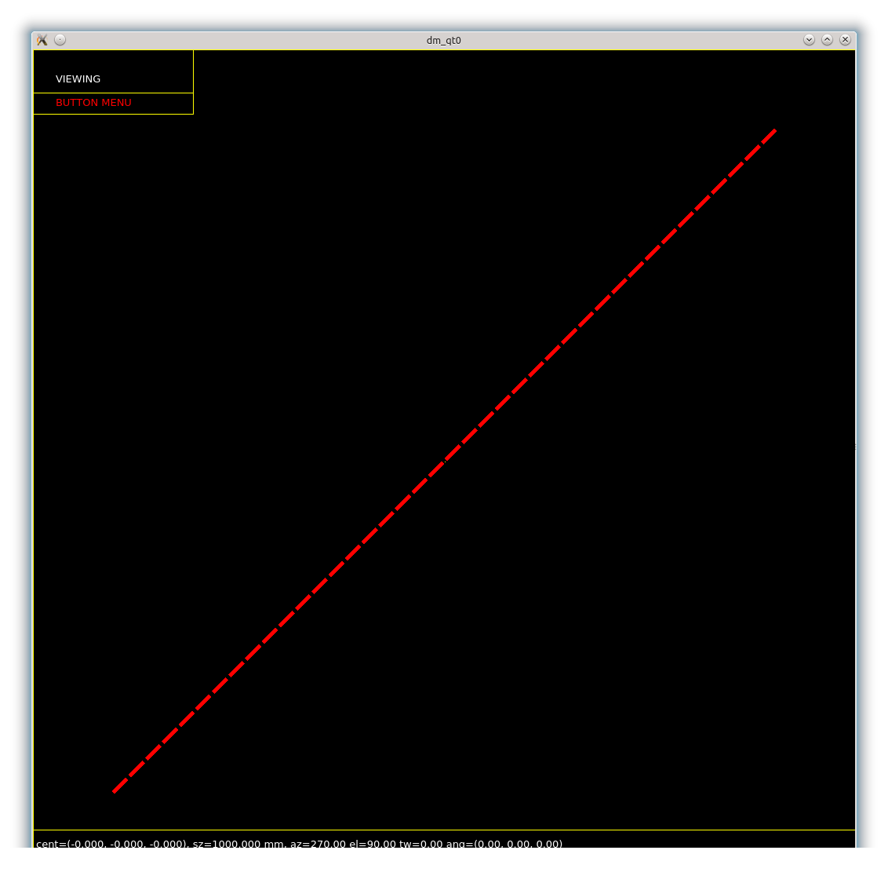
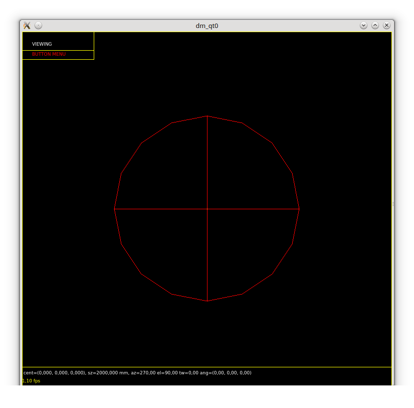
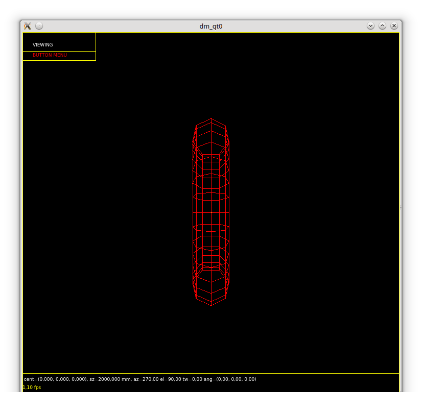
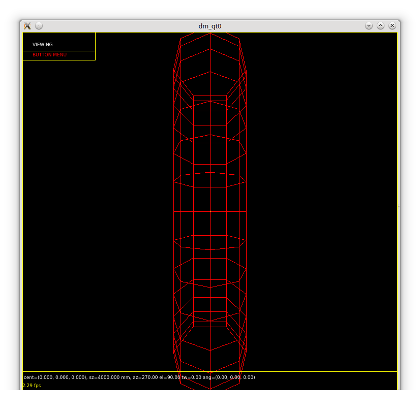
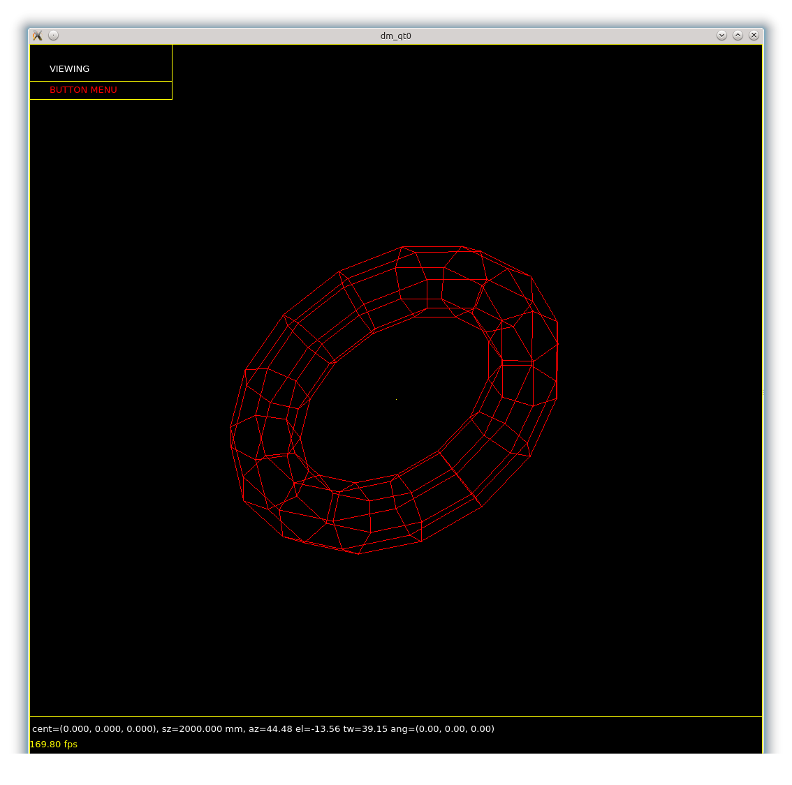
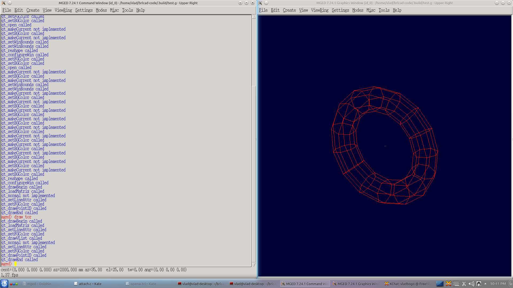

# Daily Progress

# Project Info

|                      |                                                                   |
|----------------------|-------------------------------------------------------------------|
| **Project Name**     | New Cross-Platform 3D Display Manager                             |
| **Student Name**     | Bogolin Simion Vlad                                               |
| **IRC nick**         | vladbogo                                                          |
| **Link to proposal** | [proposal](../Proposal/DisplayManager.md)     |

# Milestones

-   Embed Qt in Tk windows
-   Drawing
    -   Line drawing
    -   Text drawing
-   Keyboard and mouse integration
-   Embedding a framebuffer window

# Logs

## Community bonding

-   30 May 2013:
    -   Updated short description of the project on the melange page.
-   1 June 2013:
    -   A first step in implementing the qt display manager. Now it only
        prints logs similar to txt dm, but has some improvements
-   4 June 2013:
    -   Final version of Qt dm patch
    -   <http://sourceforge.net/p/brlcad/patches/185/>
-   14 June 2013:
    -   Added to g-voxel (src/conv/g-voxel.c) program the same optional
        arguments as the src/libged/voxelize.c (-s -t and -d).
    -   <http://sourceforge.net/p/brlcad/patches/189/>

## Week 1 (17 June - 23 June)

-   **Weekly milestone**:
    -   As I haven't worked with Qt before I will focus on getting more
        familiarized with it this week and also a more detailed look on
        the existing dm's code to be sure I will not miss anything.
-   17 June 2013:
    -   Created a first qt small application. It is not something
        complicated. I focused on the compilation procedure and how to
        integrate qt with cmake.
-   18 June 2013:
    -   I successfully built a qt project using cmake. I struggled with
        the difference between Qt4 and Qt5 but finally managed to make a
        cmake build.
-   19 June 2013:
    -   Got commit access
    -   Updated the txt display manager patch
        -   <https://sourceforge.net/p/brlcad/patches/163/>
-   20 June 2013:
    -   Studied existing cmake files in order to complete integration of
        Qt with cmake.
    -   Found out a FindQt.cmake implementation and tested it: does not
        work.
-   21 June 2013:
    -   Studied existing X-dm implementation, especially the open
        function.
-   22 June 2013:
    -   A short break so I didn't do much today but I've looked on the
        mged dm files (mged/dm-ogl.c).
-   23 June 2013:
    -   Studied some more detailed Qt projects that involve basic
        drawing.
-   **Conclusion**:
    -   Overall it was a good week in which I think I've managed to
        accomplish the weekly milestone. I still have to clear out some
        things but I'm confident I can start implementing effectively.

## Week 2 (25 June - 30 June)

-   **Weekly milestone**:
    -   Start implementing effectively and make progress in embedding Qt
        in Tk window.
-   24 June 2013:
    -   Committed the qt display manager patch. It only prints logs now.
    -   Additional test to set BRLCAD_ENABLE_QT. Still needs to be
        improved because at the moment the path to Qt installation
        should be provided in the CMAKE_PREFIX_PATH.
-   25 June 2013:
    -   Integrated Qt in BRL-CAD's cmake build and created a small
        application to test the integration. Still needs to quiet
        warnings from Qt files.
-   26 June 2013:
    -   A break day so I did not do much work.
-   27 June 2013:
    -   IRC discussion regarding various problems: framebuffer to be
        used by the new display manager (i will start with a null/text
        framebuffer), fPIC flag
    -   Committed changes to complete Qt integration in cmake build and
        found a suitable solution for the position independent code flag
        at least for the moment (cmake version 2.8.11)
    -   Almost everything ready so tomorrow I will start working
        effectively to embed Qt in Tk window
-   28 June 2013:
    -   Found different ways to quiet warnings from Qt files.
    -   Read Qt documentation and studied some basic drawing
        applications.
-   29 June 2013:
    -   Started working on actual embedding.
    -   Small steps in order to create the Tk main window.
    -   Go back to Bucharest (and hopefully this will solve the internet
        connection problem which was a little bad here) so today is a
        busy day.
-   30 June 2013:
    -   Dealt with generic Tk window problems such as window type
        (top-level or embedded), creating a display, window dimension.
    -   Almost finished the logic behind the Tk window so that Qt can be
        successfully embedded in it.
-   **Conclusion**:
    -   A lot of things that were needed to be clarified are now clear,
        especially after the IRC discussion.
    -   Tk main window is almost created so I have made some progress in
        the actual implementation.
    -   Still the cmake integration took more that I've expected so I
        can't say I've made all things I had in mind for this week but
        this is nothing to be worried about because I am on schedule.

## Week 3 (1 July - 7 July)

-   **Weekly milestone**:
    -   Finish embedding Qt in Tk window.
-   1 July 2013:
    -   Finished creating Tk main window: now it's displays an empty
        window.
    -   Struggled with a segfault due to doevent(mged/doevent.c)
        function: solved this by adding an qt_doevent(mged/dm-qt.c)
        function which does nothing for the moment.
-   2 July 2013:
    -   Studied QPixmap examples.
-   3 July 2013:
    -   Review existing dm X implementation and focus on pixmap
        creation.
-   4 July 2013:
    -   After updating to the latest sources Tcl_Eval from dm_open
        failed. Solved it by recompiling the whole code again.
    -   Read about QApplication in detail because when I tried to create
        some Qt widgets I got a runtime error saying that QApplication
        is required.
    -   Looked on the drawBegin function to see how drawing is dealt
        with in the current implementation.
    -   Ignored the float-equal warning for libdm so that the code
        compiles with strict compilation on.
-   5 July 2013:
    -   Break day
-   6 July 2013:
    -   Studied an existing Qt and Tk integration.
-   7 July 2013:
    -   Struggled with showing a Qt window using processEvents function.
-   **Conclusion**:
    -   Quite a busy week with a lot of unexpected problems so I am a
        little bit behind my original schedule but I am confident I will
        make up for the lost time next week.
    -   I had some discussions with my mentor during the past days and
        decided to leave the Tk part as small as possible (preferably
        just Qt to be used in the display window)

## Week 4 (8 July - 14 July)

-   **Weekly milestone**:
    -   Draw lines in the new display manager.
-   8 July 2013:
    -   Finally solved the display of the Qt window (processEvents must
        be called during refresh)
-   9 July 2013:
    -   Studied the mged main loop and refresh procedure to see how
        could Qt be integrated with.
-   10 July 2013:
    -   Searched for different ways to integrate Tk and Qt main loop
        event.
    -   Found Xt and Qt integration and studied the implementation.
-   11 July 2013:
    -   Tried to make the Qt and Tk integration using the
        QWidget::create function.
    -   Unfortunately this does not work either but at least the
        solution compiles unlike the previous tries.
-   12 July 2013:
    -   Break day
-   13 July 2013:
    -   Read about X11 Qt event integration so that I could try a
        similar approach with Tk.
-   14 July 2013:
    -   Committed changes to illustrate the Qt and Tk integration.
    -   Implemented qt-close function so that the display manager is
        gracefully released.
    -   IRC discussion regarding Qt and Tk integration.
    -   Tested the QWidget::create function also on raw X11 windows.
    -   Studied some drawing line examples.
-   **Conclusion**:
    -   Unfortunately the embedding still does not work so in the worst
        case I will go on another path: not use Tk and create just a Qt
        window.
    -   Drawing lines shouldn't be a problem so that after the windows
        are created it should not be a big task.

## Week 5 (15 July - 21 July)

-   **Weekly milestones**:
    -   Solve the embedding problem.
    -   Finish the drawing line functionality.
    -   Start implementing the draw string functionality.
-   15 July 2013:
    -   Implemented the qt_reshape function.
    -   Partially implemented the qt_configureWin function.
    -   Set the window background color.
    -   Added the processEvents callback to struct dm so that the
        QApplication::processEvents could be called in the mged's main
        event loop.
-   16 July 2013:
    -   I have tried again to embed Qt in an X11 window and posted a
        stackoverflow question regarding the procedure:
        -   <http://stackoverflow.com/questions/17686315/qwidget-in-x11-window>
    -   Also the link to yesterday questions regarding Qt and Tk:
        -   <http://stackoverflow.com/questions/17648421/how-to-create-a-qwidget-with-a-tk-window-as-parent>
        -   <http://qt-project.org/forums/viewthread/29996/>
    -   I hope to get an answer soon otherwise I will take in
        consideration ignoring Tk.
-   17 July 2013:
    -   Almost finished implementing the drawLine2d functionality.
    -   Implemented the qt_setBGcolor function.
    -   Tried to build on windows but unsuccessful.
-   18 July 2013:
    -   Finished a first implementation for drawLine2d. Still needs to
        be a little bit cleaned and drawBegin and drawEnd should be used
        which is scheduled for tomorrow.
    -   Read more about Qt events and started to take in consideration
        ignoring Tk (search for what and where should be changed)
-   19 July 2013:
    -   Implemented the qt_setFGColor function.
    -   Implemented the qt_drawBegin and qt_drawEnd and modified the
        logic so that the QPainter is created in drawBegin and destroyed
        in drawEnd
    -   Implemented the qt_drawString2D function and the
        qt_drawPoint2D function.
    -   Tested embedding Qt in Tk using XReparentWindow even though it
        wouldn't be a cross platform solution. The test was unsuccessful
        but there still are some things that I need do read about so I
        will continue the test tomorrow.
-   20 July 2013:
    -   Documented more on the approach from yesterday: I try to use the
        XReparentWindow to embed Qt in Tk because being both (on Linux)
        X11 windows this should be possible but still unsuccessful.
    -   Some fixes in src/proc-db/cchannel.h applied in r56161 and
        r56163.
    -   Reviewed patches 212 and 213:
        -   <https://sourceforge.net/p/brlcad/patches/212/>
        -   <https://sourceforge.net/p/brlcad/patches/213/>
-   21 July 2013:
    -   Break day
-   **Conclusion**:
    -   A good week and at the end of it I have implemented the draw
        string functionality and the draw line 2d.
    -   I also asked various questions regarding the embedding but
        received no answer until now.
    -   Results:

## Week 6 (22 July - 28 July)

-   **Weekly milestones**:
    -   Implement the draw 3d line functionality
    -   Decide on the embedding problem
    -   Prepare the midterm evaluation
-   22 July 2013:
    -   Couldn't get to a result from the last week's approach on the
        embedding (using XReparentWindow funtion)
    -   Studied some 3d drawing examples in Qt
-   23 July 2013:
    -   Read more about 3d drawing in Qt
    -   Tried to resize the window but until the embedding it's not
        solved the callbacks are not called on resize event.
    -   Tried to find a way to solve the lnk1104 error on windows: tried
        to make cmake add quotes to libraries dependencies path.
-   24 July 2013:
    -   Modified font size for string drawing according to the size of
        the window.
    -   Discussion with my mentor regarding the embedding problem.
        Received some suggestions and tested them but still no luck.
    -   Sometimes I get a SEGFAULT when closing the dm so I investigated
        the problem using gdb and valgrind but when I tested the error
        did not occurred.
-   25 July 2013:
    -   Solved the embedding problem: there still are some things that
        need to be done better but Qt is displayed in the Tk window. I
        will make the necessary changes so that everything works as
        expected in the next days.
    -   I want to thank D.Rossberg for his help and support in finding
        the solution :).
-   26 July 2013:
    -   Result:
        -   The window's content is the same like in the first pictures
            posted but this time Qt content is shown within a Tk window
            :).
        -   As seen in picture one the Qt and the Tk windows have
            different size (the bottom text does not appear) so when
            resizing the Tk window the Qt one does not automatically
            changes zie. I'll work to fix this behaviour and hope to be
            fixed by tomorrow.
    -   Made some sanity checks and fixed some small issues.
-   27 July 2013:
    -   Solved the resize problem: the Qt window now gets resized when
        the Tk one changes size.
-   28 July 2013:
    -   Studied existing dm_drawVList implementation.
-   **Conclusion**:
    -   Good week in which the embedding problem was solved.

## Week 7 (29 July - 4 August)

-   **Weekly milestones**:
    -   Finish drawing.
    -   Start working at mouse integration.
-   29 July 2013:
    -   Submitted the evaluation form on melange.
    -   A little break
-   30 July 2013:
    -   Implemented the qt_loadMatrix, qt_setWinBounds and
        qt_drawVList function.
    -   The display manager is able to display more complex objects:

-   31 July 2013:
    -   Struggled with mouse integration.
    -   The problem is that Qt receives the events but the Tk window
        does not so I tried to make Qt pass the events to Tk but I have
        been unsuccessful for the moment.
-   1 August 2013:
    -   Continued to find a way to send Tk events from Qt. Still I was
        unsuccessful.
-   2 August 2013:
    -   Break day
-   3 August 2013:
    -   Tried sending events using the XSendEvent function but there
        still are things that I need to figure out.
-   4 August 2013:
    -   Managed to send events to the Tk window using Tcl_Eval
        function. I still have a problem because the events are not
        processed when they are sent but they are processed later.
-   **Conclusion**:
    -   At the end of this week more complex objects can be drawn in the
        qt window.
    -   Also I have made progress in integrating the mouse between Qt
        and Tk.

## Week 8 (5 August - 11 August)

-   **Weekly milestone**:
    -   Finish the keyboard and mouse integration
-   5 August:
    -   Struggled with locale settings and after an IRC discussion found
        a solution.
    -   Committed the changes I've made during the last days regarding
        mouse integration.
    -   Almost finished the mouse integration: the content resizes when
        pressing mouse buttons:

-   6 August 2013:
    -   Dealt with Control+LeftMouseButton binding: I successfully
        managed to rotate the object but I still have some problems
        because since it starts rotating it never stops:

-   7 August 2013:
    -   Break day
-   8 August 2013:
    -   Solved the rotation problem
    -   Read about keyboard events
-   9 August 2013:
    -   Integrated keyboard events:

-   10 August 2013:
    -   Break day
-   11 August 2013:
    -   Searched for a more generic way of dealing with events. I've got
        a couple of ideas that will ease adding new key bindings to the
        display manager.
    -   Did some more testing to see if everything behaves as expected.
-   **Conclusion**:
    -   Good week in which I've almost finished dealing with keyboard
        and mouse integration.
    -   As I am a bit ahead of schedule I'll focus on testing in the
        next couple of days.

## Week 9 (12 August - 19 August)

-   **Weekly milestone**:
    -   Finish the keyboard and mouse integration
-   12 August 2013:
    -   Some more testing: found a problem when pressing control+mouse
        button: at the first move the object jumps in a new position
        then moves as expected.
-   13 August 2013:
    -   Studied archer code to see how the new display manager can be
        integrated.
-   14 August 2013:
    -   Break day
-   15 August 2013:
    -   Continued to see how archer works and how can I integrate the
        new display manager.
-   16 August 2013:
    -   Break day
-   17 August 2013:
    -   Break day
    -   I had a small holiday and from tomorrow I'll get back to work.
-   18 August 2013:
    -   Back to work so I continued searching for a way to integrate the
        new display manager in archer.
-   **Conclusion**:
    -   The display manager is taking shape after the mouse and the
        keyboard integration are complete.

## Week 10 (19 August - 25 August)

-   **Weekly milestones**:
    -   Test the display manager
    -   Solve any issues that might appear
    -   Research embedding a framebuffer window functionality
-   19 August 2013:
    -   Found a issue regarding starting the display manager without a
        database: the background colour is not set.
    -   Added the option to select the Qt display manager from
        Modes&gt;Display Manager in mged's menu:

-   20 August 2013:
    -   Solved the issue regarding opening the display manager without a
        database: the problem was that after setting the background
        colour (in drawend) the UpdateRequest event is invoked, but it
        takes effect just if the window is exposed. Without processing
        other events the window wasn't exposed so the behaviour wasn't
        the expected one.
    -   Continued searching a way to integrate the display manager in
        archer: I've managed to add a Modes&gt;Display Manager option
        but now I have to see how I can add the appropriate behaviour.
-   21 August 2013:
    -   Studied more archer code: found some keypoints in libtclcad that
        I will focus on tomorrow.
    -   Searched about how framebuffer windows are embedded in current
        dms.
    -   Tested the Qt display manager in mged.
-   22 August 2013:
    -   Got the first object drawn in archer. However after discussing
        with my mentor and testing on another platform I get a segfault.
    -   Solved some sanity checks regarding calling drawVList before
        drawBegin or if some error occurs.
-   23 August 2013:
    -   Tested a solution for the segfault from yesterday.
    -   Found a solution to bound: invalid bounds. This occurred because
        Qt sets different locale so that comma is used for decimal
        separator.
-   24 August 2013:
    -   Break day
-   25 August 2013:
    -   Drawing in archer with segfault solved.
    -   Tried to find a way to hook the Modes-&gt;Display Manager to
        actually selecting a new display manager. Haven't managed yet.
-   **Conclusion**:
    -   Even though I changed a little bit the weekly milestones I
        managed to get drawings displayed in archer. Still there are
        some things that need to be solved (event processing in archer)
        but at the moment the display manager can be used in both mged
        and archer.

## Week 11 (26 August - 1 September)

-   **Weekly milestone**:
    -   Finish the archer integration.
    -   Start working at framebuffer window embedding.
-   26 August 2013:
    -   Tried do solve the event problem that still occurs when using
        the dm in archer.
-   27 August 2013:
    -   Continued struggling with linking the menu item with the actual
        code.
-   28 August 2013:
    -   Searched for actual framebuffer window embedding and tried to
        find all relevant paths.
-   29 August 2013:
    -   Break day
-   30 August 2013:
    -   Continued the research in the both aspects: archer and
        framebuffer window.
    -   Being one of the most unclear parts of the project, embedding a
        framebuffer window needs a lot of research.
-   31 August 2013:
    -   Continued the quest to find useful code sections.
-   1 September 2013:
    -   Made some testing in archer to see if objects are displayed
        well. Everything seems to work except the event processing which
        is only done when drawing.
    -   Unfortunately I haven't found archers event processing code
        section.
-   **Conclusion**:
    -   The archer integration is 90% done.
    -   I have studied and tried to came up with a solution for
        framebuffer window embedding.

## Week 12 (2 September - 8 September)

-   **Weekly milestone**:
    -   Finish archer integration.
    -   Testing and fixing other issues.
-   2 September 2013:
    -   Fix one issue regarding object rotation. The event was generated
        without initial coordinates so that the object first jumped in a
        position the started to rotate correctly.
    -   Modified the event processing so that new bindings can be easily
        added: just add a function that from the Qt event generates the
        corresponding Tk one.
-   3 September 2013:
    -   Fixed a locale issue: even though it was set in mged.c there
        still were some problems so I've set the locale to POSIX in
        dm-qt.cpp. Now everything seems to work fine.
    -   Tried to process events in archer. I've made some progress in
        order to process events correctly.
-   4 September 2013:
    -   Break day
-   5 September 2013:
    -   Researched a strange behavior while running archer: at startup
        there are no drawing functions called but when trying with a
        different dm the functions are called. Probably this is due to
        lack of event processing.
-   6 September 2013:
    -   Tried to solve the issue reported yesterday. I hope by the end
        of this week the new display manager would be able to run in
        archer perfectly.
-   7 September 2013:
    -   Almost finished the event processing for archer. Just some small
        changes are needed.
-   8 September 2013:
    -   Finished the archer integration.
    -   Studied existing frambuffer interface so that I can start
        implementing a Qt framebuffer.
-   **Conclusion**:
    -   Archer integration is done.

## Week 13 (9 September - 15 September)

-   **Weekly milestone**:
    -   Testing
-   9 September 2013:
    -   Did some testing and I found out that the selection tool in
        archer and the measure tool do not work correctly so I
        investigated the behavior: turns out the tk click events
        generated do not had mouse position infos.
    -   There still is a problem with the measuring tool: after showing
        the distance and drawing the line, it draws multiple other lines
-   10 September 2013:
    -   Fixed some memory leaks and did some testing.
-   11 September 2013:
    -   Rewritten the event integration using Tcl_CreateEventSource so
        that QApplication::processEvents is called every time
        Tcl_DoOneEvent is called and no additional calls have to be
        made.
-   12 September 2013:
    -   Simulated the non-blocking processing events using
        Tcl_DoWhenIdle and Tcl_CreateTimerHandler so that the actual
        archer/mged/bwish code shouldn't be modified at all.
-   13 September 2013:
    -   Made some fixes and added comments.
    -   Investigated the closing segfault but I haven't been able to
        solve it yet.
-   14 September 2013:
    -   Mostly a break day but I've continued working to the segfault
        reported yesterday. Still no luck.
-   15 September 2013:
    -   Added Qt to cmake report.
    -   Made some cleanups since after the past days changing there were
        some things that were not needed anymore.
    -   Added some comments.
-   **Conclusion**:
    -   The display manager is mostly done and working.

## Week 14 (16 September - 22 September)

-   Weekly milestone:
    -   More testing and other fixes.
    -   Start implementing the Qt framebuffer.
-   16 September 2013:
    -   Started working on the qt framebuffer interface.
-   17 September 2013:
    -   Continued researching the closing segfault.
    -   Researched the existing framebuffer interfaces and how are they
        integrated.
-   18 September 2013:
    -   Tried to solve the segfault: gdb + searches in libx and qt code.
-   19 September 2013:
    -   More attempts to solve the segfault.
-   20 September 2013:
    -   Mostly a break day.
-   21 September 2013:
    -   Added new events
    -   Small fixes + comments
    -   Started working on project summary.
-   22 September 2013:
    -   Cleanups
-   **Conclusion**:
    -   Everything seems to work fine.

## Week 15

-   23 September 2013:
    -   Tried more approaches to solve the segfault.
-   24 September 2013:
    -   Completed final evaluation.

# Project summary

[The project summary can be found here](qt-display-manager.md)
