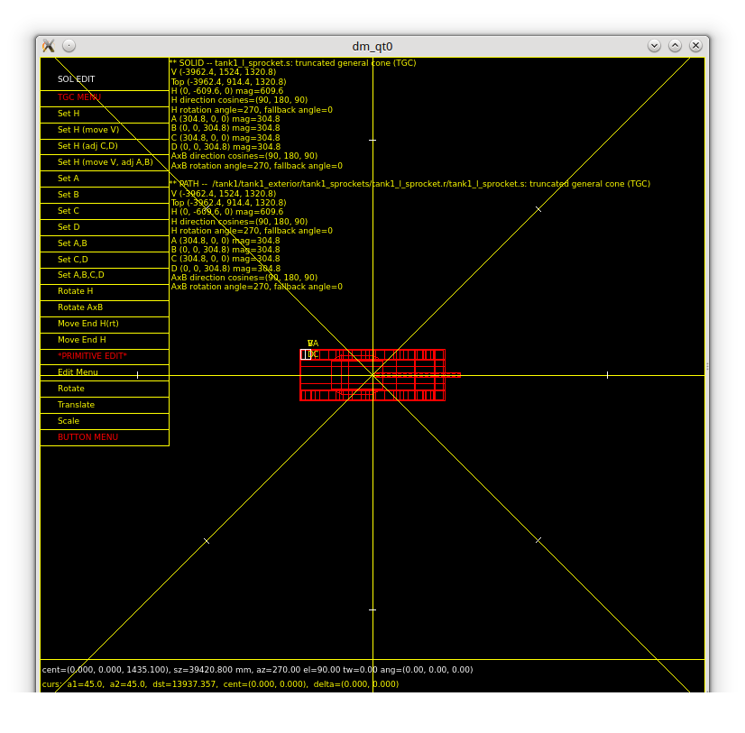
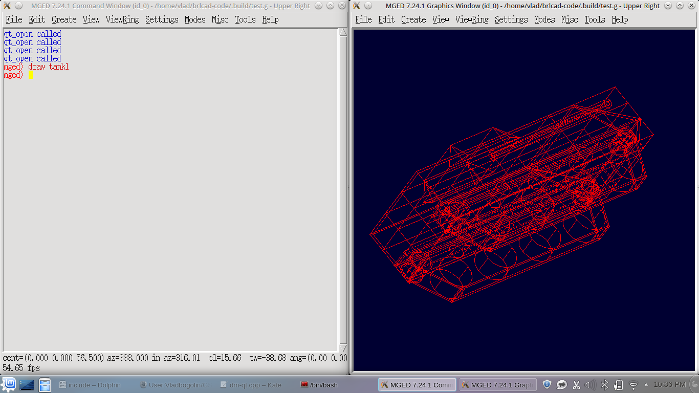

# Requirements

Qt 5.1 has to be installed.

# Project Summary

Being my first participation in Google Summer of Code and my fist
contact with open source projects I was very excited and eager to start
working.

For the past three months I worked on implementing a new display manager
for BRL-CAD. The project focused on implementing a Qt display manager
having the following functionalities which were also my initial
milestones:

-   Embed Qt in Tk windows
-   Drawing
    -   Line drawing
    -   Text drawing
-   Keyboard and mouse integration
-   Embedding a framebuffer window

Before midterm evaluation I focused on the first two aspects: embedding
Qt in Tk windows and drawing. I have experienced a lot of difficulties
while trying the embedding, but finally at midterm the display manager
was able to draw almost every model.

After midterm evaluation, I focused on dealing with keyboard and mouse
events since it's an important aspect. I tried to do everything so that
new key bindings can be easily added, this means adding a function that
has as input a Qt event and returns the corresponding Tk one. Another
aspect that I've achieved in this period is integrating Qt in archer
which was quite tricky since there were a lot of problems that needed to
have a better solution: event processing which was done non-blocking,
I've managed to simulate the behavior so that there wouldn't be any
needs to modify the existing archer code. The last aspect I've been
working on after midterm evaluation is embedding a framebuffer window.
After making some research and discussing with my mentor I've decided to
start implementing a new Qt framebuffer interface which is at the
beginning but I am eager to continue working after GSoC to finish this
project too.

During the final days I've been focusing on testing, commenting and
solving issues.

# Results

One of the best way to see the actual results is from screenshots:

To use the display manager in classic mged simply select it when
prompted:

To use the display manager in mged it must be selected from
Modes-&gt;DisplayManager-&gt;Qt.

used in archer too. At this moment there isn't a option like in mged
(Modes-&gt;DisplayManager-&gt;Qt) so what has to be done to use the dm
in archer is modify src/tclscripts/lib/Get.tcl line 957 (set dmType qt)
and deactivate the use of Display Lists:

[log page](Logs.md).

One of the most important aspects that need to be done after GSoC is the
development of a new Qt framebuffer interface which I already started.
